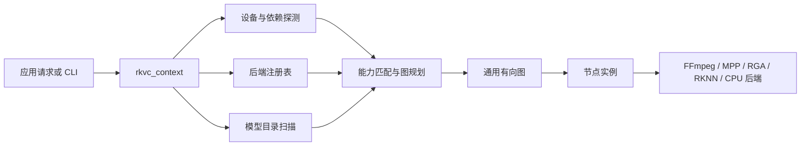
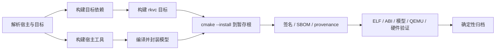
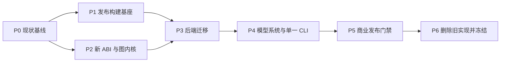

# rkvc 0.4.0 大版本重构计划

状态：实施中（见文末"实施状态"）  
目标版本：0.4.0  
兼容策略：不兼容 0.3.x；不提供旧 API、旧 CLI 或旧包布局兼容层

## 实施状态（随实现更新）

- **P0/P1 完成**：根 `CMakeLists.txt` 已拆为 `cmake/RkvcOptions.cmake` /
  `RkvcDependencies.cmake` / `RkvcTargets.cmake` / `RkvcInstall.cmake`；
  版本号唯一来源为 `project(VERSION)`；`tools/rkvc-build`（stdlib Python）
  承担唯一发布路径：锁定 sysroot（Ubuntu 20.04 arm64，SHA-256 锁文件）→
  交叉构建 → SBOM/许可证归集 → 封装（SHA256SUMS+provenance）→ 产物验证
  （ELF 架构/解释器/glibc 2.31 基线/绝对 RPATH 拒绝）→ 确定性归档 →
  QEMU 冒烟。重复归档字节级一致；混入 x86 ELF 必然验证失败。
- **P2 完成（核心契约）**：`context/request/job/frame/diagnostic` 公共 ABI
  位于 `include/rkvc/`；图内核已具备 create/configure 与 open/start 分离、
  context/job 引用生命周期、有界非阻塞输入与背压、端口格式协商、逆序
  回滚，以及 configure/open 失败后的有序候选回退（最多 64 次）。后端帧
  描述可携带 payload size、PTS/DTS、flags 和 DMA-BUF fd，并以释放回调归还
  MPP/RGA/RKNN 资源。唯一公共库的导出符号冻结在 `librkvc.map` 的
  `RKVC_0.4` 节点；严格告警与 ASan/UBSan 回归常绿。
- **P3 进行中（文件管线与 MPP DSO 落地，板卡回归未完成）**：后端 DSO 加载器完成（`lib/backend_dso.c`：可信目录
  dlopen、`rkvc_backend_query()` ABI 握手、失败隔离、淘汰诊断、
  `RTLD_NOW|RTLD_LOCAL`）；工厂描述符在注册期校验，单候选损坏或打开失败
  不再拖垮其他路径。内建 `fileio` 后端（`lib/node_fileio.c`：
  `file.source` flush 产出整个文件、`file.sink` 逐行裁剪写出）使
  规划器对 FILE 端点自动注入 SOURCE/SINK 步骤，统一 CLI
  `decode/encode/transcode` 文件→文件路径已打通。MPP 后端 DSO
  （`backends/mpp/backend_mpp.c`）实现 `mpp.decode`（H.264/HEVC/AV1 +
  AUTO/转码首包 Annex-B 探测）与 `mpp.encode`（H.264/HEVC，DMA-BUF
  零拷贝/HOST 拷贝、CBR/FIXQP），由发布管线 `deps-mpp` 阶段交叉构建并
  随包分发 MPP 运行库；`rkvc_frame_spec` 新增 `ver_stride`。x86 契约测试
  `test_media_pipeline`（9 用例）与交叉包 verify/QEMU 冒烟常绿。
  **MPP 硬件功能、RGA/RKNN 后端与板卡回归尚未验证**；P3 不能仅凭
  加载器、fake backend 或 x86_64/QEMU 结果判定闭环，三块板卡当前离线。
- **P4 进行中（容器与信任链完成，运行时绑定未完成）**：`.rkmodel` v1 线格式
  （`lib/rkmodel_layout.h`：64B 固定头 + 有界 TLV + 载荷表含 SHA-256 +
  可选 Ed25519 签名尾）；读取器 `lib/rkmodel.c`（上界检查、未知 TLV 跳过、
  载荷按需校验）；注册表 `lib/model_registry.c`（可信目录扫描、候选失败
  只淘汰）；写入/签名侧 `tools/rkvc_build/rkmodel.py`
  （pack/keygen/sign/verify/inspect，ctypes libsodium）；trust root
  dev/prod 分离（`RKVC_ENABLE_MODEL_SIGN` + `RKVC_TRUST_PUBKEY_HEX` +
  `RKVC_TRUST_PRODUCTION`；dev 根配置期自动生成临时对，prod 必须显式公钥
  否则配置失败）。CLI `rkvc inspect models` 已接真实注册表。
  Python 签名 → C 验证互操作已闭环（trust=development）。显式 `model_id`
  已进入 job 创建校验，但自动模型选择尚未驱动实际 transform 工厂参数，
  因而 P4 不能按端到端口径标记完成。
- **P5 完成（发布门禁基础）**：CycloneDX 1.5 SBOM（`bom.cyclonedx.json`，
  sysroot 锁定包 + 适配器清单）、`legal/` 许可证归集，均在 seal 前生成以
  纳入 SHA256SUMS；`provenance.json` 记录版本/target/git revision。
  生产签名运营（HSM/KMS、发布评审门禁）超出代码库范围。
- **P6 已完成旧架构切除**：0.3 Session/Pipeline/Router、旧节点实现、七个
  独立 CLI、旧示例与专用测试、手工打包脚本和 `RKVC_1.0` 符号节点均已
  删除。0.4 核心直接产出 `librkvc.so.0`，不再存在 `rkvc_core` 迁移目标或
  `RKVC_BUILD_NEW_ENGINE` 开关；安装树只包含 0.4 公共头、统一 CLI、核心库
  和后端 DSO。未迁移的 RGA/RKNN/SR/MLVC 功能暂不可用，不回退旧路径。

剩余硬件门禁项：MPP/RGA/RKNN 后端 DSO 化、媒体 CLI 平价、真实板卡回归。
执行顺序为 RK3588（权威板卡）→ RK3576 → RV1126B；每块板均运行
统一 CLI 的 `inspect device` 和 H.264/HEVC/AV1 能力范围内的媒体基线。

## 为什么要重构

0.3.x 已经验证了 RKMPP、RGA、RKNN、SVT-AV1、MLVC 和可移植包可以在同一项目中工作，但实现方式已接近扩展上限。根 `CMakeLists.txt` 同时负责依赖定位、产品裁剪、代码生成、测试和安装；`scripts/package-portable.sh` 又实现了一套超过千行的依赖构建、模型生产、文件装配、加密、验证和归档流程。两者对目标架构、依赖目录和包内容的认识并不完全相同。新增一块板卡或一种模型时，通常需要在多个 shell `case`、CMake 条件和测试脚本中同步修改。

运行时也存在同类问题。`session.c` 和 `session_run.c` 直接知道每一种节点，模型路径暴露为大量业务参数，CLI 被拆成多个功能重叠的可执行文件。结果是编译期特性、设备能力、模型可用性和用户意图混在一起，无法形成稳定的商业库边界。

0.4.0 的核心不是整理目录，而是建立三个长期稳定的事实来源：

1. 编译产物由 CMake target 和 install component 定义，打包器只消费安装结果。
2. 硬件、后端和模型由运行时探测并按能力匹配，不由中央板卡表决定。
3. 用户只描述输入、输出和质量/时延约束，图构建器负责选择可执行路径。

版本完成后，从 x86_64 构建机应能一次产出包含多种 RKNN 目标模型的 AArch64 通用可移植包；同一个包复制到受支持的 Rockchip 开发板后，可自动识别设备、装载合适后端和模型，无需修改配置或重新打包。

## 设计边界

### 0.4.0 要解决的事情

0.4.0 建立统一的宿主/目标构建模型、基于安装树的唯一打包路径、通用图执行内核、动态后端与模型发现、单一 CLI、可验证模型容器、可复现发布和硬件发布门禁。公共库按商业 SDK 的标准定义 ABI、线程、错误、日志、资源所有权和安全边界。

### 本版本刻意不做的事情

0.4.0 不兼容 0.3.x 的头文件、符号、CLI 参数、环境变量和包目录；不保留同名转发程序。它也不把驱动或固件纳入 SDK，不承诺在 QEMU 中验证 NPU/VPU 功能，不把任意第三方 `.so` 自动视为可信插件。Windows、macOS 和 Android 不进入 0.4.0 发布范围。

ARM32 不与 AArch64 同时首发。统一目标模型必须允许以后添加 `arm-linux-gnueabihf`，但 0.4.0 GA 交付目标先固定为 x86_64 宿主到 AArch64 Linux；这样可以把工程资源集中在 RKNN 开发板的真实硬件验证上。

## 关键技术决策

### 宿主、目标和设备必须分离

构建图显式区分 host、target 和 device。host 是执行构建步骤的环境，例如 `x86_64-linux-gnu`；RKNN Toolkit、模型封装、签名和包验证工具都属于宿主产物。target 是最终二进制 ABI，例如 `linux-aarch64-glibc231`；`librkvc`、CLI、后端和可再分发依赖都属于目标产物。device 是板端的运行时探测结果，包含 device-tree compatible、MPP 能力位、RGA/RKNN 驱动和运行时 ABI、设备权限等，它不是一个编译目标。

一个 target 包可以服务多个 device。每个构建阶段必须声明自己在哪种机器上运行、产生哪种目标产物；缓存键包含工具链、sysroot、源码和参数摘要。`uname` 只能描述 host，不能决定发布 target。宿主、目标和模型输出使用不同目录，链接器与 pkg-config 搜索路径不允许相互穿透，配置阶段不得执行目标程序。

RKNN 模型是宿主工具生成、设备消费的数据产物。发布命令可以接收任意 Toolkit target 字符串，实际 Toolkit 是有效性的最终裁判；项目不维护板卡白名单。成功产物封装为自描述 `.rkmodel`，打包器和运行时都读取模型本身，不根据文件名猜测平台。

继续扩充 `VALID_PLATFORMS`、shell `case` 或每板一套 CMake preset 会把 device 错当成 target，并造成库的重复构建，因此不采用。外置 JSON manifest 也不作为模型和包内容的权威：需要长期存在的元数据进入产物本身，需要审计的记录从完成的安装树生成。

### Linux 二进制基线固定为 glibc 2.31

0.4.x 的 AArch64 可移植包以 glibc 2.31 为最低基线。所有目标程序和需要随包分发的开源依赖都使用固定的 Ubuntu 20.04 AArch64 sysroot 或等价的只读 sysroot 构建；发布 runner 当前系统的 `/usr/aarch64-linux-gnu` 不能作为隐式输入。sysroot 来源必须由不可变摘要固定。

产物验证是最终判据。验证器遍历安装树中的 ELF，解析 `.gnu.version_r`，拒绝任何高于 `GLIBC_2.31` 的需求，同时检查目标架构、动态解释器、GLIBCXX/CXXABI 和意外宿主依赖。至少在一套真实 glibc 2.31 AArch64 rootfs 中执行加载与无硬件冒烟。

包内不携带 glibc、动态加载器、libpthread、libdl 等基础系统组件。依赖如果要求更新 libc API，应降级、打补丁或退出发布包，不能通过降低检查强度放行。完全静态链接 glibc 会恶化 NSS、解析器、`dlopen` 和安全更新问题；musl 又无法保证 Rockchip 专有运行时兼容性，二者都不作为 0.4.0 路径。0.4.x 补丁版本不得静默提高 libc 基线。

### 动态发现的适用边界

动态发现用于后端、设备能力和模型，不等于让构建结果不可控。后端通过版本化 ABI 自我描述，模型通过版本化容器头自我描述，设备通过驱动和系统接口自我描述；候选的选择顺序必须稳定且可以解释。C/CMake 源文件仍由 target 明确拥有，依赖版本仍需固定，生产签名策略仍需显式配置。

允许存在依赖锁定、SBOM、provenance 和许可证报告，因为它们解决可复现与审计问题；它们不能反过来成为运行时路由的第二事实源。扫描缓存也只是一种性能优化，必须能从真实文件重新生成。

## 目标架构



核心库只保留上下文、资源、图、调度和稳定公共 API。媒体实现位于内部模块或后端 DSO 中，通过同一个节点接口进入图。后端导出固定入口 `rkvc_backend_query()`，返回 ABI 版本、能力、探测函数和节点工厂。上下文只扫描可信目录，例如包内 `$ORIGIN/../lib/rkvc/backends` 和管理员配置目录；默认不扫描当前工作目录，也不允许环境变量在特权进程中覆盖可信路径。

模型不再由 `rkvc_pipeline_desc` 中的多个路径字段拼接。`.rkmodel` 是自描述、可签名的模型容器，头部包含模型族、角色、版本、RKNN 目标、输入输出契约、量化信息、内容摘要和密钥槽，载荷可以容纳 RKNN、PMF 和 QP patch。注册表扫描搜索路径时只读取有界头部，完成签名验证和兼容性过滤后再按请求装载载荷。目录名称只用于组织文件，不参与正确性判断。

这里所说的动态发现不是“猜文件名”。发现对象必须通过版本化 ABI 或版本化容器头自我描述；探测失败只淘汰该候选，不应让整个进程崩溃。扫描结果可以缓存，但缓存随文件身份、mtime 和运行时 ABI 失效，绝不是另一份需要维护的配置真相。

### 设备与能力模型

设备身份来自 `/proc/device-tree/compatible`，能力来自 MPP ioctl、RGA/RKNN 驱动及运行时查询、设备节点权限和实际后端探测。SoC 字符串仅用于匹配 RKNN 编译目标，不能替代能力判断。所有选择都使用候选评分：硬约束先过滤 ABI、模型 I/O、像素格式、分辨率和设备能力，软约束再按延迟、质量、零拷贝代价和用户偏好排序。

新增板卡因此不要求修改 rkvc 源码。只要设备报告已有能力并存在匹配的自描述模型，它就可以进入候选集合。模型编译器是否接受某个 RKNN 目标，由实际安装的 RKNN Toolkit 验证；构建脚本不保存 `VALID_PLATFORMS` 一类列表。

### 图内核

新增 `lib/graph.c`、`lib/node.c`、`lib/registry.c` 和对应内部头文件。节点统一实现 `configure/open/process/flush/close` 生命周期，以带格式约束的端口连接。图构建分为协商和实例化两步：协商阶段只计算候选路径与缓冲格式，实例化阶段才打开设备和分配大块内存。任一步失败都按逆序释放已经创建的对象。

0.3.x 中散落在 `session_open_nodes()`、模板分支和多套 run loop 中的控制流迁入图规划器与通用调度器。demux、decoder、scale、SR、encoder、mux 都成为普通节点；MLVC 不再拥有绕过主图的特殊泵循环。背压、EOS、flush、cancel 和错误传播只实现一次。零拷贝是否成立是端口协商结果，跨内存域时由规划器显式插入 upload/download/convert 节点。

公共 API 不直接暴露内部节点类型。建议的新对象关系为：

```text
rkvc_context  ->  rkvc_probe / rkvc_model_registry / rkvc_backend_registry
rkvc_request  ->  输入、输出、编解码和质量约束
rkvc_job      ->  已规划并可 start/wait/cancel 的一次执行
rkvc_frame    ->  带引用计数的 host/DMABUF 媒体对象
```

所有公开结构以 `struct_size` 和 `api_version` 开头，句柄保持 opaque。库内线程不调用用户回调时持有内部锁；回调线程语义写入 API 文档。错误由枚举码和可选的 job/context 诊断链共同表达，CLI 可以把同一诊断输出为人类文本或 JSON。

### CLI

七个最终用户程序收敛为一个 `rkvc`：

```text
rkvc inspect [device|models|backends|file]
rkvc encode ...
rkvc decode ...
rkvc transcode ...
rkvc upscale ...
rkvc bench ...
rkvc license ...
```

所有子命令共享解析、单位、日志、进度、退出码和 JSON 输出。CLI 把参数转换为 `rkvc_request` 后即调用公共 API，不包含后端选择和模型路径拼装逻辑。默认由模型注册表自动选择；高级用户可以用稳定的模型 ID、后端 ID 或搜索路径覆盖选择，但无需知道包内相对路径。`rkvc inspect device --json` 输出的结构也作为现场支持和硬件实验室采集格式。

构建机工具不混入这个最终用户 CLI。仓库提供一个 Python 标准库实现的 `tools/rkvc-build`，统一执行依赖、配置、构建、模型编译、暂存、封装、验证和归档。它是发布编排器，不链接目标库，也不随 ARM 包分发。

## 统一构建与打包流水线

统一流水线只有一条产物流向：



`tools/rkvc-build` 只编排阶段并传递明确的宿主、目标和 sysroot；每个阶段由输入摘要决定缓存。CMake 负责项目目标和安装内容，绝不由打包脚本手工复制一套“应该存在”的二进制列表。依赖通过导入 target 消费，根 CMake 拆为 `cmake/RkvcOptions.cmake`、`RkvcDependencies.cmake`、`RkvcTargets.cmake`、`RkvcInstall.cmake` 和各后端子目录。

宿主工具和目标产物必须处于不同前缀。RKNN Toolkit、模型封装/签名工具运行在 x86_64；`librkvc`、CLI、后端和目标依赖使用 AArch64 sysroot。任何阶段都不得通过 `uname -m` 推断目标，不得从宿主 `/usr/lib` 为目标链接，不得把目标程序当作配置期生成器执行。

glibc 基线为 2.31，交叉编译必须使用固定的 Ubuntu 20.04 AArch64 sysroot 或等价的、经校验的 sysroot，而不是 Ubuntu 24.04 runner 的目标多架构库。发布验证扫描全部 ELF 的 symbol version，拒绝 `GLIBC_2.31` 之后的引用。

### 可移植包

主交付物改为按 CPU ABI 命名，而不是按板卡命名：

```text
rkvc-0.4.0-linux-aarch64-glibc231-portable/
├── bin/rkvc
├── lib/librkvc.so.0
├── lib/rkvc/backends/*.so
├── lib/rkvc/vendor/<provider>/<abi>/*.so
├── include/rkvc/*.h
├── share/rkvc/models/**/*.rkmodel
├── share/doc/rkvc/
└── share/licenses/
```

一次发布命令可以调用 x86 RKNN Toolkit 为任意多个用户指定的目标编译模型，然后将所有兼容容器放入同一个通用包：

```bash
tools/rkvc-build package \
  --target linux-aarch64-glibc231 \
  --model-target rk3588 --model-target rk3576 --model-target rv1126b
```

目标字符串只是请求，不是内置支持表；每个值由实际 Toolkit 接受或拒绝。板端注册表根据真实设备只装载匹配项。需要缩小体积时，`tools/rkvc-build package --for-device <probe.json>` 从已经验证的通用暂存树中做确定性裁剪，不重新编译库，也不引入另一条板卡专用流程。

`librknnrt`、`librga` 等专有或预编译组件放在 provider 私有目录，由对应后端以受控路径装载，避免污染全局链接命名空间。是否允许再分发、允许哪些硬件和版本，必须在商业发布前取得可审计的法律结论；没有授权时，流水线只能生成依赖目标系统运行时的 SDK 包，不能悄悄携带二进制。

包验证从暂存树出发，归档只是最后一步。验证器检查 ELF 架构、RPATH、SONAME、依赖闭包、glibc symbol version、意外导出符号、可写可执行段、文件权限、模型签名、模型与后端 ABI、许可证材料、SBOM 和 provenance。QEMU 只负责加载、CLI 和无硬件路径；VPU/RGA/NPU 的功能与性能必须由硬件实验室完成。

运行时选择不依赖外置 JSON manifest。商业交付仍然需要 SPDX/CycloneDX SBOM、SLSA provenance、许可证报告和发布摘要；这些是从真实安装树生成的审计证据，不参与构建目标选择或运行时路由，因此不构成第二份配置源。

## 商业级库与模型

### 库的发布约束

0.4.0 开发阶段允许破坏 ABI，进入 beta 后冻结 `librkvc.so.0`。导出符号由 version script 明确控制；CI 对公共头做 C/C++ 编译检查，对共享库做 ABI dump，对 release build 做 ASan/UBSan、静态分析、fault injection、长时间并发、取消与资源泄漏测试。所有全局状态迁入 `rkvc_context`，只有日志后端和不可变进程信息允许进程级共享。

项目当前为 AGPL-3.0-or-later。若“商业级库”包含闭源集成或 OEM 再分发，需要在 GA 前完成版权归集并决定双许可证/商业许可证方案；技术重构不能绕过这个产品决策。FFmpeg、MPP、SVT-AV1、librga、RKNN runtime 和模型来源都必须逐项形成可交付的许可证证据。

### 模型供应链与保护

模型发布分为训练产物、可评估候选和已签名生产容器。训练权重、ONNX 中间件和 Toolkit 缓存不进入运行包。生产容器必须能追溯源码/数据策略、训练代码提交、权重摘要、转换工具版本、目标 NPU、量化方法、I/O 契约和质量门禁结果，但敏感信息可以只进入内部 provenance，不进入客户可见字段。

现有“库内嵌 master key + XOR 混淆”的方案不能作为商业安全边界。0.4.0 使用签名保证模型真实性和完整性；需要保密时，模型内容密钥按产品或客户生成，通过许可证中的密钥槽封装，运行时由可替换 key-provider 解封。通用明文主密钥不进入 `librkvc.so`。解密只发生在受控内存中，失败时清零，日志不输出密钥、明文路径或模型拓扑。纯离线设备可以使用机器绑定许可证，但机器标识采集、换板、RMA 和时钟异常都必须有明确运营流程。

模型能否晋级生产不是由文件存在决定。每个模型族需要固定评测集和参考实现，记录正确性、RD 曲线、视觉指标、端到端延迟、峰值内存、持续负载温升、不同驱动/Toolkit 组合和异常输入。模型容器的签名策略区分 development 与 production trust root；正式库默认拒绝 development 签名，除非显式启用开发模式。

## 代码迁移

重构采用“先建立新主干，再删除旧实现”的顺序，但不会对外提供双 API。第一阶段先让统一编排器能从 x86 构建、安装并验证一个无 NPU 的 AArch64 包，证明宿主/目标隔离和 glibc 基线。第二阶段引入图内核和后端注册，将标准编解码链迁入新图；随后迁移 RGA、SR 和 MLVC。第三阶段切换模型容器与单一 CLI。最后删除旧脚本、旧公共 API 和所有特殊 run loop。

建议的目标目录如下，它表达模块边界而非要求一次性移动所有文件：

```text
include/rkvc/          稳定公共 ABI
src/core/              context、graph、scheduler、buffer、diagnostic
src/media/             内建 demux/mux 与格式协商
backends/              mpp、rga、rknn、svt、cpu 后端
cli/                   单一 rkvc 与子命令
model/                 容器、注册表、验证与 key-provider
cmake/                 target、依赖、安装、toolchain
tools/rkvc-build       唯一发布编排入口
tests/                 unit、contract、integration、package
```

旧实现的删除范围包括独立的 `rkvc_encode`、`rkvc_decode`、`rkvc_transcode`、`rkvc_info`、`rkvc_bench`、`rkvc_yuv_upscale`、`rkvc_session_upscale`，以及 `package-portable.sh` 中的手工文件复制、固定平台表和重复依赖构建逻辑。现有安装脚本只有在成为统一编排器的内部 recipe 且具备明确输入/输出时才保留；否则由 CMake ExternalProject 或独立、可测试的 Python stage 替代。

## 实施工作包

重构按纵向可验证切片推进。旧代码可以在开发分支中短暂作为结果对照，但不会形成公开兼容层，也不会进入 0.4.0 安装树。每个工作包必须让主分支保持可构建、可测试；只有新路径达到退出条件后，才删除被替代实现。



### P0：建立可比较的现状基线

先保存媒体正确性与性能基线，而不是保存旧接口。选取 H.264、HEVC、AV1、SR 和 MLVC 的最小固定样本，记录解码帧摘要、编码可解码性、关键媒体属性、内存峰值和板端吞吐。当前导出符号、ELF 依赖和包文件也保留为重构输入，用于识别应该删除的偶然耦合，不作为 0.4 ABI 目标。

退出条件是同一套测试既能驱动 0.3 实现，也能在后续切换到 0.4 request/job API；硬件结果带设备 probe 数据，不能只写板卡名称。

### P1：先打通唯一发布路径

创建 `tools/rkvc_build/` Python 包和轻量入口 `tools/rkvc-build`。入口负责阶段编排、日志、缓存和错误展示；依赖适配器各自实现 `probe/fetch/build/install` 协议，由目录扫描发现，不在主程序维护依赖分支。版本固定来自 git submodule、不可变下载摘要或容器摘要，不能依赖“当前最新版”。

CMake 在这一阶段拆出目标、依赖和安装规则。所有目标通过 `install(TARGETS)`、`install(FILES)` 或生成 target 进入暂存根，发布编排器不手写最终包文件名。先只生成无 NPU 的 `linux-aarch64-glibc231` 包，以尽早证明 sysroot 隔离、相对 RPATH、确定性归档和 QEMU 验证。

退出条件是干净 x86_64 环境只运行一条 `tools/rkvc-build package` 命令即可得到 AArch64 包；重复运行命中缓存且最终归档摘要一致；故意混入 x86 ELF、绝对 RPATH 或 `GLIBC_2.32` 符号时验证必然失败。

### P2：冻结新公共概念，建立图内核

公共头首先收敛到 `context`、`request`、`job`、`frame`、`diagnostic` 五类概念，再实现 `graph`、`node`、`port`、`scheduler`。请求只表达媒体目标和约束，不包含 `MppCtx`、`AVFrame`、RKNN context 或模型文件布局。图测试使用 fake node 覆盖协商失败、open 回滚、背压、EOS、flush、cancel 和并发销毁，不依赖硬件。

建议的库 target 是稳定的 `rkvc` 核心与按能力拆分的 `rkvc_backend_*`。后端接口包含 ABI 版本、唯一 ID、probe、capabilities 和 node factory；加载器对每个候选单独隔离错误，并形成“为何选中/淘汰”的诊断链。候选排序在相同输入下必须确定，不能依赖 `readdir()` 顺序。

退出条件是 fake backend 可以完全运行一条内存内图，所有失败点通过 fault injection，公共头不包含 FFmpeg、MPP、RGA 或 RKNN 类型，并且共享库只导出 version script 允许的符号。

### P3：按数据路径迁移后端

先迁移 FFmpeg demux/mux 与标准软件节点，再迁移 MPP 编解码和 RGA，这样可以尽早在无 NPU 环境形成完整链路。RKNN SR 和 MLVC 最后迁入，`node_mlvc.c` 按 encoder、decoder、entropy、container 拆分，删除其特殊 run loop。格式协商显式描述像素格式、尺寸、步幅、内存域和 modifier；规划器只在必要时插入转换节点。

后端 DSO 的默认发现路径来自 `rkvc_context` 显式配置、可执行文件/库的包相对目录和系统安装目录。当前工作目录永不自动进入搜索路径；特权进程忽略环境覆盖。开发构建可以通过明确的 context option 增加目录，但诊断必须标记为非生产来源。

退出条件是 P0 的 H.264、HEVC、AV1 基线全部通过，同一请求可以根据实际探测在 MPP 与软件候选间选择，缺失或损坏的单个后端不会阻止核心库和其他后端工作。

### P4：模型容器、自动选择与 CLI 切换

先实现 `.rkmodel` v1 reader/writer 和只读 inspect，再接入加密与签名。容器头采用有界、可跳过未知字段的 TLV 编码，固定整数端序与最大尺寸；载荷表用 offset/length/hash 描述 RKNN、PMF、QP patch 等对象。签名覆盖规范化头部和全部载荷摘要。模型注册表只在验证头部之后建立候选，不把不可信字符串直接用于路径拼接或日志格式串。

模型搜索路径与后端使用同样的可信原则：context 显式目录、包内 `share/rkvc/models`、系统数据目录。选择器先按容器版本、签名信任、模型角色、I/O 契约、RKNN target 和运行时 ABI 做硬过滤，再按生产等级、质量档、性能数据与用户偏好评分。实际 `rknn_init` 仍是兼容性的最终确认；首选失败时可以回退并保留完整诊断。

单一 `rkvc` CLI 与这一阶段同时切换，因为它是自动发现能力的首个正式消费者。各子命令只构造 request 或调用 inspect API，共享参数定义和 JSON schema。旧程序不安装、不生成软链接；测试与文档一次切到新命令。

退出条件是用户不传模型路径即可在至少两种 RKNN 目标设备上运行匹配模型；交换模型目录、加入错误目标或破坏签名时选择结果仍正确且可解释；同一个 AArch64 通用包无需修改即可跨板运行。

### P5：建立商业发布门禁

开发签名和生产签名使用不同 trust root。生产签名只发生在隔离发布环境，构建工作流提交摘要、签名服务返回签名，不把私钥放入仓库、CI 变量或通用构建容器。需要模型保密时，内容密钥由 key-provider 根据许可证密钥槽解封；核心库只依赖接口，不内置通用 master key。

发布任务从安装树生成 SBOM、provenance、许可证报告和确定性摘要，并依次通过 ABI、ELF、模型、QEMU、硬件功能、性能和长稳门禁。硬件任务消费 `rkvc inspect device --json`，结果按能力归档；CI 配置可以列出实验室机器，但产品代码不据此形成板卡表。

退出条件是未经生产签名、来源不明、许可证材料不全或硬件质量未达阈值的产物无法进入 release channel；签名服务不可用时构建可以停留在 candidate，但不能降级生成“看起来像正式版”的包。

### P6：删除旧实现并冻结 0.4

最后删除旧 CLI 源、旧 session/pipeline 公共头、特殊节点循环、平台白名单、手工打包复制逻辑和不再使用的安装脚本。随后重写 architecture、API、packaging、delivery 和 release 文档，使它们只描述 0.4；删除所有指向旧命令与旧环境变量的示例。

进入 beta 时冻结公共 C ABI、后端 ABI 和 `.rkmodel` v1 reader 行为。此后只允许向后可读地增加 TLV 字段，不改变已发布字段语义；0.4 内部实现仍可重构。

### 文件迁移落点

| 当前区域                                                  | 0.4.0 落点                                                | 处理方式                                 |
| --------------------------------------------------------- | --------------------------------------------------------- | ---------------------------------------- |
| `lib/session*.c`、`pipeline.c`、`scheduler.c`、`router.c` | `src/core/graph*`、`planner*`、`job*`                     | 提取通用生命周期后删除模板分支和专用循环 |
| `lib/node_*.c`                                            | `src/media/` 或 `backends/<name>/`                        | 按节点接口迁移，不直接被核心枚举         |
| `lib/node_mlvc.c`                                         | `backends/rknn/mlvc_*` 与独立容器/熵模块                  | 拆分超大文件并进入统一图                 |
| `lib/platform.c`                                          | `src/core/probe.c` 与各后端 probe                         | 核心保留通用系统事实，厂商能力归后端     |
| 七个 `cli/rkvc_*.c`                                       | `cli/rkvc.c`、`cli/cmd_*.c`、共享 parser/output           | 形成一个二进制和稳定退出码               |
| 根 `CMakeLists.txt`                                       | 根入口、`cmake/`、各模块 CMake target                     | 根文件只保留项目装配，不实现依赖细节     |
| `package-portable.sh`、`build-models.sh`、安装脚本        | `tools/rkvc_build/` stages 与 recipes                     | 先迁移可测试逻辑，再整体删除旧入口       |
| `model_crypt.c`、授权工具                                 | `model/container*`、`model/trust*`、`model/key_provider*` | 签名与加密分离，移除内嵌通用主密钥       |

### 第一施工批次

第一批只处理 P0 与 P1，不同时改图和公共 API。它应创建编排器骨架、glibc 2.31 toolchain/sysroot 接口、CMake install staging 和新的 package verifier；现有库暂时作为被安装对象。这样最早暴露跨架构、依赖闭包和包布局风险，并为后续所有重构提供同一验证出口。

第二批建立 fake-node 图内核和新公共头，不接真实硬件。第三批只迁移标准编解码最短链并让单一 `rkvc inspect`、`rkvc transcode` 首次贯通。SR、MLVC、模型安全和商业门禁在基础链稳定后进入，避免模型工具链与调度内核同时失控。

## 交付节奏与完成定义

### M1：构建基座

统一宿主/目标模型、glibc 2.31 sysroot、拆分后的 CMake target、install component 和 `tools/rkvc-build` 落地。x86_64 CI 能生成不含硬件模型的 AArch64 包，并通过 ELF、依赖闭包和 QEMU 验证。完成后停止给旧 `package-portable.sh` 增加功能。

### M2：图与后端

通用图生命周期、格式协商、注册表和后端 ABI 落地；H.264/HEVC/AV1 的 encode/decode/transcode 迁移完成。故障注入证明任意节点 open/process/flush 失败都不会泄漏资源。旧 session 专用循环在这一里程碑末删除。

### M3：模型与 CLI

`.rkmodel` 容器、签名验证、搜索路径、候选评分和 RKNN 后端落地，SR/MLVC 不再要求用户传一组文件路径。单一 `rkvc` 覆盖 inspect、encode、decode、transcode、upscale 和 bench；文本与 JSON 诊断来自同一数据模型。

### M4：商业发布链

完成生产签名服务/key-provider 接口、SBOM/provenance、许可证审计、ABI gate、模型质量 gate 和硬件实验室矩阵。一次 x86_64 发布任务能够生成同时携带多个 RKNN 目标模型的 AArch64 通用包，并可从 probe 数据裁剪出薄包。

### M5：0.4.0 GA

GA 候选必须在 glibc 2.31、当前支持发行版和真实 Rockchip 板卡上完成安装、发现、编解码、SR/MLVC、并发、取消、长稳和升级/回滚验证。发布包可从干净 checkout 重建且摘要一致；包内不存在宿主 ELF、绝对构建路径、明文生产密钥、ONNX/训练权重或未声明依赖。公共 ABI、模型容器格式和后端 ABI 的支持周期在发布说明中明确。

以下结果共同定义 0.4.0 完成，而不是“代码已经移动”：

| 场景           | 必须得到的结果                                                       |
| -------------- | -------------------------------------------------------------------- |
| 新增 RKNN 目标 | 向构建命令传入目标名并由 Toolkit 验证；无需修改平台列表或 C 源码     |
| 同包跨板       | 同一 AArch64 包在不同板上选择各自模型，错误候选不会被装载            |
| 缺少 NPU       | inspect 明确报告原因；纯 CPU/VPU 功能仍可使用                        |
| 旧系统运行     | 所有 ELF 不引用高于 GLIBC_2.31 的符号，Ubuntu 20.04 AArch64 可加载   |
| 可移植性       | 移动解压目录后仍通过相对 RPATH、模型和后端发现运行                   |
| 供应链         | 每个文件都能归属到项目、依赖、模型或生成证据，签名与摘要可离线验证   |
| API 质量       | ABI gate、线程/所有权契约、错误诊断和故障注入均进入 CI               |
| 模型质量       | 固定数据集与真实设备结果达到发布阈值，production trust root 完成签名 |

## 主要风险

动态 DSO 带来装载面扩大，因此可信目录、权限检查、ABI 握手和签名策略必须与插件机制同时落地，不能后补。自描述模型容器会改变现有模型工具链，需尽早完成最小 reader/writer 并冻结 v1 头部。不同 RKNN Toolkit 与驱动组合的兼容性无法由字符串完全推导，选择器必须把实际初始化作为最终探测，并保留可诊断的候选回退。

最大的非技术风险是许可证与模型权利不清。AGPL 商用方式、Rockchip 专有运行时再分发权、训练数据/权重权利和客户密钥运营必须在 M4 之前由责任人签署结论，否则只能发布开发者版本，不能把技术验证通过等同于商业可交付。
