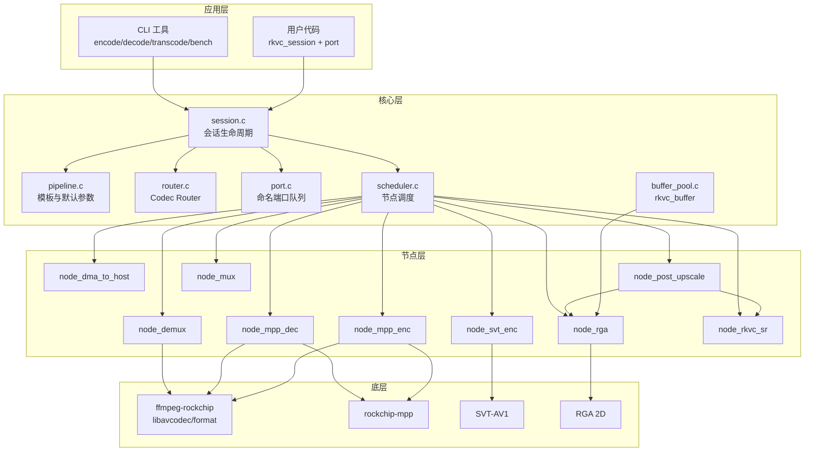

# 架构

rkvc 以 **Session** 为核心，将编解码流程建模为可配置的 **节点图**，由 **Codec Router** 按策略选择 H.264 / HEVC / AV1 路线。

## 平台探测（无预设板卡）

rkvc 不维护任何预设板卡/SoC 知识：所有平台事实都在运行时从系统信息探测（`lib/platform.c`），新增板卡无需改动任何代码。

- **SoC 名**：`/proc/device-tree/compatible` 的 `rockchip,<soc>` 条目（如 `rk3588`、`rk3576`）。
- **NPU**：存在性看 `/sys/kernel/debug/rknpu/version` 或 `/dev/dri/by-path/*npu*`；核心数数 rknpu debugfs `load` 的 `CoreN:` 条目。
- **RGA**：`/dev/rga` 存在性。
- **VPU 编解码能力**：MPP `mpp_get_vcodec_type()`——内核驱动经 `mpp_service` ioctl 上报的硬件能力位（内核不可用时 MPP 按其 SoC 库兜底）；按 MPP 引擎语义映射（VDPU/RKVDEC → 解码、VEPU/RKVENC → 编码、AV1DEC → AV1 硬解；Rockchip 无 AV1 硬编引擎，AV1 编码走软件 SVT-AV1）。
- **NPU 多核自适应**（`lib/rknn_util.h`）：`rkvc_rknn_apply_npu_cores()` 从探测核心数向下尝试 `rknn_set_core_mask`，以 RKNN 驱动为最终权威（如 RK3576 双核自动 0x7→0x3）。
- **能力汇总**：`rkvc_query_caps`（`lib/init.c`）= FFmpeg rkmpp 注册 ∩ 设备权限 ∩ MPP 上报的 VPU 支持；`rkvc_caps.soc` 为探测到的 SoC 名。
- **分辨率上限**：内核无探测渠道（`MPP_DEV_GET_MAX_*` ioctl 未实现），rkvc 不再虚报——超尺寸输入由 MPP 在建链时拒绝。

## 0.4 图内核与后端 DSO（新引擎，rkvc_core）

0.4 起媒体路径迁移到 `rkvc_context → rkvc_request → rkvc_job → rkvc_frame`
公共 ABI（`include/rkvc/`），图内核位于 `lib/graph.c`/`executor.c`/`job.c`：

- **节点生命周期**：`configure` 只协商格式，`open` 才开设备/分配大块内存；
  任一步失败按逆序关闭已打开对象。端口间为**有界队列**（默认深度 3），
  背压经阻塞 push/pull 传递；`rkvc_exec_pull` 以 `RKVC_STATUS_EOF` 表示流结束。
- **规划确定性**：候选顺序 = 后端注册顺序 + 工厂顺序，与 readdir() 无关；
  无候选时规划失败并携带诊断链（`rkvc_diag`：状态码 + 阶段 + 主体 + 原因）。
- **后端 DSO 契约**：后端是导出 `const rkvc_backend *rkvc_backend_query(void)`
  的 `.so`；`rkvc_backend.abi_version` 必须等于核心 `RKVC_ABI_VERSION`
  （ABI 握手），否则淘汰。加载器（`lib/backend_dso.c`）只扫描可信目录
  （包内 `lib/rkvc/backends/`、`/usr/local/lib/rkvc/backends`、
  `/usr/lib/rkvc/backends` 及 context 显式目录；**永不扫描 CWD**），
  `dlopen(RTLD_NOW|RTLD_LOCAL)`，单个候选失败只淘汰并记录诊断，
  句柄随 context 销毁。内建后端经 `rkvc_backend_register_builtins()`
  注册点接入（默认空表，硬件后端编译期替换）。
- **符号收敛**：共享库导出由 `librkvc.map` 白名单控制（RKVC_1.0 旧符号 +
  RKVC_0.4 新 ABI，`local:*` 只在末节点），配合 `-Bsymbolic-functions`
  防 LD_PRELOAD 劫持内部调用。

## 0.4 模型容器（.rkmodel v1）

模型发布单元为 `.rkmodel` 容器（线格式 `lib/rkmodel_layout.h`）：

- **布局**：64B 固定头（magic/version/header_len/payload_count/flags）→
  有界 TLV 头区（≤1MiB；family/role/id/version/rknn_target/min_abi/...，
  未知 tag 跳过）→ 载荷表（≤16 项 × 56B：kind/offset/length/SHA-256）→
  可选签名尾（84B：alg/key_id/Ed25519 sig）→ 载荷数据。
- **签名语义**：覆盖固定头+TLV+载荷表（含全部载荷摘要），因此间接覆盖
  全部载荷；签名尾插入会重排载荷偏移（写入侧负责）。key_id =
  SHA-256(pubkey)[0:16]。
- **信任模型**：trust root 编译期固定（`RKVC_TRUST_PUBKEY_HEX`），
  dev/prod 分离——dev 构建接受开发根签名（trust=development）；
  prod 构建（`RKVC_TRUST_PRODUCTION=ON`）要求生产根签名，
  unsigned 一律 untrusted。无验证后端时已签名模型如实标 untrusted。
- **注册表**：context 创建时扫描可信模型目录（包内 `share/rkvc/models/`、
  系统数据目录、context 显式目录），只读有界头部；载荷按请求装载并校验
  摘要（`RKVC_STATUS_INTEGRITY`）。工具：`python3 -m rkvc_build.rkmodel
  pack|keygen|sign|verify|inspect`。

## 模块关系



## Codec Router

`rkvc_route_resolve()` 根据 `rkvc_pipeline_desc` 中的 `policy`、`codec`、分辨率与帧率选择路线：

| policy                         | 默认路线            | 编码器                              | 解码器       |
| ------------------------------ | ------------------- | ----------------------------------- | ------------ |
| `REALTIME`                     | H.264 RKMPP         | `h264_rkmpp`                        | `h264_rkmpp` |
| `BALANCED`                     | HEVC RKMPP          | `hevc_rkmpp`                        | `hevc_rkmpp` |
| `BALANCED`（1080p+ 且 ≥50fps） | H.264 RKMPP         | `h264_rkmpp`                        | `h264_rkmpp` |
| `QUALITY`                      | AV1                 | `libsvtav1` (preset 11)             | `av1_rkmpp`  |
| `OFFLINE`                      | AV1（非实时高质量） | `libsvtav1` (preset 4，≥1fps@1080p) | `av1_rkmpp`  |

显式设置 `codec` 为 `H264` / `HEVC` / `AV1` 时跳过 policy 路由，强制对应编解码族。

## 管线模板

| 模板             | 用途                 | 典型节点链                                     |
| ---------------- | -------------------- | ---------------------------------------------- |
| `FILE_ENCODE`    | 原始 NV12 → 容器     | mux ← mpp/svt enc ← (rga 下采样)               |
| `FILE_DECODE`    | 容器 → 原始 NV12     | dma_to_host ← (post_upscale) ← mpp dec ← demux |
| `FILE_TRANSCODE` | 容器 → 容器          | mux ← enc ← (rga) ← mpp dec ← demux            |
| `AV1_STORAGE`    | AV1 存储档           | 强制 AV1 SVT + av1_rkmpp                       |
| `LIVE_CAPTURE`   | 低延迟 V4L2 采集编码 | v4l2 → (rga) → mpp/svt enc → mux               |
| `LIVE_TRANSCODE` | 实时端口硬件转码     | capture(bitstream) → mpp dec → (rga) → mpp enc → output |

## Session 端口

每个 Session 暴露三个命名端口，用于流式 push/pull：

| 端口      | 方向 | 数据类型                                 | 说明                                              |
| --------- | ---- | ---------------------------------------- | ------------------------------------------------- |
| `capture` | 输入 | `RKVC_BUF_VIDEO` / `RKVC_BUF_BITSTREAM`  | `LIVE_TRANSCODE` 支持帧或 Annex-B access unit      |
| `output`  | 输出 | `RKVC_BUF_VIDEO` 或 `RKVC_BUF_BITSTREAM` | 解码帧或编码码流                                  |
| `preview` | 输出 | `RKVC_BUF_VIDEO`                         | `LIVE_CAPTURE`：与 `capture` 同帧侧抽；满则丢最旧 |

文件模式通过 `rkvc_session_run_file()` 阻塞跑完整条管线，无需手动操作端口。

### 端口队列语义

`port.c` 实现有界 FIFO（默认深度 3，由 `queue_depth` 配置）：

| 操作                      | 队列满/空 | 返回值                     |
| ------------------------- | --------- | -------------------------- |
| `rkvc_port_push`          | 满        | `RKVC_ERR_AGAIN`           |
| `rkvc_port_pull(..., 0)`  | 空        | `RKVC_ERR_AGAIN`（非阻塞） |
| `rkvc_port_pull(..., N)`  | 空超时    | `RKVC_ERR_AGAIN`           |
| `rkvc_port_pull(..., -1)` | —         | 阻塞直至有数据             |

详见 [api.md](api.md#port)。

## 缓冲区生命周期

1. **分配**: `rkvc_buffer_alloc_video_host()` 创建主机帧，或 `rkvc_buffer_alloc_bitstream()` 包装码流（`copy=0` 为零拷贝引用）
2. **查询**: `rkvc_buffer_kind_of()`、`rkvc_buffer_get_video_info()`（DMA-BUF 元数据）、`get_video_planes()`（主机可写帧）
3. **上传**: 节点内部通过 `av_hwframe_transfer_data` 上传到 RKMPP DMA-BUF
4. **处理**: MPP / SVT 硬件或软件编码；RGA 负责下采样
5. **下载**: `node_dma_to_host` 将硬件帧拉回主机内存
6. **后处理**: `node_post_upscale` 按 `post_upscale_algo` 分流 — **RGA**（`nearest`/`bilinear`/`bicubic`：`node_rga`）或 **RKNN 超分**（`rkvc_sr`：`node_rkvc_sr`）
7. **释放**: `rkvc_buffer_unref()` 引用计数归零时释放

### 独立 RGA API（不经 Session）

`node_rga.c` 同时导出公共 C API，供 CLI `rkvc_yuv_upscale` 与测试直接调用：

- `rkvc_upscale_yuv420p` / `rkvc_upscale_nv12` — 单次平面缩放
- `rkvc_upscale_ctx_*` — 复用 RGA import 的批量上下文

## ROI（区域相对 QP）

| API                    | H.264/HEVC（MPP）                                                                            | SVT-AV1               |
| ---------------------- | -------------------------------------------------------------------------------------------- | --------------------- |
| `rkvc_session_set_roi` | 硬 ROI：`AVRegionOfInterest` + metadata `rkvc_roi_force_intra` → `rkmppenc` → `KEY_ROI_DATA` | 忽略（无硬 ROI 桥接） |

公开结构为 `rkvc_roi_rect{x,y,w,h,qp_offset,force_intra}`；`qp_offset→qoffset` 换算只在 `node_mpp_enc` 一处。桥接层（`rkmppenc`）必要：编码仍走 `avcodec_send_frame`，外部无法直接写 `MppFrame` meta。

## 热切换（码率 / GOP / IDR）

`include/rkvc/reconfig.h`：应用层带宽自适应调用；策略状态机不进 SDK。

| API                       | MPP（H.264/HEVC）                                         | SVT-AV1                           |
| ------------------------- | --------------------------------------------------------- | --------------------------------- |
| `set_bitrate` / `set_gop` | 下一帧写 `AVCodecContext`，`rkmppenc` → `MPP_ENC_SET_CFG` | 仅更新 `desc`（运行中改参需重建） |
| `request_idr`             | 下一帧 `pict_type=I` → `MPP_ENC_SET_IDR_FRAME`            | 挂起标志无硬效果                  |
| `reconfigure`             | 按 `flags` 批量上述项                                     | 同左                              |

分辨率 / profile 变更需重建 Session（mux/SPS 绑定），不在本 API。

## UDP / RTP 原语

`rkvc_net`（`include/rkvc/net.h`）提供码流收发，**不**绑定 Session：

| 模式           | 协议                                       | 用途                          |
| -------------- | ------------------------------------------ | ----------------------------- |
| `RKVC_NET_UDP` | 16B 分片头 + 载荷（最多 16 片）            | 任意裸码流 / Annex-B          |
| `RKVC_NET_RTP` | 12B RTP（PT=96）+ ≤1400B 分片，Marker 帧尾 | 简化 RTP；非完整 RFC / 无 SIP |

典型用法：Session `output` 拉码流 → `rkvc_net_send`；对端 `rkvc_net_recv` → 解码 Session。GB28181 / WebRTC 信令属应用层。

## 下采样 + 后处理上采样

模拟「低分辨率编码 → 解码 → 上采样还原」管线：

```
全分辨率 REF → RGA 1/N 下采样 → 编码 → 解码 → RGA / RKNN 上采样 → 输出
```

对应字段：`enc_scale_denom`（编码前下采样分母）、`post_upscale_algo`（`nearest` / `bilinear` / `bicubic` / `rkvc_sr`，RGA 或 RKVC 神经网络超分）。`width`/`height` 始终为显示/参考分辨率。

**注意**：编码模板（`FILE_ENCODE` / `FILE_TRANSCODE`）只应用下采样；上采样仅在解码模板与 `rkvc_session_upscale` 中执行。

`rkvc_sr` 走开源 Phase-RLFN 单输入 residual core（`lib/node_rkvc_sr.c` / `lib/rkvc_sr_phase.c`）：NV12 直接 PixelUnshuffle 打包，RGA 生成 bicubic 基线，NPU 输出经 PixelShuffle 后叠加回 NV12。只接受 NCHW `12→108` 契约，旧 RGB 与 codec-aware 双输入模型不兼容。导出与 bundle 见 [sr-model-yuv-spec.md](sr-model-yuv-spec.md)。

## 辅助模块

| 模块        | 文件            | 公共 API                                        |
| ----------- | --------------- | ----------------------------------------------- |
| 平台探测    | `platform.c`    | （内部）`rkvc_platform_probe`                   |
| 初始化      | `init.c`        | `rkvc_init` / `rkvc_deinit` / `rkvc_version`    |
| 能力        | `init.c`        | `rkvc_query_caps` / `rkvc_check_hw_permissions` |
| FFmpeg 工具 | `ffmpeg_util.c` | `rkvc_set_log_level` / `rkvc_get_log_level`     |
| 输入探测    | `utils.c`       | `rkvc_probe_input_format`                       |
| 名称转换    | `router.c`      | `rkvc_codec_name` / `rkvc_policy_name`          |

## RKMPP 解码器初始化

RKMPP 解码器在 `avcodec_open2()` 时自动创建硬件设备上下文，无需手动设置 `hw_device_ctx`。这是 ffmpeg-rockchip 的内部行为，与标准 FFmpeg hwaccel API 不同。
