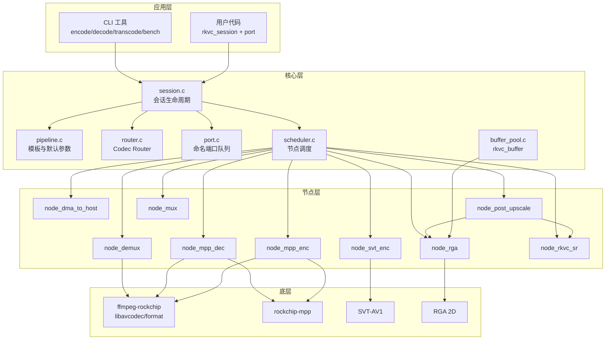

# 架构

rkvc v2 以 **Session** 为核心，将编解码流程建模为可配置的 **节点图**，由 **Codec Router** 按策略选择 H.264 / HEVC / AV1 路线。

## 模块关系



## Codec Router

`rkvc_route_resolve()` 根据 `rkvc_pipeline_desc` 中的 `policy`、`codec`、分辨率与帧率选择路线：

| policy | 默认路线 | 编码器 | 解码器 |
|--------|----------|--------|--------|
| `REALTIME` | H.264 RKMPP | `h264_rkmpp` | `h264_rkmpp` |
| `BALANCED` | HEVC RKMPP | `hevc_rkmpp` | `hevc_rkmpp` |
| `BALANCED`（1080p+ 且 ≥50fps） | H.264 RKMPP | `h264_rkmpp` | `h264_rkmpp` |
| `QUALITY` | AV1 | `svt-av1` (preset 11) | `av1_rkmpp` |
| `OFFLINE` | AV1（非实时高质量） | `svt-av1` (preset 4，≥1fps@1080p) | `av1_rkmpp` |

显式设置 `codec` 为 `H264` / `HEVC` / `AV1` 时跳过 policy 路由，强制对应编解码族。

## 管线模板

| 模板 | 用途 | 典型节点链 |
|------|------|------------|
| `FILE_ENCODE` | 原始 NV12 → 容器 | mux ← mpp/svt enc ← (rga 下采样) |
| `FILE_DECODE` | 容器 → 原始 NV12 | dma_to_host ← (post_upscale) ← mpp dec ← demux |
| `FILE_TRANSCODE` | 容器 → 容器 | mux ← enc ← (rga) ← mpp dec ← demux |
| `AV1_STORAGE` | AV1 存储档 | 强制 AV1 SVT + av1_rkmpp |
| `LIVE_CAPTURE` | 低延迟采集（占位） | V4L2 待接 |

## Session 端口

每个 Session 暴露三个命名端口，用于流式 push/pull：

| 端口 | 方向 | 数据类型 | 说明 |
|------|------|----------|------|
| `capture` | 输入 | `RKVC_BUF_VIDEO` | 采集/原始帧入口 |
| `output` | 输出 | `RKVC_BUF_VIDEO` 或 `RKVC_BUF_BITSTREAM` | 解码帧或编码码流 |
| `preview` | 输出 | `RKVC_BUF_VIDEO` | **占位**：队列已创建，当前无节点向其 push（LiveCapture 规划） |

文件模式通过 `rkvc_session_run_file()` 阻塞跑完整条管线，无需手动操作端口。

### 端口队列语义

`port.c` 实现有界 FIFO（默认深度 3，由 `queue_depth` 配置）：

| 操作 | 队列满/空 | 返回值 |
|------|-----------|--------|
| `rkvc_port_push` | 满 | `RKVC_ERR_AGAIN` |
| `rkvc_port_pull(..., 0)` | 空 | `RKVC_ERR_AGAIN`（非阻塞） |
| `rkvc_port_pull(..., N)` | 空超时 | `RKVC_ERR_AGAIN` |
| `rkvc_port_pull(..., -1)` | — | 阻塞直至有数据 |

详见 [api.md](api.md#port)。

## 缓冲区生命周期

1. **分配**: `rkvc_buffer_alloc_video_host()` 创建主机帧，或 `rkvc_buffer_alloc_bitstream()` 包装码流（`copy=0` 为零拷贝引用）
2. **查询**: `rkvc_buffer_kind_of()`、`rkvc_buffer_get_video_info()`（DMA-BUF 元数据）、`get_video_planes()`（主机可写帧）
3. **上传**: 节点内部通过 `av_hwframe_transfer_data` 上传到 RKMPP DMA-BUF
4. **处理**: MPP / SVT 硬件或软件编码；RGA 负责下采样
5. **下载**: `node_dma_to_host` 将硬件帧拉回主机内存
6. **后处理**: `node_post_upscale` 按 `post_upscale_algo` 分流 — **RGA**（`nearest`/`bilinear`/`bicubic`：`node_rga`）或 **RKNN 超分**（`rkvc_sr`：`node_rkvc_sr`）
7. **释放**: `rkvc_buffer_unref()` 引用计数归零时释放

### 独立 RGA API（不经 Session）

`node_rga.c` 同时导出公共 C API，供 CLI `rkvc_yuv_upscale` 与测试直接调用：

- `rkvc_upscale_yuv420p` / `rkvc_upscale_nv12` — 单次平面缩放
- `rkvc_upscale_ctx_*` — 复用 RGA import 的批量上下文

## 下采样 + 后处理上采样

模拟「低分辨率编码 → 解码 → 上采样还原」管线：

```
全分辨率 REF → RGA 1/N 下采样 → 编码 → 解码 → RGA / RKNN 上采样 → 输出
```

对应字段：`enc_scale_denom`（编码前下采样分母）、`post_upscale_algo`（`nearest` / `bilinear` / `bicubic` / `rkvc_sr`，RGA 或 RKVC 神经网络超分）。`width`/`height` 始终为显示/参考分辨率。

**注意**：编码模板（`FILE_ENCODE` / `FILE_TRANSCODE`）只应用下采样；上采样仅在解码模板与 `rkvc_session_upscale` 中执行。

`rkvc_sr` 走 RKVC 神经网络超分（`lib/node_rkvc_sr.c`）。现网模型在 RGB 域训练，推理含 NV12↔RGB CSC；下一代 **YUV-native** 模型规格见 [sr-model-yuv-spec.md](sr-model-yuv-spec.md)。

## 辅助模块

| 模块 | 文件 | 公共 API |
|------|------|----------|
| 初始化 | `init.c` | `rkvc_init` / `rkvc_deinit` / `rkvc_version` |
| 能力 | `init.c` | `rkvc_query_caps` / `rkvc_check_hw_permissions` |
| FFmpeg 工具 | `ffmpeg_util.c` | `rkvc_set_log_level` / `rkvc_hash_file` |
| 输入探测 | `utils.c` | `rkvc_probe_input_format` |
| 名称转换 | `router.c` | `rkvc_codec_name` / `rkvc_policy_name` |

## RKMPP 解码器初始化

RKMPP 解码器在 `avcodec_open2()` 时自动创建硬件设备上下文，无需手动设置 `hw_device_ctx`。这是 ffmpeg-rockchip 的内部行为，与标准 FFmpeg hwaccel API 不同。
