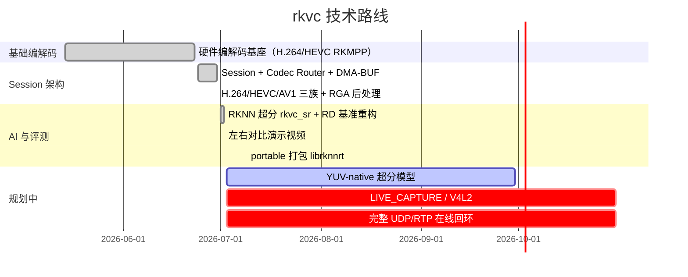

# rkvc 项目交付文档

> **版本**: 见 `CMakeLists.txt` `project(VERSION)` · **硬件**: RK3588 / RK3588S · **架构**: Session + Pipeline + Codec Router

面向客户与集成方的**交付清单**。技术细节以子文档为准，避免与本页重复维护。

---

## 场景概览：离线 vs 在线

### 离线压缩（已交付，可验收）

适用于录像文件、批量转码、RD 评测等**非实时**场景，通过 `rkvc_session_run_file()` 一次性跑完整条管线。

| 模式                      | 模板 / 工具                         | 典型用途          | 输入 → 输出                  |
| ------------------------- | ----------------------------------- | ----------------- | ---------------------------- |
| 文件编码                  | `FILE_ENCODE` / `rkvc_encode`       | 原始 NV12 入库    | NV12 → MP4（H.264/HEVC/AV1） |
| 文件转码                  | `FILE_TRANSCODE` / `rkvc_transcode` | 码流换格式/换策略 | 容器 → 容器                  |
| 文件解码                  | `FILE_DECODE` / `rkvc_decode`       | 回放、后处理      | 容器 → NV12                  |
| 低分辨率编码 + 上采样还原 | `rkvc_session_upscale`              | AI/RGA 画质评估   | 容器 → NV12（全分辨率）      |
| RD 基准                   | `bench/run_rd_benchmark.sh`         | 码率-画质曲线     | 1080p 片段 → CSV/图表        |

**特点**：吞吐优先，可跑满存储 I/O；`QUALITY` 策略下 SVT-AV1 **软编码**会占满多核 CPU，但编解码均可离线批处理。

### 在线压缩（部分交付，有已知缺口）

适用于摄像头采集、低延迟预览、流式推拉等**实时**场景，通过 Session **命名端口**（`capture` / `output`；`preview` 为占位）逐帧 push/pull。

| 能力                       | 状态           | 说明                                                                                   |
| -------------------------- | -------------- | -------------------------------------------------------------------------------------- |
| 低延迟编解码链路           | ✅ 可测         | LIVE_CAPTURE + `low_latency`（`example_live_capture`）                                 |
| 流式 Session API           | ✅ 可用         | `example_stream_ports`（命名端口 push/pull 并发消费）                                  |
| 三策略实时转码             | ✅ 可用         | `REALTIME`→H.264 硬编（E2E ~36 fps@1080p 转码）；`BALANCED` ~27 fps；`QUALITY` ~24 fps |
| 非实时高质量               | ✅ 可用         | `OFFLINE`→SVT-AV1 preset 4 + 硬解（~2 fps@1080p，≥1 fps）                              |
| V4L2 采集 (`LIVE_CAPTURE`) | ✅ 可用         | `capture_device` + `example_live_capture`；`"mock"` 合成源可测                         |
| UDP/RTP 网络回环           | ✅ 原语         | `rkvc_net_*` + `example_net_loopback` / `network-e2e-test.sh`                          |
| ROI                        | ✅ 硬路径       | H.264/HEVC：`rkmppenc`→MPP `KEY_ROI_DATA`（相对 QP / force_intra）；SVT 忽略           |
| 多 Session 配额            | ✅ 可用         | `rkvc_runtime_set_quota`                                                               |
| 热切换（码率/GOP/IDR）     | ✅ 可用         | `rkvc_session_set_bitrate` / `set_gop` / `request_idr`（MPP）                          |
| `preview` 端口             | ✅ LIVE_CAPTURE | 与 `capture` 同帧侧抽；满则丢最旧                                                      |

**在线 vs 离线差异小结**：

- **编码侧**：在线推荐 `REALTIME`（H.264 RKMPP 硬编，CPU 占用低）；近实时可用 `QUALITY`（SVT-AV1 p11）；离线归档用 `OFFLINE`（SVT-AV1 p4，画质更高、≥1fps@1080p）。
- **解码侧**：H.264 / HEVC / AV1 均为 **RKMPP 硬解**，在线/离线共用，单帧硬解耗时可忽略（见下文 AI 性能表）。
- **AI 超分**：当前为**解码后处理**，适合「边缘低码率上传 + 云端/终端解码还原」；编码阶段不做 NPU 推理。

---

## 技术路线与里程碑



| 节点                         | 内容                                       | 状态       | 完成时间                                                |
| ---------------------------- | ------------------------------------------ | ---------- | ------------------------------------------------------- |
| **P0** 硬件编解码基座        | ffmpeg-rockchip + MPP：H.264/HEVC 硬编硬解 | ✅ 已交付   | 2026-05 ~ 06                                            |
| **P1** Session 架构          | Codec Router、管线模板、可移植包           | ✅ 已交付   | **2026-06-30**（v0.2.0）                                |
| **P2** AV1 存储档            | SVT-AV1 软编 + `av1_rkmpp` 硬解            | ✅ 已交付   | 2026-06-30                                              |
| **P3** 下采样 + RGA 上采样   | `enc_scale_denom` + `post_upscale_algo`    | ✅ 已交付   | 2026-06-30                                              |
| **P4** RKNN AI 超分          | `rkvc_sr` 节点、双缓冲异步推理             | ✅ 已交付   | **2026-07-02**（v0.2.1）                                |
| **P5** RD 基准与演示         | `bench/config.json`、对比演示 MP4          | ✅ 已交付   | 2026-07-02                                              |
| **P5b** portable 自包含 RKNN | 可移植包携带 `librknnrt.so` + `models/`    | ✅ 已交付   | **2026-07-09**（v0.2.3）                                |
| **P6** YUV-native 模型       | 消除 NV12↔RGB CSC，降延迟                  | 📋 设计稿   | 待定（见 [sr-model-yuv-spec.md](sr-model-yuv-spec.md)） |
| **P7** 在线采集/组网         | V4L2、ROI/配额、UDP/RTP 原语               | ✅ 原语完成 | 2026-07-10                                              |

---

## 文档导航

| 主题                      | 文档                                         |
| ------------------------- | -------------------------------------------- |
| 快速构建与首次运行        | [getting-started.md](getting-started.md)     |
| 架构与节点                | [architecture.md](architecture.md)           |
| API 参考                  | [api.md](api.md)（含 Doxygen 生成说明）      |
| 打包与可移植包            | [packaging.md](packaging.md)                 |
| 测试与质量门禁            | [testing.md](testing.md)                     |
| 性能与 RD 基准            | [benchmark.md](benchmark.md)                 |
| YUV-native 超分（设计稿） | [sr-model-yuv-spec.md](sr-model-yuv-spec.md) |
| 发布包用户文档            | [release/README.md](release/README.md)       |

---

## 交付物检查清单

### 源码与版本

- [ ] `CMakeLists.txt` `project(VERSION)` 与 `rkvc_version()` / `rkvc_info -v` 一致
- [ ] `git submodule` 已初始化（浅克隆：`third_party/{SVT-AV1,mpp,ffmpeg-rockchip,librga}`）
- [ ] `CHANGELOG.md` 已记录本次变更

### 构建产物

- [ ] Release 构建成功：`cmake --preset default && cmake --build --preset default`（产物在 `.build/release/`，约定见 [build-layout.md](build-layout.md)）
- [ ] CLI：`rkvc_encode`、`rkvc_decode`、`rkvc_transcode`、`rkvc_info`、`rkvc_bench`、`rkvc_session_upscale`、`rkvc_yuv_upscale`
- [ ] 示例程序（含 `example_encode_file`、`example_decode_file` 等）

### 可移植包

```bash
./scripts/package-portable.sh
source scripts/build-common.sh
./scripts/test-portable.sh ".build/dist/$(rkvc_portable_pkg_dir)"
```

- [ ] 产物：`rkvc-*-linux-aarch64-portable.tar.gz`（约 7–8 MB，含 `librga` + `librknnrt` + `models/`）
- [ ] 包内 `./test.sh` 全过（含可选 `rkvc_sr` NPU 冒烟）
- [ ] 包内 `./network-e2e-test.sh` 冒烟通过（UDP/RTP 本机回环）

### 测试门禁

```bash
./scripts/test-strict.sh
export RKVC_RUN_HARDWARE_TESTS=1
ctest --test-dir .build/tests -j1 -R 'test_session_' --output-on-failure
./scripts/test-rga.sh
./scripts/test-npu-sr.sh
```

- [ ] `tests` preset：**19** 个 CTest 目标（9 单元 + 8 硬件子用例 + `test_cli_args`、`test_bench_permission_failure`）
- [ ] RK3588 实机硬件用例通过（夹具自生成，无需 `tests/fixtures/`）
- [ ] NPU 门禁：`./scripts/test-npu-sr.sh`（需 `models/rkvc_sr_x3.crypt.rknn`）

### 设备与环境

- [ ] SoC：RK3588 / RK3588S，BSP 内核 5.10 或 6.1
- [ ] 设备权限：`/dev/mpp_service`、`/dev/dma_heap/*`、`/dev/rga`、`/dev/dri/*`、NPU（`/sys/kernel/debug/rknpu/version` 或 `*npu-render*`）（见 [getting-started.md](getting-started.md)）
- [ ] 依赖脚本已执行：`build-svt.sh`、`install-librga.sh`、`rebuild-ffmpeg-rkmpp.sh`
- [ ] AI 超分模型：`models/rkvc_sr_x3.crypt.rknn`（gitignore；打包时自动拷贝）

---

## 功能验收要点

| 能力              | 验收方式                                                                                    |
| ----------------- | ------------------------------------------------------------------------------------------- |
| 四策略转码        | `rkvc_transcode -p realtime\|balanced\|quality\|offline`                                    |
| E2E fps           | `rkvc_bench -i clip.mp4`（须 `-i` 指定输入）                                                |
| RGA 后处理上采样  | `rkvc_session_upscale --enc-scale-denom 2 --post-upscale bilinear`                          |
| RKNN 超分（可选） | `rkvc_session_upscale --post-upscale rkvc_sr --rkvc-sr-model PATH`（需 `RKVC_ENABLE_RKNN`） |
| 多像素格式解码    | `./example_decode_file input.mp4 out.yuv p010`                                              |
| RD 基准           | `./bench/run_rd_benchmark.sh /path/to/1080p.mp4`                                            |

---

## AI 超分与 RK3588 性能（`rkvc_sr`）

> 评测条件：**RK3588** · **1920×1080** · 测试片段默认 **4 s / ~122 帧 @ 30 fps**（`bench/config.json` `clip.sec=4`）· 模型 **`rkvc_sr_x3.crypt.rknn`（3× 超分）**

### 管线说明

```
全分辨率 1080p REF
  → RGA 1/3 下采样（360p）→ 编码（SVT-AV1 / RKMPP）
  → 硬解（av1_rkmpp / h264_rkmpp）
  → RKNN 3× 超分 + RGA CSC（NV12↔RGB）
  → 输出 1080p NV12
```

现网模型在 **RGB 域**训练，每帧含 2 次 RGA 色彩转换；下一代 **YUV-native** 模型可去掉 CSC（见 [sr-model-yuv-spec.md](sr-model-yuv-spec.md)）。

### 单帧耗时（1080p，3× 路线，RD 基准实测）

| 阶段                     | 耗时/帧（约）            | 硬件            | 说明                                                   |
| ------------------------ | ------------------------ | --------------- | ------------------------------------------------------ |
| 硬解码                   | **< 0.2 ms**             | VPU（RKMPP）    | `decode_sec` ≈ 0.02 s / 122 帧                         |
| AI 超分推理 + CSC        | **~14 ms**               | NPU + RGA       | `postproc_sec` ≈ 1.7 s / 122 帧（含 RKNN 与 NV12↔RGB） |
| NEON 量化/反量化         | 含于 postproc            | CPU（A76）      | `rkvc_sr_neon.c`                                       |
| **解码 + AI 还原合计**   | **~14 ms/帧（~70 fps）** | VPU + NPU       | 仅解码侧；不含编码                                     |
| 全链路 E2E（含 3× 编码） | **~73 ms/帧**            | VPU + NPU + CPU | 含 SVT-AV1 软编 + 硬解 + AI 还原（500 kbps 测点）      |

### CPU / NPU / 硬编支持

| 资源         | 在线（`REALTIME`）                            | 离线（`QUALITY` + AI 还原）                         |
| ------------ | --------------------------------------------- | --------------------------------------------------- |
| **CPU**      | 低（硬编 H.264，调度为主）                    | 高（SVT-AV1 软编占满多核；AI 路径 NEON 量化）       |
| **NPU**      | 解码后处理时占用（`rkvc_sr`）                 | 同左；`rknn_set_core_mask` 使用三核                 |
| **VPU 硬编** | ✅ H.264 / HEVC（`h264_rkmpp` / `hevc_rkmpp`） | ✅ 同左                                              |
| **VPU 硬解** | ✅ H.264 / HEVC / AV1（`av1_rkmpp`）           | ✅ 同左                                              |
| **AV1 编码** | —                                             | ❌ 无硬编；SVT-AV1 **软件编码**（`libSvtAv1Enc.so`） |

> **结论**：AI 超分是**解码后处理**，不替代编码器；低码率优势来自「360p 编码 + 3× AI 还原」。在线场景若需 AI 还原，需保证 NPU 预算 ~15 ms/帧（1080p 输出）。

复现计时：

```bash
.build/release/rkvc_session_upscale -i clip.mp4 -o out.nv12 \
  --width 1920 --height 1080 --enc-scale-denom 3 \
  --post-upscale rkvc_sr --rkvc-sr-model rkvc_sr_x3.crypt.rknn --print-timing
```

---

## 效果展示与画质指标

### 指标通俗说明

| 指标                        | 含义                                            | 怎么读                                                              |
| --------------------------- | ----------------------------------------------- | ------------------------------------------------------------------- |
| **PSNR**（峰值信噪比，dB）  | 重建画面与原始画面的像素误差；**越高越好**      | > 40 dB 肉眼难辨差异；30~35 dB 轻微模糊；< 28 dB 明显失真           |
| **SSIM**（结构相似度，0~1） | 衡量亮度/对比度/结构是否保留；**越接近 1 越好** | > 0.95 极好；0.80~0.90 可接受；< 0.75 细节损失明显                  |
| **码率**（kbps）            | 每秒传输的数据量；**越低越省带宽**              | 同画质下码率越低越优；AI 路线目标是在**更低码率**下逼近全分辨率画质 |

### 关键帧对比（演示片）

左右对比演示片由 `scripts/make-comparison-demo.sh` 生成：**左** = 1080p 全分辨率 AV1 参考；**右** = 1/3 分辨率低码率 AV1 + **RKVC SR 3×** 还原。

| 场景           | 参考码率  | 低码率 + AI 还原 | 演示输出（生成后）                                            |
| -------------- | --------- | ---------------- | ------------------------------------------------------------- |
| 集装箱物流港口 | 1600 kbps | 350 kbps         | `bench/results/demos/container_logistics_port_comparison.mp4` |
| 帆船海洋       | 4000 kbps | 900 kbps         | `bench/results/demos/sailboat_ocean_comparison.mp4`           |

```bash
./scripts/make-comparison-demo.sh   # 需源视频与 RKVC SR 模型；见 bench/demo_videos.json
```

完整演示片默认写到 `bench/results/demos/*.mp4`（不入库；需自行生成或向交付方索取）。

### RD 曲线与性能图（1080p E2E）


### 量化对比（1080p · 4 s 片段 · 3× 下采样编码 · 目标码率 500 kbps）

> 数据来源：`bench/results/rd_data.csv`（RK3588 实测）

| 方案                         | 实际码率  | PSNR 加权   | SSIM      | 相对全分辨率 AV1                                       |
| ---------------------------- | --------- | ----------- | --------- | ------------------------------------------------------ |
| SVT-AV1 **全分辨率**（基线） | 1423 kbps | **32.4 dB** | **0.879** | —                                                      |
| 3× 下采样 + **双线性**上采样 | 1494 kbps | 27.0 dB     | 0.775     | 带宽相近，画质 **-5.4 dB**                             |
| 3× 下采样 + **`rkvc_sr` AI** | 1494 kbps | **29.0 dB** | **0.821** | 比双线性 **+2.0 dB / +0.046 SSIM**，仍低于全分辨率基线 |

**解读**：在相近码率下，AI 超分显著优于传统插值（边缘更锐利、纹理更少涂抹），但尚不能完全追平全分辨率编码；适合**带宽敏感**且可接受轻微画质损失的场景。YUV-native 模型上线后预期进一步缩小与基线的差距。

复现 RD 数据：

```bash
ENC_SCALE_DENOM=3 RUN_CODECS=svt-av1,post-upscale \
  UPSCALE_ALGOS=bilinear,rkvc_sr ./bench/run_rd_benchmark.sh /path/to/1080p.mp4
```

---

## 解码端部署与平台兼容

### 解码服务器算力要求（仅解码 / 解码 + AI 还原）

| 部署形态                        | 最低配置                                   | 推荐配置             | 预期吞吐（1080p）                                          |
| ------------------------------- | ------------------------------------------ | -------------------- | ---------------------------------------------------------- |
| **纯硬解**（H.264/HEVC/AV1）    | RK3588 · 2 GB RAM · Linux aarch64          | 4 GB RAM · 散热良好  | **> 60 fps**（单路，VPU 瓶颈）                             |
| **硬解 + RGA 双线性 3× 还原**   | 同上 + `/dev/rga`                          | 4 GB RAM             | **~15~20 fps**（RGA 上采样为主）                           |
| **硬解 + `rkvc_sr` AI 3× 还原** | RK3588 · 4 GB RAM · NPU 驱动 · `librknnrt` | 8 GB RAM（多路并发） | **~70 fps** 单路理论（~14 ms/帧）；多路按 NPU 份额线性分摊 |

**系统依赖**（解码端必需）：

```bash
# 设备节点（权限不足返回 RKVC_ERR_PERMISSION）
/dev/mpp_service          # VPU 编解码
/dev/dma_heap/*           # DMA-BUF 分配
/dev/rga                  # 缩放 / CSC（AI 路径必需）
/dev/dri/*                # DRM（部分硬解路径）

# 用户态库（可移植包已 RPATH 自包含）
librockchip_mpp · ffmpeg-rockchip · librga · librknnrt（AI 路径）
```

**不需要**在纯解码端安装 SVT-AV1（仅编码/转码 `QUALITY` 策略时需要 `libSvtAv1Enc.so`）。

### 支持架构

| 架构 / 平台                             | 支持情况         | 说明                                                                                                              |
| --------------------------------------- | ---------------- | ----------------------------------------------------------------------------------------------------------------- |
| **Linux aarch64**（RK3588 / RK3588S）   | ✅ **官方支持**   | 可移植包 `rkvc-*-linux-aarch64-portable.tar.gz` 须在目标机构建                                                    |
| **Linux aarch64**（RK3568 / RK3566 等） | ❌ **未支持**     | MPP/VPU 版本不同、NPU 算力弱（RK3568 NPU ≈ 1 TOPS vs RK3588 ≈ 6 TOPS），**未做兼容测试**                          |
| **Android**（aarch64）                  | ⚠️ **未官方交付** | 代码依赖 Linux 设备节点与 BSP 用户态库；理论上可用 Rockchip Android BSP + NDK 移植，**当前无 APK/AAR 与 CI 验证** |
| **x86_64 / 其他**                       | ❌ 不支持         | RKMPP / RGA / RKNN 均为 Rockchip 专有硬件栈                                                                       |

### 常见问题

| 问题                          | 答复                                                                                |
| ----------------------------- | ----------------------------------------------------------------------------------- |
| 解码服务器能否用 x86 + 软解？ | 本仓库 **不提供** x86 构建；软解 AV1 可用系统 FFmpeg，但不在 rkvc 交付范围          |
| RK3568 能否跑 `rkvc_sr`？     | **不能作为交付目标**；NPU 型号与 RKNN 模型均面向 RK3588 导出                        |
| Android 上能否跑起来？        | 需自行移植并替换设备访问层；建议以 **RK3588 Linux 板** 作为首批集成平台             |
| 多路并发怎么估？              | 单路 AI 还原约 14 ms/帧 → 1 路 1080p@30 fps 余量充足；4 路并发需实测 NPU 调度与散热 |

CLI 快速验证解码端：

```bash
./rkvc_info -j                    # 确认 h264_dec/hevc_dec/av1_dec = 1
./rkvc_decode -i stream.mp4 -o out.nv12
./rkvc_session_upscale -i low.mp4 -o out.nv12 \
  --width 1920 --height 1080 --post-upscale rkvc_sr --rkvc-sr-model model.rknn
```

---

## 已知限制

- 仅支持 RK3588 / RK3588S；可移植包须在 **aarch64 目标机**构建
- 板端摄像头 `STREAMON` 可能因 ISP 未就绪返回 `EPERM`；完整 GB28181/WebRTC 信令属应用层
- `rkvc_encode -i` 仅接受原始 NV12；`--enc-scale-denom` 只做编码前下采样
- **后处理上采样**（RGA / `rkvc_sr`）仅 `rkvc_session_upscale` / `FILE_DECODE`；编码路径请用 `rkvc_encode --enc-scale-denom`
- `QUALITY` 依赖 SVT-AV1 软件编码，CPU 占用高于硬编
- 现网 `rkvc_sr` 模型为 RGB 域；YUV-native 规格见 [sr-model-yuv-spec.md](sr-model-yuv-spec.md)

---

## 故障排查（速查）

| 症状                        | 处理                                                            |
| --------------------------- | --------------------------------------------------------------- |
| `RKVC_ERR_PERMISSION`       | 检查设备节点权限（见上）                                        |
| `RKVC_ERR_FORMAT`           | 编码用 NV12；压缩文件用 decode/transcode                        |
| `RKVC_ERR_HW` / `NOT_FOUND` | `rkvc_info -j`；重跑 `rebuild-ffmpeg-rkmpp.sh`、`build-svt.sh`  |
| AV1 失败                    | 确认 `libSvtAv1Enc.so` 存在                                     |
| `rkvc_bench` 无输入         | `rkvc_bench -i clip.mp4` 或先 `example_encode_file -o test.mp4` |

```bash
export RKVC_LOG_LEVEL=debug   # 或代码中 rkvc_set_log_level(AV_LOG_DEBUG)
rkvc_info -j
./.build/release/rkvc_bench -i test.mp4
```

---

## 许可与第三方

| 组件            | 许可                                  | 位置                           |
| --------------- | ------------------------------------- | ------------------------------ |
| rkvc（本项目）  | AGPL-3.0-or-later（双许可见 LICENSE） | 源码树 `LICENSE`               |
| ffmpeg-rockchip | LGPLv3（`--enable-version3` 构建）    | `third_party/ffmpeg-rockchip/` |
| Rockchip MPP    | Apache 2.0 / MIT                      | `third_party/mpp/`             |
| SVT-AV1         | BSD-3-Clause Clear + AOM PATENTS      | `third_party/SVT-AV1/`         |
| librga          | Apache 2.0                            | `third_party/librga/`          |
| libsodium       | ISC                                   | `third_party/libsodium/`       |
