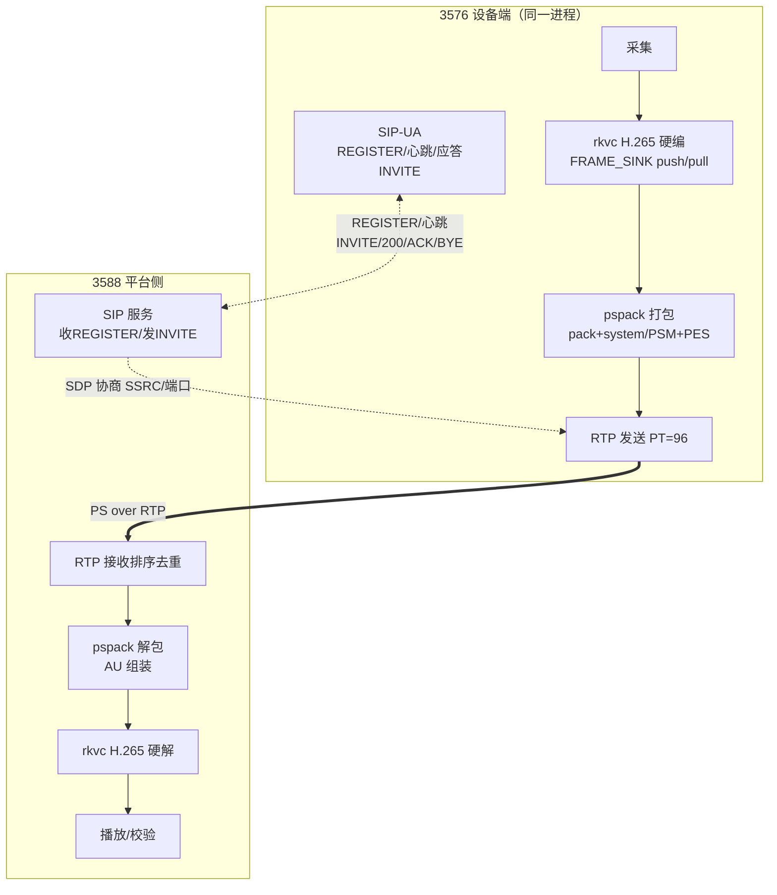

# GB28181 H.265 推流（PS over RTP）

> 范围：GB/T 28181-2022 的 H.265 媒体面（PS 封装 + RTP 承载）与本仓
> `codecs/pspack` 的实现口径。SIP 信令只记流程，信令栈归宿主；
> MLVC 承载见 [mlvc-streaming-spec.md](mlvc-streaming-spec.md)。

## 1. 角色与流程

3576 作设备端（编码推流），3588 作平台侧（收流解码）。代码只有一份，
差异仅 SIP 行为（设备发 REGISTER/应答 INVITE，平台收 REGISTER/发起 INVITE）。

## 2. 信令流程（宿主负责）

1. 设备 `REGISTER` → 平台 401 → 带 Digest 再注册，心跳保活。
2. 平台 `INVITE`（SDP 含 `m=video … RTP/AVP 96`、`a=rtpmap:96 PS/90000`、
   `y=` SSRC、端口与 TCP 主被动）→ 设备 `200 OK`（SDP 应答）→ 平台 `ACK`。
3. 设备按协商地址起流；结束平台发 `BYE`。传输优先 TCP 被动/主动，
   UDP 仅受控链路可用。

## 3. PS 容器格式（实现口径）

视频单节目，PES `stream_id = 0xE0`，`stream_type` H.265 = `0x24`、
H.264 = `0x1B`。每帧恰一个 pack；关键帧的 pack 内 pack 头之后
依次为 system 头、PSM，再接首个 PES。

### 3.1 pack 头（14B：`00 00 01 BA` + 10B）

| 位宽    | 字段                                 | 取值                                                 |
| ------- | ------------------------------------ | ---------------------------------------------------- |
| 2       | 固定                                 | `01`                                                 |
| 33+9    | SCR base + ext                       | SCR base = PTS（90kHz），ext = 0                     |
| 22      | program_mux_rate                     | `MuxOptions.mux_rate_50bs`（默认 25000，50B/s 单位） |
| 1+1+5+3 | marker + marker + `11111` + stuffing | 填充长度 0                                           |

### 3.2 system 头（15B：`00 00 01 BB` + 2B 长度 9 + 9B）

`rate_bound` 同 mux_rate；`audio_bound = 0`、`video_bound = 1`；
随后一个视频绑定项：`0xE0` + `11` + scale 1 + bound 230。

### 3.3 PSM（20B：`00 00 01 BC` + 2B 长度 14 + 10B 表 + 4B CRC32）

表：`0xC0 0xFF` + 空节目信息 + ES 映射长 4 + 单表项
`[stream_type, 0xE0, 0x0000]`；CRC32（IEEE）覆盖表 10B。
仅关键帧 pack 携带，晚加入者从任一关键帧起解。

### 3.4 PES（首包 14B 头 + 载荷，续包 9B 头 + 载荷）

| 包  | 头                                             | 说明                            |
| --- | ---------------------------------------------- | ------------------------------- |
| 首  | `00 00 01 E0` + 显式长度 + `84 80 05` + 5B PTS | `data_alignment = 1` 标 AU 起点 |
| 续  | `00 00 01 E0` + 显式长度 + `80 00 00`          | 无 PTS，载荷 ≤ 60000B           |

单 AU 超 60KB 按 60000B 切片；载荷为 Annex-B 原样（含起始码，
仿真防范保证包内无伪起始码）。单 AU 上限 64MB（`kMaxPayload`）。

## 4. `pspack` 契约

- `mux_frame(codec, annexb, size, pts90, keyframe)`：一调用一 AU，
  失败 `Invalid`（空/空指针）/`Format`（超 64MB）。
- `Demux::append/next/flush`：`next` 在下个 AU 起点到达时吐出上一个 AU
 （固定一帧管线延迟，PTS 保序显示无碍）；流尾调 `flush` 排最后一帧，
  排空后 `flush` 报 `Eof`；数据不够报 `Again`。
- 无 PSM 先验时按 NAL 嗅探定 codec（HEVC 优先，AVC 的 SPS/IDR 低 5 位
  可能与 HEVC 保留类型混淆，故 PSM 为准）。
- 配对约束：只与本打包器帧格式配对（align 位组帧）；第三方 PS
  走 ES 解析器，不进本解包器。`len == 0` 的视频 PES 直接判 `Format`。
- PTS 33 位回绕（`& 0x1FFFFFFFF`），DTS 恒等于 PTS（无 B 帧）。

## 5. RTP 与时钟

- PT = 96，时钟 90000Hz，Marker 置于一帧末包；载荷上限 1400B 等长切片。
- 编码输入 `pts` 有效则换算 90kHz；未知哨兵时首帧为 0 按帧率标称递增。
- rANS 式的零容忍在此不适用，但丢包仍打乱 AU 组装：优先 TCP/SRT 类
  可靠承载；UDP 下平台按 PSM/关键帧重同步。

## 6. 分工与验收

- 本仓：`rkvc` 编解码 + `pspack` 装箱/拆箱（字节精确到 AU）。
- 宿主：SIP 会话生死、socket 收发与重传/排序、线程与配置、播放渲染。
- 验收：注册心跳正常、点播可拉起、推送稳定、解码无花屏卡顿；
  花屏先查 PSM/`stream_type`/PTS，卡顿先查 RTP 排序与 AU 组装。
