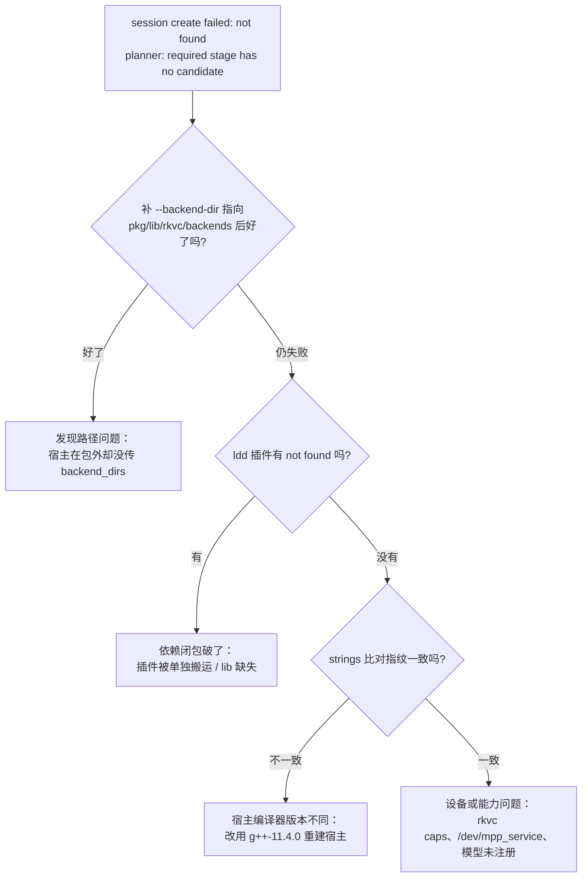

# 可移植包 × 宿主集成

> 面向把 rkvc 内嵌进下游宿主（如 `semantic-codec-sdk` / ais SDK）的集成者，
> 回答一个问题：`tools/portable/build.sh` 产出的 tarball，要怎么和宿主拼到一起。
> 宿主侧 C ABI 契约、内嵌构建见
> [semantic-codec-sdk-integration.md](semantic-codec-sdk-integration.md)；
> 包怎么构建、怎么单独部署见 [deployment.md](deployment.md)。
> 本文的结论均为 2026-09-10 在 RK3576（Ubuntu 22.04.5）实测。

## 1. 包的定位：运行期交付物，不是 SDK

| 包内有                                                    | 包内没有                                   |
| --------------------------------------------------------- | ------------------------------------------ |
| `bin/rkvc`（CLI，C++ 运行时静态链接）                     | **头文件**（`core/include/rkvc/*.h`）      |
| `lib/rkvc/backends/rkvc_*.so`（codec 插件）               | **core 库**（静态或动态）                  |
| `lib/*.so*`（MPP / rknnrt / SVT-AV1）                     | CMake package config / `find_package` 支持 |
| `licenses/`、可选 `models/`、`test.sh`、`MANIFEST.sha256` | codec 插件开发用的 `plugin.hpp`            |

因此集成天然分两半，两边不要混：

1. **构建期**：宿主自己从源码内嵌 core（`add_subdirectory(core)` + 链
   `rkvc::core`），这一段与包无关，按
   [SDK 集成 §3.1](semantic-codec-sdk-integration.md) 做。
2. **运行期**：宿主从包里取 **插件** 与 **第三方运行库**（本文）。

包的这部分职责是确定的：插件是运行时 `dlopen` 的独立 DSO，第三方库随包携带
且 RUNPATH 全 `$ORIGIN` 相对，所以**宿主不需要把包的路径写进
`LD_LIBRARY_PATH`，也不需要重编**。

若希望"包即 SDK"（拿到包就能编宿主），需要补 `librkvc.so` + 头文件 +
CMake config；当前**不提供**，宿主一律走源码内嵌。

## 2. 宿主怎么找到包内插件

`rkvc_context_create` 按下列顺序收集 `*.so`（`core/src/c_api.cpp`，目录内排序
后逐个握手，失败静默跳过）：

| #   | 目录                                     | 说明                                                                    |
| --- | ---------------------------------------- | ----------------------------------------------------------------------- |
| ①   | `rkvc_context_options.backend_dirs`      | 调用方显式传入，按数组顺序；**先命中的赢**                              |
| ②   | `<含 core 的映像所在目录>/rkvc/backends` | `dladdr` 定位；映像是宿主可执行文件**或宿主 .so**                       |
| ③   | `<同上目录>/../lib/rkvc/backends`        | 可移植包布局；与 ② 都会尝试（重复命中时第二次按重复工厂拒载，无副作用） |
| ④   | `/usr/local/lib/rkvc/backends`           | 系统安装位                                                              |
| ⑤   | `/usr/lib/rkvc/backends`                 | 系统安装位                                                              |

据此可选四类部署位，实测（`av1` 软编 3 帧 640×360，宿主二进制在
`/tmp/hosttest/bin/`，包在 `/tmp/rkvc-pkg/...`）：

| 部署位                           | 宿主需要传参                                        | 结果                                                           |
| -------------------------------- | --------------------------------------------------- | -------------------------------------------------------------- |
| **A. 宿主在包外**（最常见）      | 必须：`backend_dirs` 指向 `<pkg>/lib/rkvc/backends` | 实测：无参 `rc=2` "no candidate"；传参 `rc=0`，547692 B        |
| **B. 宿主映像落在 `<pkg>/lib/`** | 不需要（命中 ③）                                    | 实测：`rc=0`，547692 B                                         |
| **C. 宿主映像落在 `<pkg>/bin/`** | 不需要（命中 ③）                                    | 实测：包内 CLI 即此形态，`test.sh` 全程不传 `--backend-dir` 也能跑通 |
| D. 插件装到系统路径              | 不需要（命中 ④/⑤）                                  | 未实测，按代码顺序推断；须自行保证三方库可解析（§4）           |

> **上游宿主是共享库**（`libais_semantic_codec.so`），部署位 B 对它成立：把
> `libais_semantic_codec.so` 放进 `<pkg>/lib/`，`dladdr` 取到的就是该 .so 的
> 路径，`lib/rkvc/backends` 直接命中，宿主侧一行配置都不用写。这是把包交付给
> 上层应用时最省事的摆法（上表用二进制置于 `<pkg>/lib/` 复现同一条 dladdr
> 路径，.so 形态未单独实测）。

A 的接线（C，节选自 `rkvc_context_options` 的用法）：

```c
const char *dirs[] = { "/opt/rkvc/lib/rkvc/backends" };
rkvc_context_options opts;
rkvc_context_options_init(&opts, sizeof(opts));
opts.backend_dirs = dirs;
opts.backend_dir_count = 1;

rkvc_context *ctx = NULL;
if (rkvc_context_create(&opts, &ctx) != RKVC_OK) { /* 处理 */ }
```

目录必须**绝对路径**（`$PWD/...` 之类的字面量不会展开，症状是"无候选"）。

## 3. 硬约束：工具链指纹

混版 `.so` 靠指纹拦住（`RKVC_TOOLCHAIN_FINGERPRINT`，
`core/include/rkvc/plugin.hpp`）：

```c
#define RKVC_TOOLCHAIN_FINGERPRINT ("g++-" __VERSION__ "-c++20-noexc-nortti")
```

`rkvc::Context::load_plugin` 对插件上报的指纹做**精确字符串比较**，不一致即
拒载。关键点是 Ubuntu 22.04 的 GCC 11 把 `__VERSION__` 展开成**纯版本号**：

```text
$ echo | aarch64-linux-gnu-g++-11 -E -dM -x c++ - | grep __VERSION__
#define __VERSION__ "11.4.0"
```

于是指纹只取决于 **GCC 主次版本**，与交叉/原生、发行版后缀无关：

| 宿主编译器                                  | 指纹                            | 能否装载本包插件 |
| ------------------------------------------- | ------------------------------- | ---------------- |
| Ubuntu 22.04 `g++-11`（11.4.0，交叉或板载） | `g++-11.4.0-c++20-noexc-nortti` | ✅ 实测           |
| Ubuntu 24.04 `g++-13`（13.3.0）             | `g++-13.3.0-c++20-noexc-nortti` | ❌ 拒载（推断）   |
| 其他 GCC 11.x（11.1/11.2/…）                | 各自版本号                      | ❌ 只认 11.4.0    |

除首行实测外，其余为按构成规则推断（指纹只由 `__VERSION__` 决定）；要确认请用
下面的 `strings` 自查，别靠推断。

包内 CLI 与插件实测都是 `g++-11.4.0-c++20-noexc-nortti`：

```bash
strings bin/rkvc                        | grep -E '^g\+\+-.*c\+\+20-noexc-nortti$'
strings lib/rkvc/backends/rkvc_av1.so   | grep -E '^g\+\+-.*c\+\+20-noexc-nortti$'
```

**自查方法**（宿主与包分别取字符串比对，一致才配对）：

```bash
strings <宿主可执行或 .so> | grep -E '^g\+\+-.*c\+\+20-noexc-nortti$'
strings <pkg>/lib/rkvc/backends/*.so | grep -E '^g\+\+-.*c\+\+20-noexc-nortti$' | sort -u
```

板卡侧对齐情况：RK3576 是 Ubuntu 22.04.5，仓库自带的 `gcc-11` 报
`11.4.0-1ubuntu1~22.04`；装 `g++-11` 后板载编译出的宿主指纹与包插件一致，
所以 [SDK 集成 §4.6 配置 C](semantic-codec-sdk-integration.md)（板载编译）与本
包可以直接配。

实测拒载效果（把包复制一份，仅改写 `rkvc_av1.so` 内的指纹为 `12.3.0`）：

```text
av1 编码 → encode: session create failed: not found
           status=-3 planner(request): required stage has no candidate   (rc=2)
同目录未改写的 h264h265 → 照常硬编 8 帧（rc=0，2151580 B）
```

即校验是逐插件独立做的：一个插件被拒不影响同目录其它插件。

注意 **`inspect backends` 不能用来判兼容**：它只对显式给到的目录做裸
`dlopen` + 打印描述符，既不比对指纹也不做自动发现（本文 §2 的自动发现发生在
`rkvc_context_create`，只有真正建会话的路径才会走）。指纹不符的插件，它照列不误。

指纹只覆盖编译器；插件 ABI（`kPluginAbi`）只在破坏性变更时 +1，所以
**宿主与插件必须取自同一次 rkvc 发布**，升级时两边同步换。

## 4. 插件不能拆散部署

插件 RUNPATH 是 `$ORIGIN/../..`（即包内 `lib/`），三方库靠它解析。把单个
`.so` 拷到别处不会报错，只会**静默消失**：

```bash
$ cp <pkg>/lib/rkvc/backends/rkvc_av1.so /tmp/mismatch/     # 只拷插件
$ ldd /tmp/mismatch/rkvc_av1.so | grep 'not found'
        libSvtAv1Enc.so.4 => not found                      # → dlopen 失败
$ rkvc encode --codec av1 ... --backend-dir /tmp/mismatch
encode: session create failed: not found                     # 与"没装插件"同一句
```

包内插件（含 MPP / rknnrt / SVT）逐项 `ldd` 无 `not found`，`test.sh` 已覆盖。
搬运或安装到别处时，要么整包保持相对布局，要么让 `lib/` 落在系统搜索路径
（`LD_LIBRARY_PATH` / `ldconfig`），二者必居其一。

## 5. 模型与设备前提

- **模型没有自动发现**：`rkvc_context_options` 只有 `backend_dirs`，没有模型
  目录项，也无环境变量。宿主须自行枚举并逐个
  `rkvc_context_add_model_file(ctx, "/abs/path/x.rkmodel", &diag)`；CLI 对应
  `--model-dir` / `--model`。`h264h265`、`av1` 不需要模型，`mlvc`、`sr` 需要。
- **设备节点**：H264/HEVC 硬编解需要 `/dev/mpp_service`；`mlvc`/`sr` 需要 NPU
  （RK3576 无 `/dev/rknpu`，NPU 以 DRM render 节点存在，core 会认）。
  `rkvc caps` 可核对。
- **运行库基线**：aarch64 产物要求 glibc ≥ 2.34（板 2.35 满足）；
  `librknnrt.so` 自身动态依赖目标机 `libstdc++.so.6` / `libgcc_s.so.1`。

## 6. 验收清单

按顺序做完这五步，集成即算通过：

1. **完整性**：`sha256sum -c MANIFEST.sha256`（包根执行）
2. **依赖闭包**：`ldd <pkg>/lib/rkvc/backends/*.so | grep 'not found'` → 无输出
3. **插件可用**：`<pkg>/bin/rkvc inspect backends --backend-dir <pkg>/lib/rkvc/backends`
   → 四个插件各带 factory 列表（只证明"能 dlopen + 导出了描述符"）
4. **指纹配对**：§3 的 `strings` 比对，两边一致
5. **真会话冒烟**：用宿主自己的路径跑一次编码（或直接用包内 CLI）——
   这是唯一能同时验证发现路径、指纹、设备、第三方库的检查：

   ```bash
   <pkg>/bin/rkvc encode --codec h264 --input in.nv12 --width 640 --height 368 \
       --pixfmt nv12 --output out.h264 --qp 26 --gop 30
   ```

   宿主在包外时补 `--backend-dir <pkg>/lib/rkvc/backends`；
   包内 CLI 不用补（自动发现）。

## 7. 排障

"无候选"是三件不同的事共用的同一句报错（包内 CLI 实测）：
发现路径没命中、插件依赖闭包破了、指纹不符。判别流程：



| 症状                                        | 根因                                                      | 处置                                            |
| ------------------------------------------- | --------------------------------------------------------- | ----------------------------------------------- |
| 包外宿主"无候选"，补 `--backend-dir` 后正常 | 未传 `backend_dirs`（包不参与自动发现，除非宿主落在包内） | §2 A：传绝对目录，或用部署位 B                  |
| `backend_dirs` 传了仍无候选，且目录看着没错 | 相对路径字面量未展开                                      | 改绝对路径                                      |
| 全部插件都不可用                            | 指纹不符（宿主编译器 ≠ 11.4.0）                           | §3：核对 `strings`，用 `g++-11` 重建宿主        |
| 只有某个插件不可用                          | 该插件被单独搬运 / 其三方库缺                             | §4：`ldd` 该插件                                |
| `inspect backends` 列出插件但会话仍无候选   | 列出 ≠ 宿主会接受：`inspect` 不比对指纹                   | 按 §3 比对指纹，再按 §2 确认发现路径            |
| 插件装到系统路径后被别的宿主抢装            | 发现顺序"先命中赢"，与系统里其他 rkvc 混用                | 一处只留一套，或宿主显式传 `backend_dirs`       |
| `dlopen` 报 GLIBC 版本不足                  | 目标机 glibc < 2.34                                       | 升级目标机，或自建更低基线的包                  |
| `mlvc`/`sr` 无候选但插件在                  | 模型未注册 / 无 NPU                                       | §5：`add_model_file` 绝对路径、`rkvc caps` 核对 |

## 8. 变更记录

| 日期       | 变更                                                                                                                                                                                |
| ---------- | ----------------------------------------------------------------------------------------------------------------------------------------------------------------------------------- |
| 2026-09-10 | 初版。实测：四类部署位（含宿主落在 `<pkg>/lib/` 的零配置命中）、指纹只取决于 GCC 版本号（`11.4.0`）、指纹改写后的拒载症状、单拷插件导致依赖闭包破裂、`inspect backends` 不做兼容校验 |
