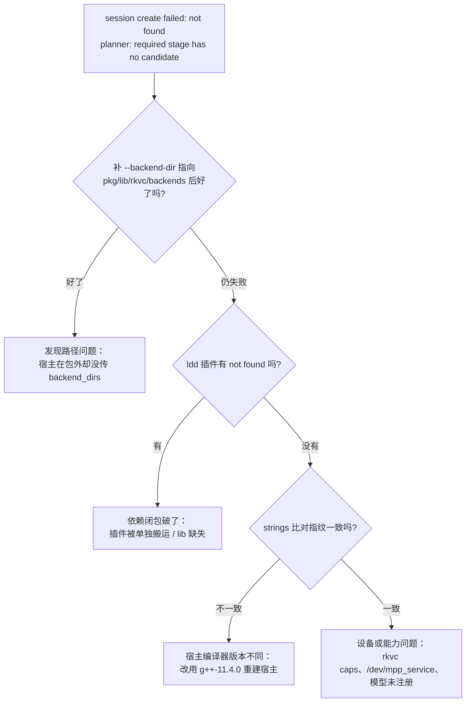

# 可移植包 × 宿主集成

> 面向两类人：想把 rkvc 内嵌进下游宿主（如 `semantic-codec-sdk` / ais SDK）的
> 集成者，和只想拿包直接跑转码的运维。回答一个问题：
> `tools/portable/build.sh` 产出的 tarball 到底怎么用、怎么拼到上游里去。
> 宿主侧 C ABI 契约见 [semantic-codec-sdk-integration.md](semantic-codec-sdk-integration.md)；
> 包怎么构建、怎么单独部署见 [deployment.md](deployment.md)。
> 本文的结论均为 2026-09-10 在 RK3576（Ubuntu 22.04.5）与 x86 交叉环境实测。

## 1. 包的定位：一个包，三种用法

可移植包是**复合产品**：同一份产物同时服务三类消费者，互不牵制。选哪条路只
取决于"谁来编代码"：

| 用法              | 谁在用                     | 需要什么                           | 入口                              |
| ----------------- | -------------------------- | ---------------------------------- | --------------------------------- |
| **① CLI 自用**    | 运维 / 现场定位 / 脚本     | 只要解包，无编译器                 | `bin/rkvc`（§7 验收）             |
| **② 链 SDK 集成** | 上游宿主、第三方应用       | C/C++ 编译器，**不需要 core 源码** | `-Drkvc_DIR=<pkg>/lib/cmake/rkvc` |
| **③ 源码内嵌**    | 需改 core / 自带编译器策略 | rkvc 源码树                        | `add_subdirectory(core)`          |

包内因此同时带着"运行物"和"开发物"：

| 包内有                                                              | 包内没有                                    |
| ------------------------------------------------------------------- | ------------------------------------------- |
| `bin/rkvc`（CLI，C++ 运行时静态链接）                               | doxide 生成的 `docs/api/`（现生成、不入库） |
| `lib/rkvc/backends/rkvc_*.so`（codec 插件）                         | rkvc 源码（要走用法 ③ 请自行 clone）        |
| `lib/librkvc.so*`（**SDK 主体**，§2）                               | 模型（bundle 目录需 `--models` 单独打包）   |
| `include/rkvc/`（16 个头文件：`rkvc.h` + C++ 头）                   |                                             |
| `lib/cmake/rkvc/`、`lib/pkgconfig/rkvc.pc`（两种查找方式）          |                                             |
| `lib/*.so*`（MPP / rknnrt / SVT-AV1）                               |                                             |
| `docs/`（全套文档）、`examples/`（三个 C ABI 样板）、`CHANGELOG.md` |                                             |
| `licenses/`、可选 `models/`、`test.sh`、`MANIFEST.sha256`           |                                             |

三条路各有边界，别混：

- 用法 ② 拿到的是**已编译的 core**（`librkvc.so`），与包内插件同源同编译器，
  所以插件指纹天生一致——这是它比用法 ③ 省事的地方。
- 用法 ③ 自己编 core，指纹取决于**你自己的编译器**，必须写 `g++-11.4.0` 同版
  才能装载包内插件（§4）。要用自己的编译器编插件宿主，就得连插件一起自己编。
- **用法 ① 不依赖 ②/③**：CLI 静态链接 core，`librkvc.so` 装不装、装哪版都不
  影响它。反过来，上游也不必为了拿 SDK 而接受 CLI 的存在。

### 1.1 为什么这样切还能留住以后接别的上游库的自由度

三个面之间的耦合点只有一处，就是**插件 ABI**（`kPluginAbi` + 工具链指纹，
§4），其余全部解耦：

- **新增一个上游库/新硬件**（新 NPU runtime、新软编库、新 ISP 库）：写一个新的
  codec 插件工程（`codecs/<name>/`，导出 `rkvc_plugin_query`），在
  `tools/portable/build.sh` 的 `collect_artifacts` 里加一条预期产物即可。
  core、SDK 面、CLI 都不用动——这是插件模型存在的意义。
- **上游库要反过来复用 rkvc**：`find_package(rkvc CONFIG)` 或
  `pkg-config rkvc`（§2），拿到的是同一份 `rkvc::core` 契约。
- **以后要出 C++ API 版 SDK**：`include/rkvc/` 里 15 个 C++ 头已随包（`context.hpp`
  等），`librkvc.so` 的符号也按官方清单审计（§7 第 3 步），不存在"只给 C 面不给
  C++ 面"的返工。
- **要拆包**（比如 SDK 与运行库分包）：`librkvc.so` 的 RUNPATH 只有 `$ORIGIN`，
  三方库全在 `lib/`，插件靠 `$ORIGIN/../..` 找 `lib/`（§5），所以"SDK + 插件 +
  三方库"三者必须同 `lib/` 布局一起搬，拆包就是把这三个一起搬。

## 2. SDK 面怎么用（用法 ②）

### 2.1 目录约定

```text
<pkg>/include/rkvc/rkvc.h             C ABI（0.5.0，ABI 主版本 0）
<pkg>/include/rkvc/*.hpp              C++ 头（context/plugin/frame/...）
<pkg>/lib/librkvc.so -> .so.0 -> .so.0.5.0    SONAME = librkvc.so.0（跟 ABI 主版本）
<pkg>/lib/cmake/rkvc/rkvcConfig.cmake         find_package(rkvc CONFIG) 用
<pkg>/lib/pkgconfig/rkvc.pc                   pkg-config 用
```

`librkvc.so` 不依赖 libstdc++/libgcc（静态链入），NEEDED 只有 glibc；所以 C
程序直接 `-lrkvc` 即可，不需要 `-lstdc++`——板卡上用 `gcc-11` 实测通过。

### 2.2 CMake 工程（推荐）

```cmake
find_package(rkvc CONFIG REQUIRED)   # 指向 <pkg>/lib/cmake/rkvc 或系统安装位
add_executable(host main.c)
target_link_libraries(host PRIVATE rkvc::core)
```

```bash
cmake -S . -B build -Drkvc_DIR=<pkg>/lib/cmake/rkvc
```

包里的 `examples/`（`integration-c` / `decode-file` / `upscale-file`）就是这个
写法，且**同时支持**用法 ② 与 ③：

```bash
cmake -S examples/integration-c -B build -Drkvc_DIR=<pkg>/lib/cmake/rkvc
cmake -S examples/integration-c -B build -DRKVC_CORE_DIR=<rkvc 源码>/core
```

### 2.3 pkg-config / 裸编译

```bash
PKG_CONFIG_PATH=<pkg>/lib/pkgconfig pkg-config --cflags --libs rkvc
gcc -I<pkg>/include host.c -L<pkg>/lib -lrkvc -o host
```

包内两份配置都写成**相对自身定位前缀**（`.pc` 用 `${pcfiledir}/../..`，
CMake config 由 `configure_package_config_file` 生成），所以整包解压到任意目录
都不用重新生成，`pkg-config` 直接给出解压后的真实路径（板卡实测）。

### 2.4 运行期：库与插件怎么被找到

- **`librkvc.so`**：由宿主自己的 rpath 决定。宿主编译时加
  `-Wl,-rpath,$ORIGIN/../lib`（宿主在 `<pkg>/bin/` 时）或用 `LD_LIBRARY_PATH`；
  用 CMake `find_package` 时，构建树里 CMake 会自动把 `<pkg>/lib` 记进 rpath。
- **插件**：`librkvc.so` 被 `dladdr` 定位在 `<pkg>/lib/`，于是发现顺序里第 ③
  条 `<映像目录>/../lib/rkvc/backends` 正好命中 `<pkg>/lib/rkvc/backends`。
  也就是说**用法 ② 默认零配置**：不用传 `backend_dirs`。板卡实测：纯 C 消费者
  链接包内 SDK、不填 `backend_dirs`，建会话成功（`test.sh` 的 SDK 段即为该检查）。

`dladdr` 认的是"含 core 的映像"：静态内嵌（用法 ③）时是宿主的可执行文件或
宿主 .so；链接 `librkvc.so`（用法 ②）时就是 `librkvc.so` 自己。两条路都不需要
宿主知道包的路径（§3 表的部署位 B/C）。

## 3. 宿主怎么找到包内插件

`rkvc_context_create` 按下列顺序收集 `*.so`（`core/src/c_api.cpp`，目录内排序
后逐个握手，失败静默跳过）：

| #   | 目录                                     | 说明                                                                    |
| --- | ---------------------------------------- | ----------------------------------------------------------------------- |
| ①   | `rkvc_context_options.backend_dirs`      | 调用方显式传入，按数组顺序；**先命中的赢**                              |
| ②   | `<含 core 的映像所在目录>/rkvc/backends` | `dladdr` 定位；映像是宿主可执行文件**或宿主 .so**                       |
| ③   | `<同上目录>/../lib/rkvc/backends`        | 可移植包布局；与 ② 都会尝试（重复命中时第二次按重复工厂拒载，无副作用） |
| ④   | `/usr/local/lib/rkvc/backends`           | 系统安装位                                                              |
| ⑤   | `/usr/lib/rkvc/backends`                 | 系统安装位                                                              |

据此可选四类部署位，实测（`av1` 软编 3 帧 640×360，宿主二进制在
`/tmp/hosttest/bin/`，包在 `/tmp/rkvc-pkg/...`）：

| 部署位                           | 宿主需要传参                                        | 结果                                                                 |
| -------------------------------- | --------------------------------------------------- | -------------------------------------------------------------------- |
| **A. 宿主在包外**（最常见）      | 必须：`backend_dirs` 指向 `<pkg>/lib/rkvc/backends` | 实测：无参 `rc=2` "no candidate"；传参 `rc=0`，547692 B              |
| **B. 宿主映像落在 `<pkg>/lib/`** | 不需要（命中 ③）                                    | 实测：`rc=0`，547692 B                                               |
| **C. 宿主映像落在 `<pkg>/bin/`** | 不需要（命中 ③）                                    | 实测：包内 CLI 即此形态，`test.sh` 全程不传 `--backend-dir` 也能跑通 |
| D. 插件装到系统路径              | 不需要（命中 ④/⑤）                                  | 未实测，按代码顺序推断；须自行保证三方库可解析（§5）                 |

> **上游宿主是共享库**（`libais_semantic_codec.so`），部署位 B 对它成立：把
> `libais_semantic_codec.so` 放进 `<pkg>/lib/`，`dladdr` 取到的就是该 .so 的
> 路径，`lib/rkvc/backends` 直接命中，宿主侧一行配置都不用写。这是把包交付给
> 上层应用时最省事的摆法（上表用二进制置于 `<pkg>/lib/` 复现同一条 dladdr
> 路径，.so 形态未单独实测）。

A 的接线（C，节选自 `rkvc_context_options` 的用法）：

```c
const char *dirs[] = { "/opt/rkvc/lib/rkvc/backends" };
rkvc_context_options opts;
rkvc_context_options_init(&opts, sizeof(opts));
opts.backend_dirs = dirs;
opts.backend_dir_count = 1;

rkvc_context *ctx = NULL;
if (rkvc_context_create(&opts, &ctx) != RKVC_OK) { /* 处理 */ }
```

目录必须**绝对路径**（`$PWD/...` 之类的字面量不会展开，症状是"无候选"）。

## 4. 硬约束：工具链指纹

混版 `.so` 靠指纹拦住（`RKVC_TOOLCHAIN_FINGERPRINT`，
`core/include/rkvc/plugin.hpp`）：

```c
#define RKVC_TOOLCHAIN_FINGERPRINT ("g++-" __VERSION__ "-c++20-noexc-nortti")
```

`rkvc::Context::load_plugin` 对插件上报的指纹做**精确字符串比较**，不一致即
拒载。关键点是 Ubuntu 22.04 的 GCC 11 把 `__VERSION__` 展开成**纯版本号**：

```text
$ echo | aarch64-linux-gnu-g++-11 -E -dM -x c++ - | grep __VERSION__
#define __VERSION__ "11.4.0"
```

于是指纹只取决于 **GCC 主次版本**，与交叉/原生、发行版后缀无关：

| 宿主编译器                                  | 指纹                            | 能否装载本包插件 |
| ------------------------------------------- | ------------------------------- | ---------------- |
| Ubuntu 22.04 `g++-11`（11.4.0，交叉或板载） | `g++-11.4.0-c++20-noexc-nortti` | ✅ 实测           |
| Ubuntu 24.04 `g++-13`（13.3.0）             | `g++-13.3.0-c++20-noexc-nortti` | ❌ 拒载（推断）   |
| 其他 GCC 11.x（11.1/11.2/…）                | 各自版本号                      | ❌ 只认 11.4.0    |

除首行实测外，其余为按构成规则推断（指纹只由 `__VERSION__` 决定）；要确认请用
下面的 `strings` 自查，别靠推断。

包内 CLI 与插件实测都是 `g++-11.4.0-c++20-noexc-nortti`：

```bash
strings bin/rkvc                        | grep -E '^g\+\+-.*c\+\+20-noexc-nortti$'
strings lib/rkvc/backends/rkvc_av1.so   | grep -E '^g\+\+-.*c\+\+20-noexc-nortti$'
```

**自查方法**（宿主与包分别取字符串比对，一致才配对）：

```bash
strings <宿主可执行或 .so> | grep -E '^g\+\+-.*c\+\+20-noexc-nortti$'
strings <pkg>/lib/rkvc/backends/*.so | grep -E '^g\+\+-.*c\+\+20-noexc-nortti$' | sort -u
```

板卡侧对齐情况：RK3576 是 Ubuntu 22.04.5，仓库自带的 `gcc-11` 报
`11.4.0-1ubuntu1~22.04`；装 `g++-11` 后板载编译出的宿主指纹与包插件一致，
所以 [SDK 集成 §4.6 配置 C](semantic-codec-sdk-integration.md)（板载编译）与本
包可以直接配。

实测拒载效果（把包复制一份，仅改写 `rkvc_av1.so` 内的指纹为 `12.3.0`）：

```text
av1 编码 → encode: session create failed: not found
           status=-3 planner(request): required stage has no candidate   (rc=2)
同目录未改写的 h264h265 → 照常硬编 8 帧（rc=0，2151580 B）
```

即校验是逐插件独立做的：一个插件被拒不影响同目录其它插件。

注意 **`inspect backends` 不能用来判兼容**：它只对显式给到的目录做裸
`dlopen` + 打印描述符，既不比对指纹也不做自动发现（本文 §3 的自动发现发生在
`rkvc_context_create`，只有真正建会话的路径才会走）。指纹不符的插件，它照列不误。

指纹只覆盖编译器；插件 ABI（`kPluginAbi`）只在破坏性变更时 +1，所以
**宿主与插件必须取自同一次 rkvc 发布**，升级时两边同步换。

## 5. 插件不能拆散部署

插件 RUNPATH 是 `$ORIGIN/../..`（即包内 `lib/`），三方库靠它解析。把单个
`.so` 拷到别处不会报错，只会**静默消失**：

```bash
$ cp <pkg>/lib/rkvc/backends/rkvc_av1.so /tmp/mismatch/     # 只拷插件
$ ldd /tmp/mismatch/rkvc_av1.so | grep 'not found'
        libSvtAv1Enc.so.4 => not found                      # → dlopen 失败
$ rkvc encode --codec av1 ... --backend-dir /tmp/mismatch
encode: session create failed: not found                     # 与"没装插件"同一句
```

包内插件（含 MPP / rknnrt / SVT）逐项 `ldd` 无 `not found`，`test.sh` 已覆盖。
搬运或安装到别处时，要么整包保持相对布局，要么让 `lib/` 落在系统搜索路径
（`LD_LIBRARY_PATH` / `ldconfig`），二者必居其一。

## 6. 模型与设备前提

- **模型没有自动发现**：`rkvc_context_options` 只有 `backend_dirs`，没有模型
  目录项，也无环境变量。宿主调
  `rkvc_context_add_model_dir(ctx, "/abs/path/bundle", &diag)` 按导出器约定
  整组装载目录内原生文件；CLI 对应
  `--model-dir` / `--model`。`h264h265`、`av1` 不需要模型，`mlvc`、`sr` 需要。
- **设备节点**：H264/HEVC 硬编解需要 `/dev/mpp_service`；`mlvc`/`sr` 需要 NPU
  （RK3576 无 `/dev/rknpu`，NPU 以 DRM render 节点存在，core 会认）。
  `rkvc caps` 可核对。
- **运行库基线**：aarch64 产物要求 glibc ≥ 2.34（板 2.35 满足）；
  `librknnrt.so` 自身动态依赖目标机 `libstdc++.so.6` / `libgcc_s.so.1`。

## 7. 验收清单

按顺序做完这几步，集成即算通过（第 1–5 步对三种用法通用，第 6 步只关用法 ②）：

1. **完整性**：`sha256sum -c MANIFEST.sha256`（包根执行）
2. **依赖闭包**：`ldd <pkg>/lib/rkvc/backends/*.so | grep 'not found'` → 无输出
3. **插件可用**：`<pkg>/bin/rkvc inspect backends --backend-dir <pkg>/lib/rkvc/backends`
   → 四个插件各带 factory 列表（只证明"能 dlopen + 导出了描述符"）
4. **指纹配对**：§4 的 `strings` 比对，两边一致
5. **真会话冒烟**：用宿主自己的路径跑一次编码（或直接用包内 CLI）——
   这是唯一能同时验证发现路径、指纹、设备、第三方库的检查：

   ```bash
   <pkg>/bin/rkvc encode --codec h264 --input in.nv12 --width 640 --height 368 \
       --pixfmt nv12 --output out.h264 --qp 26 --gop 30
   ```

   宿主在包外时补 `--backend-dir <pkg>/lib/rkvc/backends`；
   包内 CLI 不用补（自动发现）。

6. **SDK 面自证**（用法 ②）：包根跑 `bash test.sh`，SDK 段会逐个点名
   `include/`、`lib/librkvc.so`、`lib/cmake/rkvc/`、`lib/pkgconfig/rkvc.pc`，
   编译一个纯 C 消费者对着包内 SDK 建会话（零配置发现）。想更深一层，用板载
   编译器把示例编出来真跑一次（板卡实测，3 帧 AV1 输出 `intc: 3 packets …`）：

   ```bash
   cd <pkg> && gcc-11 -std=c99 -Wall -Iinclude examples/integration-c/main.c \
       -Llib -Wl,-rpath,'$ORIGIN/../lib' -lrkvc -o /tmp/intc_encode
   /tmp/intc_encode lib/rkvc/backends/rkvc_av1.so 640 368 3
   ```

   > 法二（FrameSink 推帧）**在 qemu-user 下必崩**，用静态 core 编同一示例同样
   > 崩、板卡上正常，属模拟器局限；CI 里只编译链接不运行，运行校验请在板卡做。

## 8. 排障

"无候选"是三件不同的事共用的同一句报错（包内 CLI 实测）：
发现路径没命中、插件依赖闭包破了、指纹不符。判别流程：



| 症状                                        | 根因                                                             | 处置                                            |
| ------------------------------------------- | ---------------------------------------------------------------- | ----------------------------------------------- |
| 包外宿主"无候选"，补 `--backend-dir` 后正常 | 未传 `backend_dirs`（用法 ③ 的宿主不参与自动发现，除非落在包内） | §3 A：传绝对目录，或用部署位 B                  |
| `backend_dirs` 传了仍无候选，且目录看着没错 | 相对路径字面量未展开                                             | 改绝对路径                                      |
| 全部插件都不可用                            | 指纹不符（宿主编译器 ≠ 11.4.0）                                  | §4：核对 `strings`，用 `g++-11` 重建宿主        |
| 只有某个插件不可用                          | 该插件被单独搬运 / 其三方库缺                                    | §5：`ldd` 该插件                                |
| `inspect backends` 列出插件但会话仍无候选   | 列出 ≠ 宿主会接受：`inspect` 不比对指纹                          | 按 §4 比对指纹，再按 §3 确认发现路径            |
| 插件装到系统路径后被别的宿主抢装            | 发现顺序"先命中赢"，与系统里其他 rkvc 混用                       | 一处只留一套，或宿主显式传 `backend_dirs`       |
| `dlopen` 报 GLIBC 版本不足                  | 目标机 glibc < 2.34                                              | 升级目标机，或自建更低基线的包                  |
| `mlvc`/`sr` 无候选但插件在                  | 模型未注册 / 无 NPU                                              | §6：`add_model_dir` 绝对路径、`rkvc caps` 核对 |
| 链接 SDK 报 `cannot find -lrkvc`            | 未指认 SDK 位置                                                  | §2.2/§2.3：`-Drkvc_DIR=` 或 `-L<pkg>/lib`       |
| 运行时 `librkvc.so.0: cannot open …`        | 宿主的 rpath 不含 `<pkg>/lib`                                    | §2.4：加 rpath 或用 `LD_LIBRARY_PATH`           |

## 9. 变更记录

| 日期       | 变更                                                                                                                                                                                                                                                                    |
| ---------- | ----------------------------------------------------------------------------------------------------------------------------------------------------------------------------------------------------------------------------------------------------------------------- |
| 2026-09-10 | 初版。实测：四类部署位（含宿主落在 `<pkg>/lib/` 的零配置命中）、指纹只取决于 GCC 版本号（`11.4.0`）、指纹改写后的拒载症状、单拷插件导致依赖闭包破裂、`inspect backends` 不做兼容校验                                                                                    |
| 2026-09-10 | 包升级为**复合产品**：新增 SDK 面（`librkvc.so` + 头文件 + CMake config + pkg-config，§1/§2），`examples/` 同时支持 `-Drkvc_DIR=` 与 `-DRKVC_CORE_DIR=`；实测板卡 `gcc-11` 裸编译链 SDK、零配置建会话并跑通 FrameSink AV1 示例（qemu 下该示例必崩，已定性为模拟器局限） |
