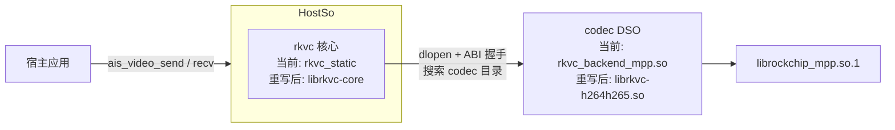

# semantic-codec-sdk 向上集成指南

> 目标：为把 rkvc（本仓库）内嵌进上层 SDK 提供所需的全部信息，单点收口、避免跑偏。
> 参考宿主：`semantic-codec-sdk`（ais SDK，2026-09 快照）。
> 与 [cpp-rewrite-plan.md](cpp-rewrite-plan.md) 的分工：计划管 rkvc 自身如何重写
> （工程布局/错误模型/插件 ABI/阶段步骤）；本文管**集成面**——rkvc 向宿主提供什么、
> 宿主侧必须做什么、如何验证与排障。重写的集成验收以本文 §2 契约为准。
>
> 全篇按时期标注：**[当前]** = main 分支 C ABI 0.4（本分支工作区即此实现）；
> **[重写后]** = cpp-rewrite 新 C ABI（落地前为计划口径，随实施更新）；
> **[契约]** = 两个时期都必须保持的行为不变量。

## 1. 集成模型

[契约] 三条结构性要点，两个时期通用：

1. **核心内嵌、codec 动态发现**。rkvc 核心链接进宿主库；编解码能力以独立
   DSO 运行时发现（dlopen + ABI 握手 + probe 探测），DSO 未定义的核心符号
   要求装载时刻可在宿主进程符号域解析（§4.2）。
2. **宿主只描述意图**。operation/codec/policy/quality/端点交给规划器，在
   已装载 codec 中按优先级/得分挑候选，open 失败自动回退次优。
3. **C ABI 是唯一稳定面**。宿主只经 C ABI 消费 rkvc（当前
   `include/rkvc/*.h`；重写后 `core/include/rkvc/rkvc.h`）；原生 C++ API
   是进程内第二面，不对宿主做跨编译器承诺。

| 项        | [当前] main（C ABI 0.4）                                | [重写后] cpp-rewrite（计划口径）                                                                   |
| --------- | ------------------------------------------------------- | -------------------------------------------------------------------------------------------------- |
| 链接形态  | `add_subdirectory(rkvc)` + `rkvc_static`（纯 C 归档）   | `librkvc-core` + 各 codec 静态直嵌或 DSO 发现；`examples/integration-c/` 为对接样板                |
| codec DSO | `rkvc_backend_{mpp,svt,rga,ffmpeg,rknn,mlvc}.so`        | 四 codec 工程插件 DSO（h264h265/mlvc/av1/sr），`rkvc_plugin_query(host_abi)` 握手                  |
| 依赖      | Threads + dl（+ 各后端前缀）                            | 同左；rknn 基础封装上提 core（`rkvc::npu`），RGA 进 core（`rkvc::rga`）                            |
| 工具链    | C17/gnu17                                               | C++20；自有源 `-fno-exceptions -fno-rtti`；GLIBC_2.17 符号上限；`-static-libstdc++ -static-libgcc` |
| 符号审计  | `tools/check-exported-symbols.sh`（对照 `librkvc.map`） | `tools/check-symbols.sh`（GLIBC 上限 + NEEDED 审计；导出面 = C ABI 头声明集合）                    |
| SDK 对接  | 本文 §3                                                 | 适配层按新 C ABI 重写（计划 Phase 6，仓库外），以 integration-c 样板为契约                         |



## 2. 接口清单与行为契约（重写验收基线）

本节回答"向上集成需要 rkvc 提供什么"。新 C ABI 设计与 integration-c 样板
按本节验收；宿主侧对接现状见 §3。

### 2.1 宿主消费的接口清单 [当前]

上游适配层 `codec/video/runtime/video_runtime.cpp`（~419 行，宿主的全部
rkvc 调用点，2026-09-09 实测）消费面：

| 类      | 符号                                                                                                                                                |
| ------- | --------------------------------------------------------------------------------------------------------------------------------------------------- |
| context | `rkvc_context_options_init` / `rkvc_context_create` / `rkvc_context_destroy` / `rkvc_probe_device`                                                  |
| job     | `rkvc_job_create`（带 diag）/ `rkvc_job_start` / `rkvc_job_push` / `rkvc_job_try_pull` / `rkvc_job_pull` / `rkvc_job_push_eos` / `rkvc_job_destroy` |
| frame   | `rkvc_frame_desc_init` / `rkvc_frame_wrap` / `rkvc_frame_get_desc` / `rkvc_frame_release`                                                           |
| diag    | `rkvc_diag_fmt_text` / `rkvc_diag_release` / `rkvc_status_str`                                                                                      |
| 枚举    | STATUS / CODEC / POLICY / OPERATION / FRAME_FMT / MEM_DOMAIN / ENDPOINT / `RKVC_FRAME_TS_UNKNOWN`                                                   |

[重写后] 新 C ABI（handle 式：context/**session**/frame/枚举/
`rkvc_status_str`/probe；结构体 size/version 首字段演化）必须等价覆盖上表
全部能力与 §2.2 全部契约；job 在新 ABI 中称 session。

### 2.2 行为契约 [契约]

宿主适配层依赖以下语义，重写必须保持：

1. **背压三原语**：push 非阻塞（输入队列有界，当前默认容量 4，满 → AGAIN）；
   pull 阻塞至有帧或 EOS；try_pull 非阻塞（空且未 EOS → AGAIN）。成功/EOS/
   暂空三态必须严格区分——旧 `rkvc_queue_try_pop` 成功弹帧误报 0 的缺陷曾致
   宿主把正常帧当 EOF，queue/job 两层回归必须保持覆盖。EOS 经 `push_eos` 注入。
2. **帧借用**：wrap 零拷贝借用宿主内存；帧引用归零前载荷必须存活；销毁
   顺序 = 先 job/session，再载荷副本，再 context。
3. **诊断链**：job/session 创建与启动失败携带 stage/subject/reason 诊断链，
   可格式化为文本。
4. **FRAME_SINK 格式注入**：无端点源节点时，请求端点声明的 fmt/宽高注入
   首末节点端口（当前实现为 `lib/graph.c` 注入段；缺失时 MPP 硬编 open 报
   FORMAT，见 §5.1）。
5. **probe 语义**：只反映设备能力探测；probe 失败淘汰候选而不使 context
   创建失败；最近装载诊断可查。
6. **排空有界性**：flush 提交 EOS 后，后端在有限时间内必然到达尾包/EOS/
   错误（当前 MPP 为输出超时切 5000ms 持续排包至 MPP EOS，见 §5.2）——
   宿主"flush 后阻塞排空"以此为先决条件。
7. **无异常** [重写后硬约束]：C ABI 实现 100% 无异常，dlopen 边界零翻译；
   OOM 走 NOMEM 返回路径。

### 2.3 状态码与宿主映射参考

[当前] 上游 `map_status()`（`video_runtime.cpp`）：

| rkvc 状态                                                    | 宿主映射              | 说明                                                              |
| ------------------------------------------------------------ | --------------------- | ----------------------------------------------------------------- |
| `OK` / `AGAIN` / `EOF` / `NOMEM`                             | 同名 `AIS_*`          | AGAIN 只出现在内部背压路径，send/recv 均不对外暴露（§3.3）        |
| `INVALID` / `NEGOTIATE`                                      | `AIS_ERR_INVALID_ARG` |                                                                   |
| `NOT_FOUND` / `UNSUPPORTED` / `FORMAT` / `PERMISSION` / `HW` | `AIS_ERR_UNSUPPORTED` | 注意 `HW` 也映到 UNSUPPORTED，open 阶段硬件失败对外表现为"不支持" |
| `LICENSE` / `UNLICENSED` / `INTEGRITY`                       | `AIS_ERR_MODEL`       | 模型/许可证类                                                     |
| 其他（`IO` / `CANCELED` / …）                                | `AIS_ERR_INTERNAL`    |                                                                   |

视频路径当前不使用 `AIS_ERR_ENCODE` / `AIS_ERR_DECODE`（留给图像式一次性
调用）。[重写后] `Status` 负值枚举保留 AGAIN/EOF 流控语义，分层（流控/
参数/格式/硬件/模型/内部）不变，具体码值随新头文件发布。

## 3. 宿主集成（上游 2026-09 快照）[当前]

### 3.1 构建：视频顶层由集成者自持

上游仓库根 `CMakeLists.txt` 已是占位报错（"Do not configure the repo root"），没有仓库级统一构建：图像（`codec/image`）与加密签发（`security`）各自独立 `project()`；语音/视频按上游约定"由对应负责人在 `codec/audio`、`codec/video` 里自己写 CMake、自己编"（上游 `docs/build.md`）。

上游只为视频提供 CMake 片段，`core/`、`platform/`、`codec/video/` 都是挂在父目标 `ais_semantic_codec` 上的 `target_sources` 片段。`codec/video/CMakeLists.txt` 全文：

```cmake
if(AIS_VIDEO_CODEC_RKVC)
    target_sources(ais_semantic_codec PRIVATE
        ${CMAKE_CURRENT_SOURCE_DIR}/video_codec.cpp
        ${CMAKE_CURRENT_SOURCE_DIR}/runtime/video_runtime.cpp)
    target_link_libraries(ais_semantic_codec PRIVATE
        rkvc_static rkvc_instrumentation)
else()
    # 未内嵌 rkvc：仅编译退化实现，视频接口返回 AIS_ERR_UNSUPPORTED。
    target_sources(ais_semantic_codec PRIVATE
        ${CMAKE_CURRENT_SOURCE_DIR}/video_codec.cpp)
endif()
```

上游不再提供 `AIS_RKVC_SOURCE_DIR` / `add_subdirectory(rkvc)` 的参考顶层，集成者需要自己写。参考顶层：

```cmake
cmake_minimum_required(VERSION 3.21)   # 内嵌 rkvc 要求 ≥3.21
project(ais_semantic_codec LANGUAGES C CXX)

set(CMAKE_C_STANDARD 11)    # SDK 公共层 C11
set(CMAKE_CXX_STANDARD 17)  # 视频适配层 C++17
set(CMAKE_POSITION_INDEPENDENT_CODE ON)

set(AIS_SDK_ROOT "" CACHE PATH "semantic-codec-sdk source tree")
option(AIS_VIDEO_CODEC_RKVC "Video codec backed by rkvc" ON)
set(AIS_RKVC_SOURCE_DIR "" CACHE PATH "rkvc source tree (>= CMake 3.21)")

add_library(ais_semantic_codec SHARED)
# 适配层以 SDK 根为 include 基准（#include "core/..." / "codec/video/..."），
# 除 include/ 外必须把 SDK 根也加进私有包含路径。
target_include_directories(ais_semantic_codec
    PUBLIC  ${AIS_SDK_ROOT}/include
    PRIVATE ${AIS_SDK_ROOT})

if(AIS_VIDEO_CODEC_RKVC)
    # ... 校验 ${AIS_RKVC_SOURCE_DIR}/CMakeLists.txt 存在 ...

    # 关键陷阱：CMake 选项不会自动变成编译定义。video_codec.cpp 用
    # #if defined(AIS_VIDEO_CODEC_RKVC) 切换真实/退化实现，上游片段并不
    # 代劳——缺了这行会静默编出"全部接口返回 AIS_ERR_UNSUPPORTED"的退化库。
    target_compile_definitions(ais_semantic_codec PRIVATE AIS_VIDEO_CODEC_RKVC=1)

    # 只取核心静态库：关掉 rkvc 自身的 CLI/示例/测试与共享库
    set(RKVC_BUILD_SHARED OFF CACHE BOOL "" FORCE)
    set(RKVC_BUILD_STATIC ON  CACHE BOOL "" FORCE)
    set(RKVC_BUILD_CLI OFF        CACHE BOOL "" FORCE)
    set(RKVC_BUILD_EXAMPLES OFF   CACHE BOOL "" FORCE)
    set(RKVC_BUILD_TESTS OFF      CACHE BOOL "" FORCE)

    # 目录属性隔离：宿主顶层若是严格 C11/-std=c 与 hidden 可见性，
    # 会污染 rkvc 子目录（gnu17 与 DSO 符号导出都依赖宽松设置）。
    # 进子目录前保存 C_STANDARD/C_EXTENSIONS/CXX_EXTENSIONS，设为宽松值，
    # add_subdirectory 后恢复。
    set(CMAKE_C_STANDARD 17)
    set(CMAKE_C_EXTENSIONS ON)
    set(CMAKE_CXX_EXTENSIONS ON)
    add_subdirectory(${AIS_RKVC_SOURCE_DIR} rkvc)
    # ... 恢复保存的属性 ...
endif()

# 挂 SDK 片段（rkvc_static 目标名在生成期解析，与 add_subdirectory 顺序无关）
add_subdirectory(${AIS_SDK_ROOT}/core sdk-core)
add_subdirectory(${AIS_SDK_ROOT}/codec/video sdk-video)
# 需要板级探测时再加：add_subdirectory(${AIS_SDK_ROOT}/platform sdk-platform)

# 若改为静态宿主库（add_library 不带 SHARED），必须向最终可执行文件
# 传播符号导出，否则后端 DSO dlopen 失败（§4.2）：
# target_link_options(ais_semantic_codec INTERFACE -Wl,--export-dynamic)
```

两个历史踩坑（均已在本仓修复，集成时勿回退）：

- rkvc 依赖脚本全部使用 `CMAKE_CURRENT_SOURCE_DIR`（而非 `CMAKE_SOURCE_DIR`），
  `add_subdirectory` 内嵌时路径才不会错位；
- rkvc 顶层显式 `set(CMAKE_C_VISIBILITY_PRESET default)`，中和宿主全局 hidden
  设置，保证核心符号进入动态符号表。改可见性后必须**全量重建**。

[重写后] 顶层改为链接 `librkvc-core`（+ 需要静态直嵌的 codec 工程），并以
`examples/integration-c/` 样板为契约；rkvc 侧 GLIBC_2.17/静态 libstdc++ 基线
不再向宿主传播 C++ 运行库约束（§4.5）。

### 3.2 公共 API 与配置

- 公共接口（`include/ais/video_codec.h`）：`ais_video_open` →
  `ais_video_send`×N → `ais_video_flush` → `ais_video_recv` 至 `AIS_ERR_EOF`
  → `ais_video_close`；能力查询 `ais_video_caps`。SDK 自身对外纯 C ABI
  （`include/ais/*.h`），视频适配层 C++17。codec ID：
  `AIS_CODEC_VIDEO_STANDARD=0x20` / `AIS_CODEC_VIDEO_SEMANTIC=0x21`，open 经
  `ais_codec_check_video` 校验；编解码族
  `AIS_CODEC_FAMILY_{AUTO,H264,HEVC,AV1,MLVC}`。
- 配置：`ais_video_config_init`/`struct_size` 已移除，`memset(&cfg,0,sizeof)`
  后逐字段赋值（上游 `tests/test_video_codec.c` 即此用法）。陷阱：
  - `memset` 后 `qp == 0` 被当**固定 QP 0**（适配层 `if (qp >= 0)
    req.quality.qp = qp`）——要自动 QP 必须显式 `cfg.qp = -1`；
  - `bitrate_bps` 为 int64，>0 时强转 int32 写入 `req.quality.bitrate_bps`，
    超 `INT32_MAX` 静默截断；
  - `fps_num/fps_den` 被静默忽略（rkvc 固定 30 fps；旧版"非 30 拒绝"已移除）。
- 缓冲：视频帧公开创建 `ais_buffer_video(w, h, fmt, pts_us, frame_index,
  &out)`；时间戳哨兵 `AIS_TS_UNKNOWN`(=INT64_MIN) ↔ `RKVC_FRAME_TS_UNKNOWN`
  互转。码流包**没有公开创建函数**：编码输出由适配层经内部头
  `core/ais_buffer_internal.h` 的 `ais_buffer_create(AIS_BUFFER_BITSTREAM, ...)`
  + `ais_buffer_set_packet_info`（PTS/DTS/flags）构造；**解码方向的外部文件/
  网络码流无公开注入入口**（send 要求 kind 为 `AIS_BUFFER_BITSTREAM`），属
  上游缺口——需推动上游在 `ais_buffer.h` 补公开创建函数，或视频侧自持补丁。
- 端点与格式：流式会话使用 `RKVC_ENDPOINT_FRAME_SINK` 双端点。编码：
  `req.input.fmt` = `cfg.format` 的 rkvc 映射（NV12/YUV420P/RGB24，不支持
  直接 open 失败 UNSUPPORTED），`req.output.fmt = RKVC_FRAME_FMT_BITSTREAM`，
  宽高写 `req.width/height`；解码：`req.input.fmt = BITSTREAM`，
  `req.output.fmt` = `cfg.format` 映射（无法映射时 `RKVC_FRAME_FMT_UNKNOWN`，
  由后端/协商决定）。`req.model_id = cfg.model_id` 透传语义模型。

### 3.3 适配层当前实现契约

适配层实现：`codec/video/video_codec.cpp`（C ABI 薄壳 + 未内嵌 rkvc 时的
退化实现）与 `codec/video/runtime/video_runtime.cpp`（C++ `ais::video::Codec`）。

- **send 完全同步**：校验 buffer kind（编码 `AIS_BUFFER_VIDEO` / 解码
  `AIS_BUFFER_BITSTREAM`）→ 深拷贝载荷 → `rkvc_frame_wrap`（借用）→ push
  循环：遇 AGAIN 先 `drain_pending()`（try_pull 排空已产出帧存入 `pending_`
  腾出输入槽位）再睡眠 100µs 重试，直至入队成功或硬错误——调用方永远收不到
  `AIS_ERR_AGAIN`。flush 后再 send 按头文件契约返回 `AIS_ERR_EOF`。
- **recv 恒阻塞**：先消费 `pending_`，空则 `rkvc_job_pull`；EOF 由
  `eof_seen_` 锁存，之后恒 `AIS_ERR_EOF`；排空期转换错误锁存进 `error_`。
- **帧载荷策略**：send 副本挂会话级 `owned_` 数组，close（`rkvc_job_destroy`
  之后）统一 free——**长流内存随累计发送量线性增长**。rkvc 侧带释放回调的
  `rkvc_backend_frame_create(&desc, free, copy, &frame)` 已导出
  （`include/rkvc/backend.h`），最后一个帧引用释放时副本自动 free、无驻留
  增长；长流/大帧场景建议改用回调方案，上游升级时注意别被其 `owned_`
  实现回退。
- **caps**：`ais_video_caps(caps)` 无 `backend_dir` 参数（临时 context 以
  NULL options 创建，只走默认搜索路径 §4.1 前三条），`cfg.backend_dir` 对
  caps 无效。语义（2026-09 起）：`has_encoder = has_mpp_encoder || has_rknn`、
  `has_decoder = has_mpp_decoder || has_rknn`（RKNN 计入编/解能力）、
  `has_npu = npu_cores > 0`；`soc` 截断 63B。caps 只反映设备探测，不代表
  已装载后端集合。
- **死锁反模式**（gdb 实证）：flush 前"send 数帧 → `while (recv==OK)` 排空"。
  硬件编码器攒帧不产包，阻塞 recv 永等输出、后端等新输入——三线程互等
  （主线程 `rkvc_exec_pull` 内 `pthread_cond_wait`、worker `queue_pop`、
  MPP `mpp_thread_wait`）。安全模式只有两种：交错 send/recv（背压 SDK 内部
  消化），或 flush 后 `while (recv==OK)` 排空至 EOF。

### 3.4 上游已知缺口（2026-09-09 实测）

1. **DMABUF 回读丢失**：`frame_to_buffer` 不检查 `spec.domain`，仅
   `if (desc.data && desc.size > 0) memcpy(...)`——MPP 硬解输出 DMABUF 帧
   （`desc.data == NULL`、载荷在 `desc.fd`，见 §5.3）会跳过拷贝、把清零的
   `ais_buffer_video` 缓冲当成功帧返回。修复前 MPP 硬解输出经新适配层不可用；
   须自持补丁（domain 检查 + fd 只读 `mmap` + 按 `stride`/`ver_stride` 分平面
   去 stride 拷贝；映射/边界/布局检查失败必须返回错误，绝不返回全零伪帧；
   非线性 modifier 拒绝，后续应经 RGA 显式转换），或在 rkvc 侧增加解码强制
   HOST 输出的请求选项。
2. 解码 bitstream 注入无公开入口（§3.2）。
3. 视频测试未接入上游构建（`tests/CMakeLists.txt` 只编图像）；无视频示例
   （`ais_video_example` 已移除）——回归入口见 §6.1。
4. 上游自身 `docs/api.md` 已过时（仍写 `ais_video_init/encode/decode/release`），
   以其头文件与实现为准。

## 4. 构建与部署机制

### 4.1 codec DSO 搜索顺序 [当前]

`rkvc_context_create` 时按以下目录顺序收集 `*.so`（排序后逐个尝试，失败只记诊断）：

1. 包内目录：`<librkvc 映射所在目录>/rkvc/backends`（dladdr 定位，适配可重定位安装布局 `lib/rkvc/backends/`）；
2. `/usr/local/lib/rkvc/backends`；
3. `/usr/lib/rkvc/backends`；
4. 调用方经 `rkvc_context_options.paths.backend_dirs` 传入的可信目录
   （宿主应把用户参数透传到此，参考宿主的 `cfg.backend_dir`）

装载失败的最近一条诊断记录在 context 内部（`backend_diag`），排除问题时可 gdb
断点 `rkvc_registry_add_backend` 观察。

[重写后] codec 插件 DSO 的发现路径与布局以 integration-c 样板和
`rkvc_plugin_query` 握手为准（计划 Phase 2/4 落地后更新本节）。

### 4.2 宿主符号导出 [契约]

- 后端/插件 DSO 以 `RTLD_NOW | RTLD_LOCAL` 装载，其未定义核心符号
  （`rkvc_node_emit` 等）要求**装载时刻**能在宿主进程全局符号域解析；
- 常规做法：rkvc 链入**宿主共享库**（visibility default 保证符号进入 `.dynsym`
  GLOBAL/DEFAULT，实测导出 80+ 核心符号）；
- 静态宿主库必须向最终可执行文件传播 `-Wl,--export-dynamic`（§3.1 参考顶层
  已给出）。遗漏时 dlopen 报 `undefined symbol: rkvc_node_emit`；
- 审计：[当前] 新增导出符号时同步 `include/rkvc/*.h` 与 `librkvc.map`，由
  `tools/check-exported-symbols.sh` 校验；[重写后] 改由
  `tools/check-symbols.sh`（GLIBC 符号上限 + NEEDED 依赖审计）兜底，导出面
  = C ABI 头声明集合。

### 4.3 DSO RUNPATH 与部署 [当前]

后端 DSO 构建时把依赖前缀的 `lib/` 写入 RUNPATH（如 MPP 前缀
`.../target/mpp/lib`）。部署到目标机时三选一：

1. 前缀按配置期路径原样存在（构建机即目标机/板载编译场景天然满足）；
2. 目标机系统路径可解析依赖（如 `/usr/local/lib` 下的 `librockchip_mpp.so.1`）；
3. 运行时 `LD_LIBRARY_PATH` 指向依赖库目录。

### 4.4 backend_dir 传参 [契约]

传给宿主/`rkvc_context_options` 的目录须为**绝对路径**；脚本内变量未展开
（如 `$PWD/rkvc` 字面量）会得到"planner 无候选"的误导性报错。

### 4.5 工具链与交叉

- [当前] rkvc 本体纯 C（C17/gnu17，CMake ≥ 3.21），交叉无碍；**若宿主含
  C++（适配层 C++17），宿主交叉工具链的 libstdc++ 必须与目标机 glibc
  兼容**——高版本宿主交叉 GCC 的 libstdc++ 常要求 GLIBC ≥ 2.36/2.38，低版本
  sysroot 链接会引用 `__isoc23_strtoul`/`arc4random` 等新符号而失败，此时改
  目标板本地编译（RK3576 板载 Ubuntu 22.04 + g++-11 实测，libstdc++ 3.4.30
  与系统运行库完全匹配）。
- [重写后] rkvc 对齐 librknnrt 工具链基线：GLIBC_2.17 符号上限 +
  `-static-libstdc++ -static-libgcc` + `check-symbols.sh` 全产物审计，rkvc
  自身不再向宿主传播 C++ 运行库版本约束；宿主自身 C++ 部分仍需自行满足
  目标机运行库。
- [重写后] mlvc/sr 工程内部为 C++ 但消费 `librknnrt.so`（其自身 NEEDED
  libstdc++），板端以系统 rknnrt 为准；纯 C 的 h264h265（MPP 为零 C++ 依赖）
  不受此影响。

### 4.6 rkvc 构建开关与典型配置 [当前]

| 开关                                            | 默认     | 说明 / 所需前缀                                                                              |
| ----------------------------------------------- | -------- | -------------------------------------------------------------------------------------------- |
| `RKVC_BUILD_SHARED` / `RKVC_BUILD_STATIC`       | OFF / ON | 内嵌取 STATIC                                                                                |
| `RKVC_BUILD_CLI` / `_EXAMPLES` / `_TESTS`       | —        | 内嵌全关                                                                                     |
| `RKVC_BUILD_BACKEND_MPP`                        | OFF      | 需 `MPP_INSTALL_PREFIX`（`lib/librockchip_mpp.so` + 头；头缺失时回退 `third_party/mpp/inc`） |
| `RKVC_BUILD_BACKEND_SVT`                        | OFF      | 需 `SVT_AV1_INSTALL_PREFIX`（`lib/libSvtAv1Enc.so` + `include/svt-av1/`）                    |
| `RKVC_BUILD_BACKEND_RGA`                        | OFF      | 需 `RGA_INSTALL_PREFIX`（`lib/librga.so`；头缺失回退 `third_party/librga/include`）          |
| `RKVC_BUILD_BACKEND_FFMPEG` / `_RKNN` / `_MLVC` | OFF      | 对应前缀见 `cmake/RkvcDependencies.cmake`                                                    |

依赖前缀可用 rkvc-build 适配器装出（含交叉），或用板卡/系统自带安装；交叉
务必用目标架构前缀，混入宿主架构库运行期才暴露。

典型配置（`-S` 指向 §3.1 的视频侧自持顶层，不再是上游仓库根）：

```bash
# A. x86 开发验证（SVT 软编路径，无硬件依赖）
cmake -S <视频顶层> -B .build -G Ninja -DAIS_VIDEO_CODEC_RKVC=ON \
  -DAIS_SDK_ROOT=/path/to/semantic-codec-sdk \
  -DAIS_RKVC_SOURCE_DIR=/path/to/rkvc \
  -DRKVC_BUILD_BACKEND_SVT=ON -DSVT_AV1_INSTALL_PREFIX=/path/to/svt-install \
  -DRKVC_BUILD_BACKEND_MPP=OFF -DRKVC_BUILD_BACKEND_RGA=OFF \
  -DRKVC_BUILD_BACKEND_FFMPEG=OFF -DRKVC_BUILD_BACKEND_RKNN=OFF \
  -DRKVC_BUILD_BACKEND_MLVC=OFF -DRKVC_BUILD_CLI=OFF \
  -DRKVC_BUILD_EXAMPLES=OFF -DRKVC_BUILD_TESTS=OFF
cmake --build .build

# C. 目标板本地编译（含 C++ 宿主的推荐路径，RK3576 实测）
cmake -S <视频顶层> -B .build -G Ninja -DCMAKE_BUILD_TYPE=Release \
  -DAIS_VIDEO_CODEC_RKVC=ON -DAIS_SDK_ROOT=/data/sdk-test/semantic-codec-sdk \
  -DAIS_RKVC_SOURCE_DIR=/data/sdk-test/rockchip-video-codec \
  -DRKVC_BUILD_BACKEND_MPP=ON -DMPP_INSTALL_PREFIX=<mpp前缀> \
  -DRKVC_BUILD_BACKEND_SVT=ON -DSVT_AV1_INSTALL_PREFIX=<svt前缀> \
  -DRKVC_BUILD_BACKEND_FFMPEG=OFF -DRKVC_BUILD_BACKEND_RKNN=OFF \
  -DRKVC_BUILD_BACKEND_MLVC=OFF -DRKVC_BUILD_CLI=OFF \
  -DRKVC_BUILD_EXAMPLES=OFF -DRKVC_BUILD_TESTS=OFF
cmake --build .build && ctest --test-dir .build
```

（aarch64 交叉的 libstdc++ 兼容性问题见 §4.5，命中时改用配置 C。）

## 5. rkvc 侧行为保证与已知约束

### 5.1 FRAME_SINK 单节点图格式注入 [契约，见 §2.2-4]

当前实现：`rkvc_graph_build` 边协商后注入 `req.input.fmt`（width/height
字段级合并，冲突报 NEGOTIATE）到首节点输入端口、`req.output.fmt` 到末节点
输出端口；FILE 端点路径由 fileio source 声明格式经边协商传递，不受影响。
状态：已修复（工作区，合入主线后更新此行）；早于该修复的检出在 MPP 硬编
open 时报 FORMAT，错误特征见 §7。

### 5.2 MPP 后端排空与超时（§2.2-6 排空有界性的当前实现）

已修复并完成 RK3576 板测：

- process 路径输出超时 `MPP_TIMEOUT_NON_BLOCK`（编码器尚未产包时 worker
  不卡在 `encode_get_packet`）；输入沿用同步 task/frame 所有权语义，设
  5000ms 有限超时，硬件异常时可失败退出；
- flush 成功提交 EOS 后输出超时切 5000ms，持续排包直到 MPP EOS，既保留
  B 帧/GOP 尾包又避免永久等待；
- 旧版 MPP 的空非阻塞输出可能以 `MPP_NOK` 而非 `MPP_OK + NULL packet`
  表示：process 路径两种都视为"当前无包"，flush 路径仍视为硬件错误；
- `rkvc_queue_try_pop` 成功/EOS/暂空三态修复（§2.2-1），队列已有帧先于
  cancel/error 状态交付；process/flush 错误最终透传给 pull，不再表现成
  正常 EOF。

### 5.3 线性 DMABUF 解码输出 [当前]

MPP 编码接受 NV12 / YUV420P（HOST 域拷入或 DMABUF 导入）；解码输出为线性
DMABUF 帧（`desc.spec.domain = RKVC_MEM_DOMAIN_DMABUF`，`desc.data` 可为
NULL、载荷在 `desc.fd`；FBC/瓦片布局需 DRM modifier 契约，后端刻意只暴露
线性帧，非线性 modifier 拒绝）。HOST 回读是**宿主职责**；当前上游适配层
该处理已丢失，见 §3.4-1。

### 5.4 MPP probe 条件 [当前]

MPP 后端装载探测 = `access("/dev/mpp_service", R_OK|W_OK)`（旧节点名
`/dev/mpp-service` 兼容）+ `mpp_check_support_format` AVC 编/解任一支持。
RK3576 实测：DEC AVC/HEVC/AV1/VP9 均可，ENC 仅 AVC/HEVC（AV1/VP9 编码返回
不支持，属硬件能力，非缺陷）。

## 6. 端到端验证

### 6.1 命令与预期输出

上游 `examples/` 已无视频示例（`ais_video_example` 移除）。当前回归入口是
`tests/test_video_codec.c`——它未接入上游任何 CMake（上游 `tests/CMakeLists.txt`
只编图像测试），视频侧顶层需自行接线：

```cmake
add_executable(test_video_codec ${AIS_SDK_ROOT}/tests/test_video_codec.c)
target_include_directories(test_video_codec PRIVATE ${AIS_SDK_ROOT}/tests)
target_link_libraries(test_video_codec PRIVATE ais_semantic_codec)
add_test(NAME video_codec COMMAND test_video_codec)
```

```bash
# backend_dir 必须绝对路径；不设则只靠默认搜索路径（§4.1 前三条）
AIS_VIDEO_BACKEND_DIR=/abs/path/to/.build/rkvc ./test_video_codec
```

行为：编码 32×32 NV12 一帧（family=AV1）→ flush → recv 至 `AIS_ERR_EOF` 并断言
有字节产出；随后尝试 decode open（无候选时允许 `AIS_ERR_UNSUPPORTED`）。
未内嵌 rkvc 或无可用后端时打印 `rkvc backend not built; skipping video test`
并以 0 退出——x86 上"测试通过"可能只是跳过，需结合后端装载日志判断。

### 6.2 实测基线（RK3576-evb1-v10，2026-09-03，旧版宿主契约）

下表在旧契约宿主（recv 分阶段拉取 + 帧回调释放）上测得；2026-09 上游重写为
同步 send / 阻塞 recv / `owned_` 驻留后需重测，**长流内存一行已不适用**（§3.3）。

| 环境           | Ubuntu 22.04 / glibc 2.35 / RKNPU v0.9.8 / 板载 g++-11 11.4.0    |
| -------------- | ---------------------------------------------------------------- |
| 构建           | 板载增量编译 29 目标全过；宿主 SDK 单测 7/7                      |
| SVT AV1 软编   | 32×32×5 帧 → 174B；flush→EOF 语义正常                            |
| MPP H264 硬编  | 640×480×5 帧 → 5 包 1204B；500 帧 → 500 包 18237B（CBR）         |
| MPP H264 回环  | 64×64×5 帧 → 5 包 386B → 5 个 NV12 HOST 帧                       |
| 交错 send/recv | 50/500 帧均正常 EOF；flush 前 AGAIN、flush 后完整阻塞排空        |
| 长流内存       | 500 帧 VmRSS 增量约 0.9MiB（复跑 5200→6112KiB）；无 MPP 泄漏告警 |

### 6.3 板级回归矩阵

- [ ] `test_video_codec.c` 接入视频侧顶层构建：AV1 编码 → flush → 排空至 EOF
      （`AIS_VIDEO_BACKEND_DIR` 绝对路径）
- [ ] H.264 逐包回环（编→解）：随 `ais_video_example` 一并移除，需自持覆盖；
      注意解码输入缺公开 bitstream 缓冲创建函数（§3.2），回环测试暂需经
      `core/ais_buffer_internal.h` 内部通道构造输入
- [ ] H264 硬编 500 帧 + RSS 前后对比（新契约下 `owned_` 驻留，预期随帧数增长；
      阈值与释放方案待 §3.3 定论后重测）
- [ ] 交错 send/recv 压力（§3.3 新契约，50/500 帧）
- [ ] 解码逐帧尺寸/数量校验；线性 DMABUF 去 stride 回读为 HOST NV12
      （新适配层未实现 DMABUF 回读，§3.4-1 补丁落地前硬解不可用）
- [ ] caps 输出（soc / mpp-enc / mpp-dec / npu；注意 §3.3 新语义）

## 7. 故障排查速查

| 错误特征                                                  | 根因                                                                                  | 处置                                                          |
| --------------------------------------------------------- | ------------------------------------------------------------------------------------- | ------------------------------------------------------------- |
| 视频接口全部返回 `AIS_ERR_UNSUPPORTED`，测试恒"跳过"      | 顶层缺 `target_compile_definitions(... AIS_VIDEO_CODEC_RKVC=1)`，编出退化实现（§3.1） | 补编译定义后全量重建                                          |
| `planner(required stage has no candidate): not found`     | 后端 DSO 未装载（目录无 .so / 路径非绝对 / dlopen 失败）                              | gdb 断 `rkvc_registry_add_backend` 看装载流；确认 §4.1/§4.4   |
| `undefined symbol: rkvc_node_emit`（dlopen）              | rkvc 核心符号未进宿主动态表（hidden 或静态宿主未导出）                                | §3.1 可见性 + §4.2 `--export-dynamic`                         |
| `job_start failed: format (-8)`（MPP 硬编）               | 旧检出无 FRAME_SINK 格式注入，`mpp_enc_open` 读到 UNKNOWN                             | §5.1 修复（graph.c 注入段）                                   |
| 三线程互等挂死（exec_pull / queue_pop / mpp_thread_wait） | flush 前"send 数帧 → `while (recv==OK)` 排空"反模式（新版 recv 恒阻塞，无超时）       | §3.3：排空只在 flush 后进行                                   |
| `drain_pending` 吞帧/误判 EOF，send 背压后丢输出          | 旧版 `rkvc_queue_try_pop` 成功弹帧后仍返回 0，被误判成 EOS                            | 更新 rkvc executor；用 queue/job 非阻塞回归测试确认（§2.2-1） |
| 解码输出为全零帧但返回成功                                | 新适配层未处理 DMABUF 域（`desc.data==NULL` 跳过 memcpy）                             | §3.4-1：自持 DMABUF 回读补丁                                  |
| `caps enc=0/dec=0` 但 NPU 可用                            | caps 新语义把 RKNN 计入编/解能力，MPP 探针失败时不体现                                | §3.3 caps（先确认语义，再查 MPP probe 条件 §5.4）             |
| 编码质量异常（码率失控/全黑）                             | `memset` 配置后未显式 `qp=-1`，`qp=0` 被当固定 QP 0                                   | §3.2                                                          |
| 长流 RSS 线性增长                                         | 新版 `owned_` 会话级驻留，close 前不释放                                              | §3.3：改 `rkvc_backend_frame_create` 回调方案                 |
| 编译报 `CLOCK_MONOTONIC` 未声明等                         | 宿主目录属性（严格 -std=c）污染 rkvc 子目录                                           | §3.1 属性隔离                                                 |
| 链接失败引用 `__isoc23_strtoul` / `arc4random`            | 交叉 libstdc++ 与低版本 sysroot glibc 不兼容                                          | §4.5：换板载编译（§4.6 配置 C）                               |

## 8. 集成核对清单

[当前]（C ABI 0.4 + 上游 2026-09 快照）：

1. [ ] 视频顶层自持：创建 `ais_semantic_codec` 目标、SDK 根 include、
       `AIS_VIDEO_CODEC_RKVC=1` 编译定义、rkvc 子项目强制项与目录属性隔离（§3.1）
2. [ ] 依赖前缀：按需准备 MPP/SVT/RGA（§4.6）
3. [ ] 构建：全量通过；后端 DSO 产出；`readelf --dyn-syms` 确认宿主 so 导出
       `rkvc_node_emit` 等核心符号（§4.2）
4. [ ] 运行：`cfg.backend_dir` 绝对路径传参；DSO 依赖在目标机可解析（§4.3/4.4）；
       注意 `ais_video_caps` 不走 `backend_dir`（§3.3）
5. [ ] 适配层：配置显式赋值（`qp=-1` 等，§3.2）；帧载荷策略（`owned_` 驻留 vs
       `rkvc_backend_frame_create` 回调，§3.3）；DMABUF 回读补丁（§3.4-1）；
       排空只在 flush 后（§3.3）；解码输入 bitstream 注入通道（§3.2）
6. [ ] 回归：`test_video_codec.c` 接线 + §6.3 矩阵全绿
7. [ ] 新增导出符号时同步 `include/rkvc/*.h` 与 `librkvc.map`
       （`tools/check-exported-symbols.sh` 校验）

[重写后]（cpp-rewrite 落地后启用）：

8. [ ] 新 C ABI 覆盖 §2.1 清单、保持 §2.2 契约；以 `examples/integration-c/`
       样板为对接契约重写 SDK 适配层（计划 Phase 6，仓库外）
9. [ ] 全产物过 `tools/check-symbols.sh`（GLIBC_2.17 上限 + NEEDED 审计）；
       codec 插件 DSO 经 `rkvc_plugin_query` 握手装载（§4.1）
10. [ ] 板级回归对照 v2 main 基线 ±5%（计划 Phase 5）

## 9. 版本与变更记录

| 日期       | 变更                                                                                                                                                                                                                                                                                                                                                                                                |
| ---------- | --------------------------------------------------------------------------------------------------------------------------------------------------------------------------------------------------------------------------------------------------------------------------------------------------------------------------------------------------------------------------------------------------- |
| 2026-09-09 | 配合 cpp-rewrite-plan v4 重构：全篇加时期标注（[当前]/[重写后]/[契约]）；新增 §2 接口清单与行为契约作为新 C ABI 与 integration-c 样板（计划 Phase 6）的验收基线；宿主侧现状收口 §3，构建/部署机制归 §4，rkvc 侧行为保证压缩至 §5；符号审计与工具链基线对齐计划口径                                                                                                                                  |
| 2026-09-09 | 适配上游 2026-09 快照：上游移除仓库级统一构建（视频顶层自持）；公共 API 收口为 `ais_video_open/send/recv/flush/caps`（`config_init`/`struct_size`/`ais_buffer_bitstream` 移除）；send 同步化、recv 恒阻塞；帧载荷改 `rkvc_frame_wrap`+`owned_` 驻留；caps 纳入 RKNN；新增 MLVC family；发现新适配层 DMABUF 回读缺失与解码 bitstream 注入缺口；`ais_video_example` 移除，回归改 `test_video_codec.c` |
| 2026-09-03 | 宿主公共 API 收口；补真实 H.264 编解码、线性 DMABUF 回读及静态安装包下游验证                                                                                                                                                                                                                                                                                                                        |
| 2026-09-03 | RK3576 收尾：修复 try_pop 误报 EOF 与 MPP 有界排空；50/500 帧硬编、RSS 和无泄漏回归通过                                                                                                                                                                                                                                                                                                             |
| 2026-09-03 | 重写为长期集成指南：并入 RK3576 实板结论（FRAME_SINK 注入修复、阻塞 pull 死锁模式、部署 RUNPATH 约定、故障速查表）                                                                                                                                                                                                                                                                                  |
| 2026-08    | 初版：x86 容器验证（SVT 软编 E2E）与最小修改提案（内嵌构建修复、try_pull 对称原语）——均已落地本仓与参考宿主                                                                                                                                                                                                                                                                                         |
