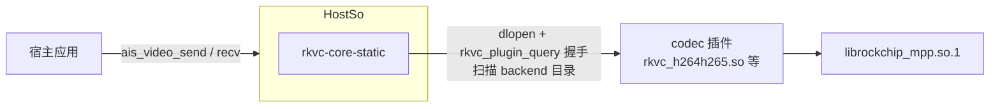

# semantic-codec-sdk 向上集成指南

> 目标：宿主（`semantic-codec-sdk`，ais SDK）内嵌 rkvc 所需的全部信息，
> 单点收口、避免跑偏。本文只写**向上集成**——rkvc 向宿主提供什么、宿主侧
> 必须做什么、如何验证与排障；rkvc 内部设计见 [architecture.md](architecture.md)，
> 版本变更见 [CHANGELOG.md](../CHANGELOG.md)。
> 参考宿主快照：2026-09。本文描述 **C ABI 0.5.0 现状**。

## 1. 集成模型

三条结构性要点：

1. **核心内嵌、codec 插件自包含**。`rkvc-core-static` 链接进宿主；
   编解码能力以独立 DSO 运行时发现（dlopen + `rkvc_plugin_query` 握手 +
   probe 探测）。插件静态内嵌 core，只导出 `rkvc_plugin_query`，
   **不要求宿主导出任何符号**（§4.2）。
2. **宿主只描述意图**。operation/codec/policy/quality/端点交给规划器，在
   已装载 codec 中按优先级/得分挑候选，open 失败自动回退次优。
3. **C ABI 是唯一稳定面**。宿主只经 `core/include/rkvc/rkvc.h`
   （C ABI 0.5.0）消费 rkvc；原生 C++ API 是进程内第二面，
   不对宿主做跨编译器承诺。

| 项        | 现状（C ABI 0.5.0）                                                                                                                                        |
| --------- | ---------------------------------------------------------------------------------------------------------------------------------------------------------- |
| 链接形态  | `add_subdirectory(core)` + `rkvc-core-static`；`examples/` 三个 C 样板为对接契约                                                                           |
| codec DSO | 四 codec 工程插件（`rkvc_h264h265.so` / `rkvc_mlvc.so` / `rkvc_av1.so` / `rkvc_sr.so`），`rkvc_plugin_query(host_abi)` 握手（`kPluginAbi=1` + 工具链指纹） |
| 依赖      | Threads + dl（+ 各 codec 前缀：MPP / rknnrt / SVT）                                                                                                        |
| 工具链    | C++20；自有源 `-fno-exceptions -fno-rtti`；aarch64 `-static-libstdc++ -static-libgcc`                                                                      |
| 符号审计  | `tools/check-symbols.sh`（GLIBC ≤ 2.34 + NEEDED 禁动态 C++ 运行时；板端审计，x86 不跑）                                                                    |
| SDK 对接  | 适配层按本 C ABI 重写（仓库外），以 `examples/integration-c/` 样板为契约                                                                                   |



## 2. 接口清单与行为契约（集成验收基线）

本节回答"向上集成需要 rkvc 提供什么"。`examples/` 三个 C 样板按本节验收；
宿主侧对接现状见 §3。

### 2.1 宿主消费的接口清单

上游适配层 `codec/video/runtime/video_runtime.cpp`（宿主的全部 rkvc 调用点，
2026-09-09 实测）消费面，按新 C ABI（handle 式 context/**session**/frame，
结构体 size/version 首字段演化）逐项覆盖：

| 类      | 符号                                                                                                                                                                                                                                                            |
| ------- | --------------------------------------------------------------------------------------------------------------------------------------------------------------------------------------------------------------------------------------------------------------- |
| options | `rkvc_context_options_init`                                                                                                                                                                                                                                     |
| context | `rkvc_context_create`（带 `backend_dirs`）/ `rkvc_context_destroy` / `rkvc_probe_device` / `rkvc_context_add_model_file`                                                                                                                                        |
| session | `rkvc_session_request_init` / `rkvc_session_create`（带 diag）/ `rkvc_session_start` / `rkvc_session_push` / `rkvc_session_try_pull` / `rkvc_session_pull` / `rkvc_session_push_eos` / `rkvc_session_wait` / `rkvc_session_destroy` / `rkvc_session_error_text` |
| frame   | `rkvc_frame_desc_init` / `rkvc_frame_wrap` / `rkvc_frame_get_desc` / `rkvc_frame_release`                                                                                                                                                                       |
| diag    | `rkvc_diag_fmt_text` / `rkvc_diag_release` / `rkvc_status_str`                                                                                                                                                                                                  |
| 枚举    | STATUS / CODEC / POLICY / OPERATION / FRAME_FMT / MEM_DOMAIN / ENDPOINT / `RKVC_FRAME_TS_UNKNOWN`                                                                                                                                                               |

### 2.2 行为契约

宿主适配层依赖以下语义，重写必须保持：

1. **背压三原语**：push 非阻塞（输入队列有界，满 → AGAIN）；
   pull 阻塞至有帧或 EOS；try_pull 非阻塞（空且未 EOS → AGAIN）。成功/EOS/
   暂空三态必须严格区分——旧 `try_pop` 成功弹帧误报 EOS 的缺陷曾致
   宿主把正常帧当 EOF，queue/session 两层回归必须保持覆盖。EOS 经 `push_eos` 注入。
2. **帧借用**：wrap 零拷贝借用宿主内存；帧引用归零前载荷必须存活；销毁
   顺序 = 先 session，再载荷副本，再 context。
3. **诊断链**：session 创建与启动失败携带 stage/subject/reason 诊断链，
   可格式化为文本；FILE 会话终端错误另经 `rkvc_session_error_text` 取阶段明细。
4. **FRAME_SINK 格式注入**：无端点源节点时，请求端点声明的 fmt/宽高注入
   首末节点端口（实现为 `core/src/graph.cpp` 注入段；缺失时 MPP 硬编 open 报
   FORMAT，见 §5.1）。
5. **probe 语义**：只反映设备能力探测；probe 失败淘汰候选而不使 context
   创建失败；最近装载诊断可查。
6. **排空有界性**：flush 提交 EOS 后，后端在有限时间内必然到达尾包/EOS/
   错误（当前 MPP 为输出超时切 5000ms 持续排包至 MPP EOS，见 §5.2）——
   宿主"flush 后阻塞排空"以此为先决条件。
7. **无异常**：C ABI 实现 100% 无异常（`-fno-exceptions -fno-rtti`），
   dlopen 边界零翻译；OOM 走 `RKVC_NOMEM` 返回路径。

### 2.3 状态码与宿主映射参考

上游 `map_status()`（`video_runtime.cpp`）按 C ABI 0.5.0 状态枚举映射：

| rkvc 状态                                                    | 宿主映射              | 说明                                                              |
| ------------------------------------------------------------ | --------------------- | ----------------------------------------------------------------- |
| `OK` / `AGAIN` / `EOF` / `NOMEM`                             | 同名 `AIS_*`          | AGAIN 只出现在内部背压路径，send/recv 均不对外暴露（§3.3）        |
| `INVALID` / `NEGOTIATE`                                      | `AIS_ERR_INVALID_ARG` |                                                                   |
| `NOT_FOUND` / `UNSUPPORTED` / `FORMAT` / `PERMISSION` / `HW` | `AIS_ERR_UNSUPPORTED` | 注意 `HW` 也映到 UNSUPPORTED，open 阶段硬件失败对外表现为"不支持" |
| `MODEL` / `LICENSE` / `INTEGRITY`                            | `AIS_ERR_MODEL`       | 模型/许可证类                                                     |
| 其他（`IO` / `CANCELED` / `INTERNAL`）                       | `AIS_ERR_INTERNAL`    |                                                                   |

视频路径当前不使用 `AIS_ERR_ENCODE` / `AIS_ERR_DECODE`（留给图像式一次性
调用）。`Status` 负值枚举保留 AGAIN/EOF 流控语义，分层（流控/参数/格式/
硬件/模型/内部）即上表。

## 3. 宿主集成（上游 2026-09 快照）

### 3.1 构建：视频顶层由集成者自持

上游仓库根 `CMakeLists.txt` 已是占位报错（"Do not configure the repo root"），没有仓库级统一构建：图像（`codec/image`）与加密签发（`security`）各自独立 `project()`；语音/视频按上游约定"由对应负责人在 `codec/audio`、`codec/video` 里自己写 CMake、自己编"（上游 `docs/build.md`）。

上游只为视频提供 CMake 片段，`core/`、`platform/`、`codec/video/` 都是挂在父目标 `ais_semantic_codec` 上的 `target_sources` 片段。`codec/video/CMakeLists.txt` 全文：

```cmake
if(AIS_VIDEO_CODEC_RKVC)
    target_sources(ais_semantic_codec PRIVATE
        ${CMAKE_CURRENT_SOURCE_DIR}/video_codec.cpp
        ${CMAKE_CURRENT_SOURCE_DIR}/runtime/video_runtime.cpp)
    target_link_libraries(ais_semantic_codec PRIVATE
        rkvc_static rkvc_instrumentation)
else()
    # 未内嵌 rkvc：仅编译退化实现，视频接口返回 AIS_ERR_UNSUPPORTED。
    target_sources(ais_semantic_codec PRIVATE
        ${CMAKE_CURRENT_SOURCE_DIR}/video_codec.cpp)
endif()
```

上游不再提供 `AIS_RKVC_SOURCE_DIR` / `add_subdirectory(rkvc)` 的参考顶层，集成者需要自己写。参考顶层：

```cmake
cmake_minimum_required(VERSION 3.21)   # 内嵌 rkvc 要求 ≥3.21
project(ais_semantic_codec LANGUAGES C CXX)

set(CMAKE_C_STANDARD 11)    # SDK 公共层 C11
set(CMAKE_CXX_STANDARD 17)  # 视频适配层 C++17
set(CMAKE_POSITION_INDEPENDENT_CODE ON)

set(AIS_SDK_ROOT "" CACHE PATH "semantic-codec-sdk source tree")
option(AIS_VIDEO_CODEC_RKVC "Video codec backed by rkvc" ON)
set(AIS_RKVC_SOURCE_DIR "" CACHE PATH "rkvc source tree (>= CMake 3.21)")

add_library(ais_semantic_codec SHARED)
# 适配层以 SDK 根为 include 基准（#include "core/..." / "codec/video/..."），
# 除 include/ 外必须把 SDK 根也加进私有包含路径。
target_include_directories(ais_semantic_codec
    PUBLIC  ${AIS_SDK_ROOT}/include
    PRIVATE ${AIS_SDK_ROOT})

if(AIS_VIDEO_CODEC_RKVC)
    # ... 校验 ${AIS_RKVC_SOURCE_DIR}/CMakeLists.txt 存在 ...

    # 关键陷阱：CMake 选项不会自动变成编译定义。video_codec.cpp 用
    # #if defined(AIS_VIDEO_CODEC_RKVC) 切换真实/退化实现，上游片段并不
    # 代劳——缺了这行会静默编出"全部接口返回 AIS_ERR_UNSUPPORTED"的退化库。
    target_compile_definitions(ais_semantic_codec PRIVATE AIS_VIDEO_CODEC_RKVC=1)

    # 只取核心静态库：关掉 rkvc 自身的 CLI 与 codec 插件
    # （宿主只跑 core 单测时才开 RKVC_CORE_BUILD_TESTS）
    set(RKVC_BUILD_CLI OFF    CACHE BOOL "" FORCE)
    set(RKVC_BUILD_CODECS OFF CACHE BOOL "" FORCE)

    # 目录属性隔离：宿主顶层若锁了旧 C++ 标准或关异常/RTTI 开关，
    # 会污染 core 子目录（C++20、无异常、无 RTTI 是硬约束）。
    # 进子目录前保存 CXX_STANDARD 与相关选项，设为所需值，
    # add_subdirectory 后恢复。
    set(CMAKE_CXX_STANDARD 20)
    set(CMAKE_CXX_STANDARD_REQUIRED ON)
    set(CMAKE_CXX_EXTENSIONS OFF)
    add_subdirectory(${AIS_RKVC_SOURCE_DIR}/core rkvc-core)
    # ... 恢复保存的属性 ...
endif()

# 挂 SDK 片段（rkvc::core 别名在生成期解析，与 add_subdirectory 顺序无关）
add_subdirectory(${AIS_SDK_ROOT}/core sdk-core)
add_subdirectory(${AIS_SDK_ROOT}/codec/video sdk-video)
# 需要板级探测时再加：add_subdirectory(${AIS_SDK_ROOT}/platform sdk-platform)
```

注意：

- 宿主链 `rkvc::core`（= `rkvc-core-static`）。codec 插件是运行时
  dlopen 的独立 DSO（`rkvc_h264h265.so` 等），**不要**链进宿主；
  插件自含 core，只导出 `rkvc_plugin_query`，宿主无需
  `-Wl,--export-dynamic`（§4.2）。
- 静态宿主同样无需导出符号。改过可见性/标准后必须**全量重建**。
- 宿主自身 C++ 部分仍需满足目标机运行库（rkvc 侧 aarch64 静态
  libstdc++/libgcc 不向宿主传播约束，§4.5）。

### 3.2 公共 API 与配置

- 公共接口（`include/ais/video_codec.h`）：`ais_video_open` →
  `ais_video_send`×N → `ais_video_flush` → `ais_video_recv` 至 `AIS_ERR_EOF`
  → `ais_video_close`；能力查询 `ais_video_caps`。SDK 自身对外纯 C ABI
  （`include/ais/*.h`），视频适配层 C++17。codec ID：
  `AIS_CODEC_VIDEO_STANDARD=0x20` / `AIS_CODEC_VIDEO_SEMANTIC=0x21`，open 经
  `ais_codec_check_video` 校验；编解码族
  `AIS_CODEC_FAMILY_{AUTO,H264,HEVC,AV1,MLVC}`。
- 配置：`ais_video_config_init`/`struct_size` 已移除，`memset(&cfg,0,sizeof)`
  后逐字段赋值（上游 `tests/test_video_codec.c` 即此用法）。陷阱：
  - `memset` 后 `qp == 0` 被当**固定 QP 0**（适配层 `if (qp >= 0)
    req.quality.qp = qp`）——要自动 QP 必须显式 `cfg.qp = -1`；
  - `bitrate_bps` 为 int64，>0 时强转 int32 写入 `req.quality.bitrate_bps`，
    超 `INT32_MAX` 静默截断；
  - `fps_num/fps_den` 透传到 `req.quality.fps`（0 取后端默认；MPP/MLVC 均已接线）。
- 缓冲：视频帧公开创建 `ais_buffer_video(w, h, fmt, pts_us, frame_index,
  &out)`；时间戳哨兵 `AIS_TS_UNKNOWN`(=INT64_MIN) ↔ `RKVC_FRAME_TS_UNKNOWN`
  互转。码流包**没有公开创建函数**：编码输出由适配层经内部头
  `core/ais_buffer_internal.h` 的 `ais_buffer_create(AIS_BUFFER_BITSTREAM, ...)`
  + `ais_buffer_set_packet_info`（PTS/DTS/flags）构造；**解码方向的外部文件/
  网络码流无公开注入入口**（send 要求 kind 为 `AIS_BUFFER_BITSTREAM`），属
  上游缺口——需推动上游在 `ais_buffer.h` 补公开创建函数，或视频侧自持补丁。
- 端点与格式：流式会话使用 `RKVC_ENDPOINT_FRAME_SINK` 双端点。编码：
  `req.input.fmt` = `cfg.format` 的 rkvc 映射（NV12/YUV420P/RGB24，不支持
  直接 open 失败 UNSUPPORTED），`req.output.fmt = RKVC_FRAME_FMT_BITSTREAM`，
  宽高写 `req.input.width/height`；解码：`req.input.fmt = BITSTREAM`，
  `req.output.fmt` = `cfg.format` 映射（无法映射时 `RKVC_FRAME_FMT_UNKNOWN`，
  由后端/协商决定）。`req.model_id = cfg.model_id` 透传语义模型。

### 3.3 适配层当前实现契约

适配层实现：`codec/video/video_codec.cpp`（C ABI 薄壳 + 未内嵌 rkvc 时的
退化实现）与 `codec/video/runtime/video_runtime.cpp`（C++ `ais::video::Codec`）。

- **send 完全同步**：校验 buffer kind（编码 `AIS_BUFFER_VIDEO` / 解码
  `AIS_BUFFER_BITSTREAM`）→ 深拷贝载荷 → `rkvc_frame_wrap`（借用）→ push
  循环：遇 AGAIN 先 `drain_pending()`（try_pull 排空已产出帧存入 `pending_`
  腾出输入槽位）再睡眠 100µs 重试，直至入队成功或硬错误——调用方永远收不到
  `AIS_ERR_AGAIN`。flush 后再 send 按头文件契约返回 `AIS_ERR_EOF`。
- **recv 恒阻塞**：先消费 `pending_`，空则 `rkvc_session_pull`；EOF 由
  `eof_seen_` 锁存，之后恒 `AIS_ERR_EOF`；排空期转换错误锁存进 `error_`。
- **帧载荷策略**：send 副本挂会话级 `owned_` 数组，close（`rkvc_session_destroy`
  之后）统一 free——**长流内存随累计发送量线性增长**。C ABI 只提供借用式
  `rkvc_frame_wrap`，没有带释放回调的帧创建函数；长流/大帧场景宿主必须自持
  载荷、按引用归零释放，上游升级时注意别被其 `owned_` 实现回退。
- **caps**：`ais_video_caps(caps)` 无 `backend_dir` 参数（临时 context 以
  NULL options 创建，只走默认搜索路径 §4.1 后三条），`cfg.backend_dir` 对
  caps 无效。语义（2026-09 起）：`has_encoder = has_mpp_encoder || has_rknn`、
  `has_decoder = has_mpp_decoder || has_rknn`（RKNN 计入编/解能力）、
  `has_npu = npu_cores > 0`（NPU 探测路径见 §5.5）；`soc` 截断 63B。caps 只反映设备探测，不代表
  已装载后端集合。
- **死锁反模式**（gdb 实证）：flush 前"send 数帧 → `while (recv==OK)` 排空"。
  硬件编码器攒帧不产包，阻塞 recv 永等输出、后端等新输入——主线程、
  worker、MPP 三方互等（gdb 可见 pull 等输出、队列等输入、MPP 等任务）。安全模式只有两种：交错 send/recv（背压 SDK 内部
  消化），或 flush 后 `while (recv==OK)` 排空至 EOF。

### 3.4 上游已知缺口（2026-09-09 实测）

1. **DMABUF 回读丢失**：`frame_to_buffer` 不检查 `spec.domain`，仅
   `if (desc.data && desc.size > 0) memcpy(...)`——MPP 硬解输出 DMABUF 帧
   （`desc.data == NULL`、载荷在 `desc.fd`，见 §5.3）会跳过拷贝、把清零的
   `ais_buffer_video` 缓冲当成功帧返回。修复前 MPP 硬解输出经新适配层不可用；
   须自持补丁（domain 检查 + fd 只读 `mmap` + 按 `stride`/`ver_stride` 分平面
   去 stride 拷贝；映射/边界/布局检查失败必须返回错误，绝不返回全零伪帧；
   非线性 modifier 拒绝，后续应经 RGA 显式转换），或在 rkvc 侧增加解码强制
   HOST 输出的请求选项。
2. 解码 bitstream 注入无公开入口（§3.2）。
3. 视频测试未接入上游构建（`tests/CMakeLists.txt` 只编图像）；无视频示例
   （`ais_video_example` 已移除）——回归入口见 §6.1。
4. 上游自身 `docs/api.md` 已过时（仍写 `ais_video_init/encode/decode/release`），
   以其头文件与实现为准。

## 4. 构建与部署机制

### 4.1 codec 插件发现顺序

`rkvc_context_create` 时按以下目录顺序收集 `*.so`（目录内排序后逐个
`rkvc_plugin_query` 握手，失败只记诊断）：

1. 调用方经 `rkvc_context_options.backend_dirs` 传入的可信目录
   （宿主应把用户参数透传到此，参考宿主的 `cfg.backend_dir`）；
2. 包内目录：`<core 所在宿主二进制映射目录>/rkvc/backends`（dladdr 定位，
   适配"CLI 与插件同目录部署"布局）；
3. `/usr/local/lib/rkvc/backends`；
4. `/usr/lib/rkvc/backends`。

装载失败的最近一条诊断记录在 context 内部，排除问题时可 gdb
断点 `rkvc::Context::load_plugin` 观察。`inspect backends` 可逐个
dlopen 探查握手结果。

### 4.2 宿主符号导出（已取消）

插件以 `RTLD_NOW | RTLD_LOCAL` 装载，`dlsym` 取 `rkvc_plugin_query`
并校验 `host_abi == kPluginAbi` 与工具链指纹；插件静态内嵌 core
（`rkvc_mlvc` PRIVATE 链 `mlvc::codec`，后者 PUBLIC 链 `rkvc::core`），
只导出 `rkvc_plugin_query`；
装载不依赖宿主进程符号域。**宿主无需 `-Wl,--export-dynamic`，
无需管 visibility，静态宿主同样**。旧 C ABI 时期的
`undefined symbol: rkvc_node_emit` 一类故障在本 ABI 下不存在；
插件拒载只看 `kPluginAbi` 与工具链指纹（`inspect backends` 可见原因）。

### 4.3 插件依赖与部署

插件 DSO 的第三方依赖（MPP 的 `librockchip_mpp.so.1`、rknnrt、SVT）走常规
动态链接；部署到目标机时三选一：

1. 前缀按配置期路径原样存在（构建机即目标机/板载编译场景天然满足）；
2. 目标机系统路径可解析依赖（如 `/usr/local/lib` 下的 `librockchip_mpp.so.1`）；
3. 运行时 `LD_LIBRARY_PATH` 指向依赖库目录。

### 4.4 backend_dir 传参

传给宿主/`rkvc_context_options` 的目录须为**绝对路径**；脚本内变量未展开
（如 `$PWD/rkvc` 字面量）会得到"无候选"的误导性报错。

### 4.5 工具链与交叉

- rkvc 全 C++20（CMake ≥ 3.21），自有源 `-fno-exceptions -fno-rtti`；
  aarch64 构建自动 `-static-libstdc++ -static-libgcc`，rkvc 自身不再向宿主
  传播 C++ 运行库版本约束；宿主自身 C++ 部分仍需自行满足目标机运行库。
- 板端审计：`tools/check-symbols.sh`（GLIBC ≤ 2.34、NEEDED 禁动态
  C++ 运行时；板 glibc 2.35，x86 构建不跑此审计）。
- mlvc/sr 消费 `librknnrt.so`（其自身 NEEDED libstdc++），板端以系统
  rknnrt 为准；h264h265 只消费 `librockchip_mpp.so`，av1 只消费
  `libSvtAv1Enc.so`。
- **若宿主含 C++（适配层 C++17），宿主交叉工具链的 libstdc++ 必须与目标机
  glibc 兼容**——高版本宿主交叉 GCC 的 libstdc++ 常要求 GLIBC ≥ 2.36/2.38，
  低版本 sysroot 链接会引用 `__isoc23_strtoul`/`arc4random` 等新符号而失败，
  此时改目标板本地编译（RK3576 板载 Ubuntu 22.04 + g++-11 实测，
  libstdc++ 3.4.30 与系统运行库完全匹配）。

### 4.6 rkvc 构建开关与典型配置

| 开关                                                   | 默认 | 说明                          |
| ------------------------------------------------------ | ---- | ----------------------------- |
| `RKVC_BUILD_CLI`                                       | ON   | 构建 `rkvc` CLI；内嵌关       |
| `RKVC_BUILD_CODECS`                                    | ON   | 构建四个 codec 插件；内嵌关   |
| `RKVC_CORE_BUILD_TESTS`                                | OFF  | core 单测；`tests` 预设/CI 开 |
| 各 codec `RKVC_*_BUILD_TESTS` / `RKVC_CLI_BUILD_TESTS` | ON   | 内嵌按需关                    |

第三方前缀（各 codec 工程独立声明，缺失时对应插件关 NPU/MPP 硬件路径，
纯软逻辑仍可构建测试）：

| 前缀                     | 消费方   | 内容                                       |
| ------------------------ | -------- | ------------------------------------------ |
| `MPP_INSTALL_PREFIX`     | h264h265 | `lib/librockchip_mpp.so` + 头              |
| `SVT_AV1_INSTALL_PREFIX` | av1      | `lib/libSvtAv1Enc.so` + `include/svt-av1/` |
| `RKNN_INSTALL_PREFIX`    | mlvc、sr | `lib/librknnrt.so` + `rknn_api.h`          |

依赖前缀用板卡/系统自带安装或目标架构前缀目录；交叉务必用目标架构前缀，
混入宿主架构库运行期才暴露。

典型配置（`-S` 指向 §3.1 的视频侧自持顶层，不再是上游仓库根）：

```bash
# A. x86 开发验证（SVT 软编路径，无硬件依赖）
cmake -S <视频顶层> -B .build -G Ninja -DAIS_VIDEO_CODEC_RKVC=ON \
  -DAIS_SDK_ROOT=/path/to/semantic-codec-sdk \
  -DAIS_RKVC_SOURCE_DIR=/path/to/rkvc \
  -DRKVC_BUILD_CLI=OFF -DRKVC_BUILD_CODECS=ON \
  -DSVT_AV1_INSTALL_PREFIX=/path/to/svt-install
cmake --build .build

# C. 目标板本地编译（含 C++ 宿主的推荐路径，RK3576 实测）
cmake -S <视频顶层> -B .build -G Ninja -DCMAKE_BUILD_TYPE=Release \
  -DAIS_VIDEO_CODEC_RKVC=ON -DAIS_SDK_ROOT=/data/sdk-test/semantic-codec-sdk \
  -DAIS_RKVC_SOURCE_DIR=/data/sdk-test/rockchip-video-codec \
  -DRKVC_BUILD_CLI=OFF -DRKVC_BUILD_CODECS=ON \
  -DMPP_INSTALL_PREFIX=<mpp前缀> -DRKNN_INSTALL_PREFIX=<rknn前缀>
cmake --build .build && ctest --test-dir .build
```

（aarch64 交叉的 libstdc++ 兼容性问题见 §4.5，命中时改用配置 C。）

## 5. rkvc 侧行为保证与已知约束

### 5.1 FRAME_SINK 格式注入（见 §2.2-4）

实现：管线组装时把 `req.input.fmt`（width/height 字段级合并，冲突报
NEGOTIATE）注入首节点输入端口、`req.output.fmt` 注入末节点输出端口
（`core/src/graph.cpp` 注入段）；FILE 端点路径由 fileio source 声明格式
传递，不受影响。早于该修复的检出在 MPP 硬编 open 时报 FORMAT，
错误特征见 §7。

### 5.2 MPP 后端排空与超时（§2.2-6 排空有界性的当前实现）

- process 路径输出超时 `MPP_TIMEOUT_NON_BLOCK`（编码器尚未产包时 worker
  不卡在 `encode_get_packet`）；输入沿用同步 task/frame 所有权语义，设
  5000ms 有限超时，硬件异常时可失败退出；
- flush 成功提交 EOS 后输出超时切 5000ms，持续排包直到 MPP EOS，既保留
  GOP 尾包又避免永久等待；
- 旧版 MPP 的空非阻塞输出可能以 `MPP_NOK` 而非 `MPP_OK + NULL packet`
  表示：process 路径两种都视为"当前无包"，flush 路径仍视为硬件错误；
- 队列 try_pop 成功/EOS/暂空三态修复（§2.2-1），队列已有帧先于
  cancel/error 状态交付；process/flush 错误最终透传给 pull，不再表现成
  正常 EOF。

### 5.3 线性 DMABUF 解码输出

MPP 编码接受 NV12 / YUV420P（HOST 域拷入或 DMABUF 导入）；解码输出为线性
DMABUF 帧（`desc.spec.domain = RKVC_MEM_DOMAIN_DMABUF`，`desc.data` 可为
NULL、载荷在 `desc.fd`；FBC/瓦片布局需 DRM modifier 契约，后端刻意只暴露
线性帧，非线性 modifier 拒绝）。HOST 回读是**宿主职责**；当前上游适配层
该处理已丢失，见 §3.4-1。

### 5.4 MPP probe 条件

MPP 后端装载探测 = `access("/dev/mpp_service", R_OK|W_OK)`（旧节点名
`/dev/mpp-service` 兼容）+ `mpp_check_support_format` AVC 编/解任一支持。
RK3576 实测：DEC AVC/HEVC/AV1/VP9 均可，ENC 仅 AVC/HEVC（AV1/VP9 编码返回
不支持，属硬件能力，非缺陷）。

### 5.5 NPU 探测条件

NPU 存在位任一命中即置位：`/dev/rknpu`、`/dev/rknpu0`、`/dev/rknn`，
或 DRI/设备指纹（`/dev/dri/by-path/` 下 `*npu*`、`/sys/class/devfreq/` 下
`*npu*`）。161（RKNPU 0.9.8 DRM 形态）无 `/dev/rknpu`，NPU 以
`card1/renderD129`（`platform-27700000.npu-card/render`）存在——只认
`/dev/rknpu*` 的旧检出在此板误报无 NPU（`has_npu=0`），更新 core/sr 即可。

## 6. 端到端验证

### 6.1 命令与预期输出

上游 `examples/` 已无视频示例（`ais_video_example` 移除）。当前回归入口是
`tests/test_video_codec.c`——它未接入上游任何 CMake（上游 `tests/CMakeLists.txt`
只编图像测试），视频侧顶层需自行接线：

```cmake
add_executable(test_video_codec ${AIS_SDK_ROOT}/tests/test_video_codec.c)
target_include_directories(test_video_codec PRIVATE ${AIS_SDK_ROOT}/tests)
target_link_libraries(test_video_codec PRIVATE ais_semantic_codec)
add_test(NAME video_codec COMMAND test_video_codec)
```

```bash
# backend_dir 必须绝对路径；不设则只靠默认搜索路径（§4.1 前三条）
AIS_VIDEO_BACKEND_DIR=/abs/path/to/.build/rkvc ./test_video_codec
```

行为：编码 32×32 NV12 一帧（family=AV1）→ flush → recv 至 `AIS_ERR_EOF` 并断言
有字节产出；随后尝试 decode open（无候选时允许 `AIS_ERR_UNSUPPORTED`）。
未内嵌 rkvc 或无可用后端时打印 `rkvc backend not built; skipping video test`
并以 0 退出——x86 上"测试通过"可能只是跳过，需结合后端装载日志判断。

### 6.2 实测基线（RK3576-evb1-v10，2026-09-03，旧版宿主契约）

下表在旧契约宿主（recv 分阶段拉取 + 帧回调释放）上测得；2026-09 上游重写为
同步 send / 阻塞 recv / `owned_` 驻留后需重测，**长流内存一行已不适用**（§3.3）。

| 环境           | Ubuntu 22.04 / glibc 2.35 / RKNPU v0.9.8 / 板载 g++-11 11.4.0    |
| -------------- | ---------------------------------------------------------------- |
| 构建           | 板载增量编译 29 目标全过；宿主 SDK 单测 7/7                      |
| SVT AV1 软编   | 32×32×5 帧 → 174B；flush→EOF 语义正常                            |
| MPP H264 硬编  | 640×480×5 帧 → 5 包 1204B；500 帧 → 500 包 18237B（CBR）         |
| MPP H264 回环  | 64×64×5 帧 → 5 包 386B → 5 个 NV12 HOST 帧                       |
| 交错 send/recv | 50/500 帧均正常 EOF；flush 前 AGAIN、flush 后完整阻塞排空        |
| 长流内存       | 500 帧 VmRSS 增量约 0.9MiB（复跑 5200→6112KiB）；无 MPP 泄漏告警 |

### 6.3 板级回归矩阵

- [ ] `test_video_codec.c` 接入视频侧顶层构建：AV1 编码 → flush → 排空至 EOF
      （`AIS_VIDEO_BACKEND_DIR` 绝对路径）
- [ ] H.264 逐包回环（编→解）：随 `ais_video_example` 一并移除，需自持覆盖；
      注意解码输入缺公开 bitstream 缓冲创建函数（§3.2），回环测试暂需经
      `core/ais_buffer_internal.h` 内部通道构造输入
- [ ] H264 硬编 500 帧 + RSS 前后对比（新契约下 `owned_` 驻留，预期随帧数增长；
      阈值与释放方案待 §3.3 定论后重测）
- [ ] 交错 send/recv 压力（§3.3 新契约，50/500 帧）
- [ ] 解码逐帧尺寸/数量校验；线性 DMABUF 去 stride 回读为 HOST NV12
      （新适配层未实现 DMABUF 回读，§3.4-1 补丁落地前硬解不可用）
- [ ] caps 输出（soc / mpp-enc / mpp-dec / npu；注意 §3.3 新语义）

## 7. 故障排查速查

| 错误特征                                             | 根因                                                                                  | 处置                                                                                        |
| ---------------------------------------------------- | ------------------------------------------------------------------------------------- | ------------------------------------------------------------------------------------------- |
| 视频接口全部返回 `AIS_ERR_UNSUPPORTED`，测试恒"跳过" | 顶层缺 `target_compile_definitions(... AIS_VIDEO_CODEC_RKVC=1)`，编出退化实现（§3.1） | 补编译定义后全量重建                                                                        |
| 无候选（`required stage has no candidate`）          | 插件未装载（目录无 .so / 路径非绝对 / 握手失败）                                      | gdb 断 `rkvc::Context::load_plugin` 看装载流；`inspect backends` 看拒载原因；确认 §4.1/§4.4 |
| 插件拒载（ABI/指纹）                                 | 插件与 core 非同一次构建（`kPluginAbi` 或工具链指纹不一致）                           | 插件与宿主链的 core 同源重建；`inspect backends` 确认                                       |
| `session_start failed: format (-8)`（MPP 硬编）      | 旧检出无 FRAME_SINK 格式注入，编码器读到 UNKNOWN                                      | §5.1 修复（`core/src/graph.cpp` 注入段）                                                    |
| 三方互等挂死（pull / queue / MPP）                   | flush 前"send 数帧 → `while (recv==OK)` 排空"反模式（recv 恒阻塞，无超时）            | §3.3：排空只在 flush 后进行                                                                 |
| `drain_pending` 吞帧/误判 EOF，send 背压后丢输出     | 旧版队列 try_pop 成功弹帧后仍报空，被误判成 EOS                                       | 更新 core；用 queue/session 非阻塞回归测试确认（§2.2-1）                                    |
| 解码输出为全零帧但返回成功                           | 新适配层未处理 DMABUF 域（`desc.data==NULL` 跳过 memcpy）                             | §3.4-1：自持 DMABUF 回读补丁                                                                |
| `caps enc=0/dec=0` 但 NPU 可用                       | caps 新语义把 RKNN 计入编/解能力，MPP 探针失败时不体现                                | §3.3 caps（先确认语义，再查 MPP probe 条件 §5.4）                                           |
| `has_npu=0` 但 NPU 驱动正常                          | 旧检出只认 `/dev/rknpu*`，DRM 形态 NPU（161）漏检                                     | 更新 core/sr（§5.5）                                                                        |
| 编码质量异常（码率失控/全黑）                        | `memset` 配置后未显式 `qp=-1`，`qp=0` 被当固定 QP 0                                   | §3.2                                                                                        |
| 长流 RSS 线性增长                                    | 适配层 `owned_` 会话级驻留，close 前不释放（C ABI 无释放回调创建函数）                | §3.3：宿主自持载荷、按引用归零释放                                                          |
| 编译报 `CLOCK_MONOTONIC` 未声明等                    | 宿主目录属性污染 core 子目录                                                          | §3.1 属性隔离                                                                               |
| 链接失败引用 `__isoc23_strtoul` / `arc4random`       | 交叉 libstdc++ 与低版本 sysroot glibc 不兼容                                          | §4.5：换板载编译（§4.6 配置 C）                                                             |

## 8. 集成核对清单

（C ABI 0.5.0 + 上游 2026-09 快照）：

1. [ ] 视频顶层自持：创建 `ais_semantic_codec` 目标、SDK 根 include、
       `AIS_VIDEO_CODEC_RKVC=1` 编译定义、core 子目录（`RKVC_BUILD_CLI=OFF` /
       `RKVC_BUILD_CODECS=OFF`）与目录属性隔离（§3.1）
2. [ ] 依赖前缀：按需准备 MPP / SVT / RKNN（§4.6，无 RGA/FFmpeg 后端）
3. [ ] 构建：全量通过；`rkvc_h264h265.so` 等插件产出；
       `nm -D` 确认插件只导出 `rkvc_plugin_query`（§4.2）
4. [ ] 运行：`cfg.backend_dir` 绝对路径传参；插件第三方依赖在目标机可解析
       （§4.3/§4.4）；注意 `ais_video_caps` 不走 `backend_dir`（§3.3）
5. [ ] 适配层：配置显式赋值（`qp=-1` 等，§3.2）；帧载荷宿主自持（§3.3）；
       DMABUF 回读补丁（§3.4-1）；排空只在 flush 后（§3.3）；
       解码输入 bitstream 注入通道（§3.2）
6. [ ] 回归：`test_video_codec.c` 接线 + §6.3 矩阵全绿
7. [ ] 适配层按 §2.1 清单消费 C ABI 0.5.0（`rkvc_session_*` + `wait` +
       `error_text`），以 `examples/` 三个 C 样板为契约
8. [ ] 板端全产物过 `tools/check-symbols.sh`（GLIBC ≤ 2.34 + NEEDED 审计）；
       插件经 `rkvc_plugin_query` 握手装载（§4.1）

## 9. 版本与变更记录

| 日期       | 变更                                                                                                                                                                                                                                                                                                                                                                                                |
| ---------- | --------------------------------------------------------------------------------------------------------------------------------------------------------------------------------------------------------------------------------------------------------------------------------------------------------------------------------------------------------------------------------------------------- |
| 2026-09-10 | NPU 探测补 DRM 形态（161 无 `/dev/rknpu` 但 `renderD129` 可用，§5.5 + 排障行）；GLIBC 审计基线收口 2.34；caps 默认路径修正为 §4.1 后三条                                                                                                                                                                                                                                                            |
| 2026-09-09 | 重写落地：全篇翻转为 C ABI 0.5.0 现状（`rkvc_session_*`、`rkvc-core-static` 内嵌、插件自包含无宿主导出、`rkvc_h264h265.so` 等新插件名、GLIBC ≤ 2.34 审计、`RKVC_BUILD_CLI/CODECS` 开关）；旧 C ABI 0.4 树已删除，时期标注移除                                                                                                                                                                       |
| 2026-09-09 | 适配上游 2026-09 快照：上游移除仓库级统一构建（视频顶层自持）；公共 API 收口为 `ais_video_open/send/recv/flush/caps`（`config_init`/`struct_size`/`ais_buffer_bitstream` 移除）；send 同步化、recv 恒阻塞；帧载荷改 `rkvc_frame_wrap`+`owned_` 驻留；caps 纳入 RKNN；新增 MLVC family；发现新适配层 DMABUF 回读缺失与解码 bitstream 注入缺口；`ais_video_example` 移除，回归改 `test_video_codec.c` |
| 2026-09-03 | 宿主公共 API 收口；真实 H.264 编解码回环、线性 DMABUF 回读、try_pop 误报 EOF 与 MPP 有界排空修复，50/500 帧硬编回归通过（旧宿主契约，内存行已不适用）                                                                                                                                                                                                                                               |
| 2026-08    | 初版：x86 容器验证（SVT 软编 E2E）与最小修改提案（内嵌构建修复、try_pull 对称原语）——均已落地本仓与参考宿主                                                                                                                                                                                                                                                                                         |
