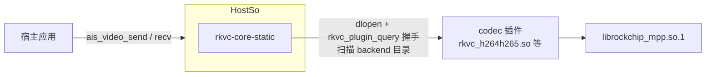

# semantic-codec-sdk 向上集成指南

> 宿主（`semantic-codec-sdk`，ais SDK）内嵌 rkvc 的单点指南：rkvc 提供
> 什么、宿主侧必须做什么、如何验证与排障。rkvc 内部设计见
> [architecture.md](architecture.md)，版本变更见 [CHANGELOG.md](../CHANGELOG.md)。
> 宿主快照 2026-09-11；本文描述 **C ABI 0.5.x 现状**。

## 1. 集成模型

1. **核心内嵌、codec 插件自包含**：`rkvc-core-static` 链接进宿主；
   编解码能力以独立 DSO 运行时发现（dlopen + `rkvc_plugin_query` 握手 +
   probe）。插件静态内嵌 core、只导出 `rkvc_plugin_query`，
   **宿主无需导出任何符号**（§4.2）。
2. **宿主只描述意图**：operation/codec/policy/quality/端点交给规划器，
   在已装载 codec 中按优先级挑候选，open 失败自动回退次优。
3. **C ABI 是唯一稳定面**：宿主只经 `core/include/rkvc/rkvc.h` 消费 rkvc；
   原生 C++ API 不对宿主做跨编译器承诺。

工具链：C++20、CMake ≥ 3.21、自有源 `-fno-exceptions -fno-rtti`；aarch64
自动 `-static-libstdc++ -static-libgcc`；依赖 Threads + dl（各 codec 另需
第三方前缀，§4.6）；板端符号审计 `tools/check-symbols.sh`（GLIBC ≤ 2.34 +
NEEDED 禁动态 C++ 运行时）。



## 2. 接口清单与行为契约

`examples/` 三个 C 样板按本节验收；宿主侧对接现状见 §3。

### 2.1 宿主消费的接口清单

上游适配层 `codec/video/runtime/video_runtime.cpp`（宿主的全部 rkvc 调用点）
消费面，按 C ABI（handle 式 context/**session**/frame，结构体
size/version 首字段演化）逐项覆盖：

| 类      | 符号                                                                                                                                                                                                                                                            |
| ------- | --------------------------------------------------------------------------------------------------------------------------------------------------------------------------------------------------------------------------------------------------------------- |
| options | `rkvc_context_options_init`                                                                                                                                                                                                                                     |
| context | `rkvc_context_create`（带 `backend_dirs`）/ `rkvc_context_destroy` / `rkvc_probe_device` / `rkvc_context_add_model_dir`                                                                                                                                        |
| session | `rkvc_session_request_init` / `rkvc_session_create`（带 diag）/ `rkvc_session_start` / `rkvc_session_push` / `rkvc_session_try_pull` / `rkvc_session_pull` / `rkvc_session_push_eos` / `rkvc_session_wait` / `rkvc_session_destroy` / `rkvc_session_error_text` |
| frame   | `rkvc_frame_desc_init` / `rkvc_frame_wrap` / `rkvc_frame_wrap_owned`（释放回调）/ `rkvc_frame_get_desc` / `rkvc_frame_release`                                                                                                                                  |
| diag    | `rkvc_diag_fmt_text` / `rkvc_diag_release` / `rkvc_status_str`                                                                                                                                                                                                  |
| 枚举    | STATUS / CODEC / POLICY / OPERATION / FRAME_FMT / MEM_DOMAIN / ENDPOINT / `RKVC_FRAME_TS_UNKNOWN`                                                                                                                                                               |

### 2.2 行为契约

宿主适配层依赖以下语义，重写必须保持：

1. **背压三原语**：push 非阻塞（输入队列有界，满 → AGAIN）；pull 阻塞至
   有帧或 EOS；try_pull 非阻塞（空且未 EOS → AGAIN）。成功/EOS/暂空
   三态严格区分，由 queue/session 两层回归覆盖。EOS 经 `push_eos` 注入。
2. **帧借用**：wrap 零拷贝借用宿主内存；帧引用归零前载荷必须存活；销毁
   顺序 = 先 session，再载荷副本，再 context。
3. **诊断链**：session 创建与启动失败携带 stage/subject/reason 诊断链，
   可格式化为文本；FILE 会话终端错误另经 `rkvc_session_error_text` 取明细。
4. **FRAME_SINK 格式注入**：无端点源节点时，请求端点声明的 fmt/宽高注入
   首末节点端口（§5.1；缺失时 MPP 硬编 open 报 FORMAT）。
5. **probe 语义**：只反映设备能力探测；probe 失败淘汰候选而不使 context
   创建失败；最近装载诊断可查。
6. **排空有界性**：flush 提交 EOS 后，后端在有限时间内必然到达尾包/EOS/
   错误（当前 MPP 实现见 §5.2）——宿主"flush 后阻塞排空"以此为先决条件。
7. **无异常**：C ABI 实现 100% 无异常，dlopen 边界零翻译；OOM 走
   `RKVC_NOMEM` 返回路径。

### 2.3 状态码与宿主映射

上游 `map_status()`（`video_runtime.cpp`）的映射：

| rkvc 状态                                                    | 宿主映射              | 说明                                                         |
| ------------------------------------------------------------ | --------------------- | ------------------------------------------------------------ |
| `OK` / `AGAIN` / `EOF` / `NOMEM`                             | 同名 `AIS_*`          | AGAIN 只出现在内部背压路径，send/recv 均不对外暴露（§3.3）   |
| `INVALID` / `NEGOTIATE`                                      | `AIS_ERR_INVALID_ARG` |                                                              |
| `NOT_FOUND` / `UNSUPPORTED` / `FORMAT` / `PERMISSION` / `HW` | `AIS_ERR_UNSUPPORTED` | `HW` 也映到 UNSUPPORTED，open 阶段硬件失败对外表现为"不支持" |
| `MODEL` / `LICENSE` / `INTEGRITY`                            | `AIS_ERR_MODEL`       | 模型/许可证类                                                |
| 其他（`IO` / `CANCELED` / `INTERNAL`）                       | `AIS_ERR_INTERNAL`    |                                                              |

视频路径不使用 `AIS_ERR_ENCODE` / `AIS_ERR_DECODE`（留给图像式一次性调用）。

## 3. 宿主集成

### 3.1 构建：视频顶层由集成者自持

上游无仓库级统一构建（仓库根 `CMakeLists.txt` 是占位报错；按上游
`docs/build.md`，语音/视频"由对应负责人自己写 CMake、自己编"），只为视频
提供挂在父目标 `ais_semantic_codec` 上的 CMake 片段。
`codec/video/CMakeLists.txt` 全文：

```cmake
if(AIS_VIDEO_CODEC_RKVC)
    # 前提：视频侧顶层已 add_subdirectory(<rkvc>/core) 并关闭
    # RKVC_BUILD_CLI / RKVC_BUILD_CODECS；此处只链 rkvc::core，
    # 插件运行时 dlopen，不链进宿主。
    # AIS_BUILDING：ais_export.h 在 Linux 下仅编译库自身时导出 AIS_API 符号。
    target_compile_definitions(ais_semantic_codec PRIVATE
        AIS_VIDEO_CODEC_RKVC=1 AIS_BUILDING=1)
    target_sources(ais_semantic_codec PRIVATE
        ${CMAKE_CURRENT_SOURCE_DIR}/video_codec.cpp
        ${CMAKE_CURRENT_SOURCE_DIR}/runtime/video_runtime.cpp)
    target_link_libraries(ais_semantic_codec PRIVATE
        rkvc::core)
else()
    # 未内嵌 rkvc：只编退化实现，视频接口返回 AIS_ERR_UNSUPPORTED。
    target_sources(ais_semantic_codec PRIVATE
        ${CMAKE_CURRENT_SOURCE_DIR}/video_codec.cpp)
endif()
```

上游不提供参考顶层，集成者自持。参考骨架：

```cmake
cmake_minimum_required(VERSION 3.21)   # 内嵌 rkvc 要求 ≥3.21
project(ais_semantic_codec LANGUAGES C CXX)

set(CMAKE_C_STANDARD 11)    # SDK 公共层 C11
set(CMAKE_CXX_STANDARD 17)  # 视频适配层 C++17
set(CMAKE_POSITION_INDEPENDENT_CODE ON)

set(AIS_SDK_ROOT "" CACHE PATH "semantic-codec-sdk source tree")
set(AIS_RKVC_SOURCE_DIR "" CACHE PATH "rkvc source tree")
option(AIS_VIDEO_CODEC_RKVC "Video codec backed by rkvc" ON)

add_library(ais_semantic_codec SHARED)
# 适配层 #include "core/..." 以 SDK 根为基准
target_include_directories(ais_semantic_codec
    PUBLIC  ${AIS_SDK_ROOT}/include
    PRIVATE ${AIS_SDK_ROOT})

if(AIS_VIDEO_CODEC_RKVC)
    # CMake 选项不会自动变成编译定义；缺它静默编出退化实现（§7）
    target_compile_definitions(ais_semantic_codec PRIVATE AIS_VIDEO_CODEC_RKVC=1)
    set(RKVC_BUILD_CLI OFF    CACHE BOOL "" FORCE)
    set(RKVC_BUILD_CODECS OFF CACHE BOOL "" FORCE)
    # 目录属性隔离：core 硬约束 C++20、无异常、无 RTTI；宿主顶层锁了
    # 旧标准/开关会污染子目录，进子目录前后保存/恢复 CXX_STANDARD 等
    set(CMAKE_CXX_STANDARD 20)
    set(CMAKE_CXX_STANDARD_REQUIRED ON)
    set(CMAKE_CXX_EXTENSIONS OFF)
    add_subdirectory(${AIS_RKVC_SOURCE_DIR}/core rkvc-core)
endif()

# 挂 SDK 片段（rkvc::core 别名生成期解析，与 add_subdirectory 顺序无关）
add_subdirectory(${AIS_SDK_ROOT}/core sdk-core)
add_subdirectory(${AIS_SDK_ROOT}/codec/video sdk-video)
# 需要板级探测时再加：add_subdirectory(${AIS_SDK_ROOT}/platform sdk-platform)
```

注意：

- 宿主只链 `rkvc::core`；插件是运行时 dlopen 的独立 DSO，**不要**链进
  宿主，也无需 `-Wl,--export-dynamic`（§4.2）。改过可见性/标准后必须
  全量重建。
- 宿主自身 C++ 部分仍需满足目标机运行库（§4.5）。

### 3.2 公共 API 与配置

- 公共接口（`include/ais/video_codec.h`）：`ais_video_open` →
  `ais_video_send`×N → `ais_video_flush` → `ais_video_recv` 至 `AIS_ERR_EOF`
  → `ais_video_close`；能力查询 `ais_video_caps`。SDK 对外纯 C ABI，视频
  适配层 C++17。codec ID：`AIS_CODEC_VIDEO_STANDARD=0x20` /
  `AIS_CODEC_VIDEO_SEMANTIC=0x21`；编解码族
  `AIS_CODEC_FAMILY_{AUTO,H264,HEVC,AV1,MLVC}`。
- 配置：无 `ais_video_config_init`，`memset(&cfg,0,sizeof)` 后逐字段赋值。
  陷阱：
  - `memset` 后 `qp == 0` 被当**固定 QP 0**——要自动 QP 必须显式 `cfg.qp = -1`；
  - `bitrate_bps` 为 int64，>0 时强转 int32，超 `INT32_MAX` 静默截断；
  - `fps_num/fps_den` 透传到 `req.quality.fps`（0 取后端默认）。
- 缓冲：视频帧 `ais_buffer_video(w, h, fmt, pts_us, frame_index, &out)`；
  码流包 `ais_buffer_bitstream(size, &out)` + `ais_buffer_set_packet_info`
  （PTS/DTS/flags）构造解码输入；只读访问器 `ais_buffer_cdata`。时间戳
  哨兵 `AIS_TS_UNKNOWN`(=INT64_MIN) ↔ `RKVC_FRAME_TS_UNKNOWN` 互转。
- 端点与格式：流式会话使用 `RKVC_ENDPOINT_FRAME_SINK` 双端点。编码：
  `req.input.fmt` = `cfg.format` 的 rkvc 映射（NV12/YUV420P/RGB24，不支持
  直接 open 失败 UNSUPPORTED），`req.output.fmt = RKVC_FRAME_FMT_BITSTREAM`，
  宽高写 `req.input.width/height`；解码：`req.input.fmt = BITSTREAM`，
  `req.output.fmt` = `cfg.format` 映射（无法映射时 UNKNOWN，由后端/协商
  决定）。`req.model_id = cfg.model_id` 透传语义模型。
- 模型注册：`cfg.model_dir` 直接传 `rkvc_context_add_model_dir(ctx, dir)`，
  按导出器约定整组装载目录内原生文件（`.rknn`/`.bin`/`.qppatch`，与 rkvc
  CLI `--model-dir` 同款约定），适配层不再自行扫描。mlvc/sr 依赖此路径，
  h264h265/av1 无模型。

### 3.3 适配层实现契约

- **send 完全同步**：校验 buffer kind（编码 `AIS_BUFFER_VIDEO` / 解码
  `AIS_BUFFER_BITSTREAM`）→ 深拷贝载荷 → `rkvc_frame_wrap_owned` → push；
  遇 AGAIN 先 `drain_pending()` 腾输入槽位再重试——调用方永远收不到
  `AIS_ERR_AGAIN`。flush 后再 send 返回 `AIS_ERR_EOF`。
- **recv 恒阻塞**：先消费 `pending_`，空则 `rkvc_session_pull`；EOF 锁存
  后恒 `AIS_ERR_EOF`；排空期错误锁存进 `error_`。
- **帧载荷策略**：send 副本经 `rkvc_frame_wrap_owned` 挂到帧引用计数，
  最后引用释放时回调 free——长流内存不随发送量增长（500 帧进程内实测
  峰值 RSS 11204KiB 板测）。wrap 失败时所有权不转移。
  **附注（2026-09-11 板级回归发现的修复）**：C ABI 的
  `rkvc_session_push` 是借用语义——返回 OK 后帧包装（内含 shared_ptr）
  仍归调用方，必须显式 `rkvc_frame_release`；否则每帧驻留一份深拷贝，
  RSS 以约一帧 NV12/帧 的斜率线性增长。该修复在适配层 `send` 的 push
  成功分支补一行释放实现。
- **caps**：`ais_video_caps` 无 `backend_dir` 参数，只走默认搜索路径
  （§4.1 后三条）。`has_encoder = has_mpp_encoder || has_rknn`、
  `has_decoder` 同理；`has_npu = npu_cores > 0`（§5.5）；`soc` 截断 63B。
  caps 只反映设备探测，不代表已装载后端集合。
- **死锁反模式**：flush 前"send 数帧 → `while (recv==OK)` 排空"。硬件
  编码器攒帧不产包，阻塞 recv 永等输出、后端等新输入，三方互等。安全
  模式只有两种：交错 send/recv，或 flush 后排空至 EOF。

### 3.4 上游侧机制与遗留事项

1. **DMABUF 数据通路**：core 在管线组装时自动插 `core.download` 桥
   （Dmabuf→Host，去 stride 分平面拷贝，见 §5.3），FRAME_SINK 解码会话
   输出即 Host 帧；适配层 `frame_to_buffer` 带域防御——仍见到 Dmabuf 帧
   （桥接未命中）时报 `AIS_ERR_INTERNAL` 并记日志，绝不返回全零伪帧。
2. **构建导出**：`codec/video/CMakeLists.txt` 带 `AIS_BUILDING=1` 编译定义
   （Linux 下 `AIS_API` 仅在编译库自身时导出；缺它编出无符号哑库，
   链接报 undefined reference to `ais_*`）。
3. 遗留：视频测试未接入上游构建（`tests/CMakeLists.txt` 只编图像），仍需
   视频侧顶层接线（§6.1）；上游 `docs/api.md` 过时，以其头文件与实现为准。

## 4. 构建与部署机制

### 4.1 codec 插件发现顺序

`rkvc_context_create` 时按以下目录顺序收集 `*.so`（目录内排序后逐个
`rkvc_plugin_query` 握手，失败只记诊断）：

1. 调用方经 `rkvc_context_options.backend_dirs` 传入的可信目录
   （宿主应把 `cfg.backend_dir` 透传到此）；
2. 二进制旁目录：`<core 所在宿主二进制映射目录>/rkvc/backends`（dladdr
   定位，适配"CLI 与插件同目录部署"布局）；
3. 可移植包布局：`<二进制目录>/../lib/rkvc/backends`（`tools/portable/`
   产出的包不带任何参数即可装载）；
4. `/usr/local/lib/rkvc/backends`；
5. `/usr/lib/rkvc/backends`。

装载失败的最近诊断记录在 context 内部，`inspect backends` 可逐个 dlopen
探查握手结果。

### 4.2 宿主符号导出（已取消）

插件以 `RTLD_NOW | RTLD_LOCAL` 装载，`dlsym` 取 `rkvc_plugin_query` 并
校验 `host_abi == kPluginAbi` 与工具链指纹；插件静态内嵌 core、只导出
`rkvc_plugin_query`，装载不依赖宿主进程符号域。**宿主无需
`-Wl,--export-dynamic`、无需管 visibility，静态宿主同样**；拒载只看
`kPluginAbi` 与工具链指纹（`inspect backends` 可见原因）。

### 4.3 插件依赖与部署

插件 DSO 的第三方依赖（MPP 的 `librockchip_mpp.so.1`、rknnrt、SVT）走常规
动态链接；目标机按下列任一方式满足（可移植包已用第 1 种）：

1. 随包携带：插件 RUNPATH（`$ORIGIN/../..`）指向包内 `lib/`，整包搬迁
   不用改配置；
2. 前缀按配置期路径原样存在（构建机即目标机/板载编译场景天然满足）；
3. 目标机系统路径可解析依赖；
4. 运行时 `LD_LIBRARY_PATH` 指向依赖库目录。

可移植包与宿主的拼装（零配置摆法、指纹约束与验收步骤）另见
[可移植包 × 宿主集成](portable-package.md)。注意插件不可单独搬运，否则
RUNPATH 闭包破裂会让插件静默消失；链接包内 `librkvc.so` 时不走 §3.1 的
源码内嵌路径，但插件指纹约束同样适用。

### 4.4 backend_dir 传参

传给宿主/`rkvc_context_options` 的目录须为**绝对路径**；脚本内变量未展开
（如 `$PWD/rkvc` 字面量）会得到"无候选"的误导性报错。

### 4.5 工具链与交叉

- 板端审计：`tools/check-symbols.sh`（GLIBC ≤ 2.34、NEEDED 禁动态
  C++ 运行时；板 glibc 2.35，x86 构建不跑此审计）。
- **若宿主含 C++（适配层 C++17），宿主交叉工具链的 libstdc++ 必须与目标机
  glibc 兼容**——高版本宿主交叉 GCC 的 libstdc++ 常要求 GLIBC ≥ 2.36/2.38，
  低版本 sysroot 链接会引用 `__isoc23_strtoul`/`arc4random` 等新符号而失败，
  此时改开发机 aarch64-linux-gnu g++-11 交叉编译或目标板本地编译
  （RK3576 实测 g++-11.4.0 / libstdc++ 3.4.30 与 glibc 2.35 匹配）。

### 4.6 rkvc 构建开关与典型配置

| 开关                                                   | 默认 | 说明                          |
| ------------------------------------------------------ | ---- | ----------------------------- |
| `RKVC_BUILD_CLI`                                       | ON   | 构建 `rkvc` CLI；内嵌关       |
| `RKVC_BUILD_CODECS`                                    | ON   | 构建四个 codec 插件；内嵌关   |
| `RKVC_CORE_BUILD_TESTS`                                | OFF  | core 单测；`tests` 预设/CI 开 |
| 各 codec `RKVC_*_BUILD_TESTS` / `RKVC_CLI_BUILD_TESTS` | ON   | 内嵌按需关                    |

第三方前缀（各 codec 工程独立声明，缺失时对应插件关 NPU/MPP 硬件路径，
纯软逻辑仍可构建测试）：

| 前缀                     | 消费方   | 内容                                       |
| ------------------------ | -------- | ------------------------------------------ |
| `MPP_INSTALL_PREFIX`     | h264h265 | `lib/librockchip_mpp.so` + 头              |
| `SVT_AV1_INSTALL_PREFIX` | av1      | `lib/libSvtAv1Enc.so` + `include/svt-av1/` |
| `RKNN_INSTALL_PREFIX`    | mlvc、sr | `lib/librknnrt.so` + `rknn_api.h`          |

依赖前缀用板卡/系统自带安装或目标架构前缀目录；交叉务必用目标架构前缀，
混入宿主架构库运行期才暴露。

典型配置（`-S` 指向 §3.1 的视频侧自持顶层）：

```bash
# x86 开发验证（SVT 软编路径，无硬件依赖）
cmake -S <视频顶层> -B .build -G Ninja -DAIS_VIDEO_CODEC_RKVC=ON \
  -DAIS_SDK_ROOT=/path/to/semantic-codec-sdk \
  -DAIS_RKVC_SOURCE_DIR=/path/to/rkvc \
  -DRKVC_BUILD_CLI=OFF -DRKVC_BUILD_CODECS=ON \
  -DSVT_AV1_INSTALL_PREFIX=/path/to/svt-install
cmake --build .build

# 板端（RK3576 实测；aarch64 交叉 libstdc++ 不兼容时同样改此路径，§4.5）
cmake -S <视频顶层> -B .build -G Ninja -DCMAKE_BUILD_TYPE=Release \
  -DAIS_VIDEO_CODEC_RKVC=ON -DAIS_SDK_ROOT=/data/sdk-test/semantic-codec-sdk \
  -DAIS_RKVC_SOURCE_DIR=/data/sdk-test/rockchip-video-codec \
  -DRKVC_BUILD_CLI=OFF -DRKVC_BUILD_CODECS=ON \
  -DMPP_INSTALL_PREFIX=<mpp前缀> -DRKNN_INSTALL_PREFIX=<rknn前缀>
cmake --build .build && ctest --test-dir .build
```

## 5. rkvc 侧行为保证

### 5.1 FRAME_SINK 格式注入（§2.2-4）

管线组装时把 `req.input.fmt`（width/height 字段级合并，冲突报 NEGOTIATE）
注入首节点输入端口、`req.output.fmt` 注入末节点输出端口（`core/src/graph.cpp`）；
FILE 端点路径由 fileio source 声明格式传递，不受影响。缺失该注入的检出
在 MPP 硬编 open 时报 FORMAT（§7）。

### 5.2 MPP 后端排空与超时（§2.2-6 的当前实现）

- process 路径输出超时 `MPP_TIMEOUT_NON_BLOCK`（编码器尚未产包时 worker
  不卡在 `encode_get_packet`）；输入沿用同步 task/frame 所有权语义，设
  5000ms 有限超时，硬件异常时可失败退出；
- flush 成功提交 EOS 后输出超时切 5000ms，持续排包直到 MPP EOS，既保留
  GOP 尾包又避免永久等待；
- 旧版 MPP 的空非阻塞输出可能以 `MPP_NOK` 而非 `MPP_OK + NULL packet`
  表示：process 路径两种都视为"当前无包"，flush 路径仍视为硬件错误；
- 队列已有帧先于 cancel/error 状态交付；process/flush 错误最终透传给
  pull，不表现成正常 EOF。

### 5.3 线性 DMABUF 解码输出

MPP 编码接受 NV12 / YUV420P（HOST 域拷入或 DMABUF 导入）；解码输出为线性
DMABUF 帧（`desc.spec.domain = RKVC_MEM_DOMAIN_DMABUF`，载荷在 `desc.fd`；
FBC/瓦片布局需 DRM modifier 契约，后端刻意只暴露线性帧，非线性 modifier
拒绝）。HOST 回读由 core 的 `core.download` 桥统一完成（`Graph::build` 对
Dmabuf→Host 边自动插桥，去 stride 分平面拷贝），适配层只做域防御
（§3.4-1）。

### 5.4 MPP probe 条件

MPP 后端装载探测 = `access("/dev/mpp_service", R_OK|W_OK)`（旧节点名
`/dev/mpp-service` 兼容）+ `mpp_check_support_format` AVC 编/解任一支持。
RK3576 实测：DEC AVC/HEVC/AV1/VP9 均可，ENC 仅 AVC/HEVC（AV1/VP9 编码
不支持，属硬件能力，非缺陷）。

### 5.5 NPU 探测条件

NPU 存在位任一命中即置位：`/dev/rknpu`、`/dev/rknpu0`、`/dev/rknn`，
或 DRI/设备指纹（`/dev/dri/by-path/` 下 `*npu*`、`/sys/class/devfreq/` 下
`*npu*`）。161（RKNPU 0.9.8 DRM 形态）无 `/dev/rknpu`，NPU 以
`card1/renderD129`（`platform-27700000.npu-card/render`）存在——只认
`/dev/rknpu*` 的旧检出在此板误报无 NPU（`has_npu=0`），更新 core/sr 即可。

## 6. 端到端验证

### 6.1 回归入口

上游 `examples/` 已无视频示例，回归入口是 `tests/test_video_codec.c`
（未接入上游 CMake，视频侧顶层自行接线，§3.4-3）：

```cmake
add_executable(test_video_codec ${AIS_SDK_ROOT}/tests/test_video_codec.c)
target_include_directories(test_video_codec PRIVATE ${AIS_SDK_ROOT}/tests)
target_link_libraries(test_video_codec PRIVATE ais_semantic_codec)
add_test(NAME video_codec COMMAND test_video_codec)
```

```bash
# backend_dir 必须绝对路径；不设则只靠默认搜索路径（§4.1 前三条）
AIS_VIDEO_BACKEND_DIR=/abs/path/to/.build/rkvc ./test_video_codec
```

行为：按环境变量编码 N 帧（默认 family=AV1 64×64×5；板上用
`AIS_VIDEO_FAMILY=h264` 等）→ flush → recv 至 `AIS_ERR_EOF` 并断言有字节
产出；再把产出逐包经 `ais_buffer_bitstream` 回灌解码，断言帧数一致且无
全零帧。未内嵌 rkvc 或无可用后端时打印 `rkvc backend not built; skipping
video test` 并以 0 退出——x86 上"测试通过"可能只是跳过，需结合后端装载
日志判断。交错压力另有 `tests/test_video_interleave.c`（同环境变量，
发送线程 + 接收主线程并发）。

### 6.2 实测基线（RK3576-evb1-v10，2026-09-11）

| 环境            | Ubuntu 22.04 / glibc 2.35 / RKNPU v0.9.8 / 交叉 g++-11.4.0（rkvc_dev 容器） |
| --------------- | --------------------------------------------------------------------------- |
| 构建            | 视频侧自持顶层 + 四插件交叉编译全过；5 产物指纹一致                         |
| H264 硬编回环   | 320×240×8 帧 → 8 包 2620B → 8 帧 NV12 HOST，0 全零                          |
| HEVC 硬编回环   | 320×240×8 帧 → 8 包 704B → 8 帧，0 全零                                     |
| AV1 软编回环    | 640×368×16 帧 → 16 包 1214B → 16 帧（板上 AV1 硬解），0 全零                |
| H264 500 帧长流 | 500 包 537060B；进程内实测峰值 RSS 11204KiB（push 后释放帧包装，平坦不随帧数增长）                       |
| 交错 send/recv  | 50/500 帧均通过（640×368），0 全零                                          |
| caps            | soc=rk3576-evb1-v10 enc=1 dec=1 npu=1                                       |

### 6.3 板级回归矩阵

（2026-09-11 实跑全过。矩阵 3 排查中发现并修复了 C ABI 帧包装泄漏，
见 §3.3 附注；实测口径为测试进程内 `/proc/self/status` 采样。）

- [x] `test_video_codec.c` 接入视频侧顶层构建：AV1 编码 → flush → 排空至
      EOF（`AIS_VIDEO_BACKEND_DIR` 绝对路径）
- [x] H264 / HEVC / AV1 逐包回环（编→解）：0 全零帧，解码输入走公开
      `ais_buffer_bitstream`（版本升级后复测）
- [x] H264 硬编 500 帧 + RSS 峰值对比（H264/HEVC 320×240 编码段
      100/300/600 帧与 640×368×500 帧全部平坦，峰值 7.4–11.2MiB；
      AV1 软编受 SVT 内部缓冲影响基线高，增长趋饱和非泄漏）
- [x] 交错 send/recv 压力（50/500 帧：h264 600 帧、hevc 500 帧均过，
      峰值 RSS 8.2/8.9MiB）
- [x] caps 输出（soc=rk3576-evb1-v10 / enc=1 / dec=1 / npu=1）

## 7. 故障排查速查

| 错误特征                                             | 根因                                                                  | 处置                                                   |
| ---------------------------------------------------- | --------------------------------------------------------------------- | ------------------------------------------------------ |
| 视频接口全部返回 `AIS_ERR_UNSUPPORTED`，测试恒"跳过" | 顶层缺 `AIS_VIDEO_CODEC_RKVC=1` 编译定义，编出退化实现（§3.1）        | 补编译定义后全量重建                                   |
| 无候选（`required stage has no candidate`）          | 插件未装载（目录无 .so / 路径非绝对 / 握手失败）                      | `inspect backends` 看拒载原因；确认 §4.1/§4.4          |
| 插件拒载（ABI/指纹）                                 | 插件与 core 非同一次构建（`kPluginAbi` 或工具链指纹不一致）           | 插件与宿主链的 core 同源重建；`inspect backends` 确认  |
| `session_start failed: format (-8)`（MPP 硬编）      | 检出无 FRAME_SINK 格式注入，编码器读到 UNKNOWN                        | 更新 core（§5.1）                                      |
| 三方互等挂死（pull / queue / MPP）                   | flush 前"send 数帧 → `while (recv==OK)` 排空"反模式（recv 恒阻塞）    | §3.3：排空只在 flush 后进行                            |
| `drain_pending` 吞帧/误判 EOF，send 背压后丢输出     | 旧版队列 try_pop 成功弹帧后仍报空，被误判成 EOS                       | 更新 core；queue/session 非阻塞回归确认（§2.2-1）      |
| 解码输出为全零帧但返回成功                           | `core.download` 桥未命中（如非线性布局），适配层域防御兜底报错        | §3.4-1：核对 core 版本与桥接；适配层日志有 dmabuf 告警 |
| `caps enc=0/dec=0` 但 NPU 可用                       | caps 把 RKNN 计入编/解能力，MPP 探针失败时不体现                      | §3.3 caps 语义；再查 MPP probe 条件（§5.4）            |
| `has_npu=0` 但 NPU 驱动正常                          | 旧检出只认 `/dev/rknpu*`，DRM 形态 NPU（161）漏检                     | 更新 core/sr（§5.5）                                   |
| 编码质量异常（码率失控/全黑）                        | `memset` 配置后未显式 `qp=-1`，`qp=0` 被当固定 QP 0                   | §3.2                                                   |
| 长流 RSS 线性增长（约每帧一帧 NV12）                | 适配层 `send` 在 `rkvc_session_push` 成功后未释放 C 帧包装——push 是借用语义，包装内 shared_ptr 永持引用致 `wrap_owned` 释放回调不触发 | `push` 返回 OK 后立即 `rkvc_frame_release`；对照 §6.3 阶梯核查 |
| 编译报 `CLOCK_MONOTONIC` 未声明等                    | 宿主目录属性污染 core 子目录                                          | §3.1 属性隔离                                          |
| 链接失败引用 `__isoc23_strtoul` / `arc4random`       | 交叉 libstdc++ 与低版本 sysroot glibc 不兼容                          | §4.5：改板载编译（§4.6）                               |

## 8. 集成核对清单

（2026-09-11 按本清单逐项核对：1–7 项有 RK3576 板测背书，第 3/8 项于
当日补跑 `nm -D` 与 `check-symbols.sh` 审计，全过。）

1. [x] 视频顶层自持：`ais_semantic_codec` 目标、SDK 根 include、
       `AIS_VIDEO_CODEC_RKVC=1` 编译定义、core 子目录
       （`RKVC_BUILD_CLI=OFF` / `RKVC_BUILD_CODECS=OFF`）与目录属性隔离（§3.1）
2. [x] 依赖前缀按需准备 MPP / SVT / RKNN（§4.6）
3. [x] 构建全量通过；`nm -D` 确认插件只导出 `rkvc_plugin_query`（§4.2）
4. [x] 运行：`cfg.backend_dir` 绝对路径；插件第三方依赖在目标机可解析
       （§4.3/§4.4）；`ais_video_caps` 不走 `backend_dir`（§3.3）
5. [x] 适配层：配置显式赋值（`qp=-1` 等，§3.2）；`rkvc_frame_wrap_owned`
       释放回调（§3.3）；排空只在 flush 后（§3.3）；DMABUF 帧域防御（§3.4-1）；
       `AIS_BUILDING=1`（§3.4-2）
6. [x] 回归：`test_video_codec.c` 接线 + §6.3 矩阵全绿
7. [x] 适配层按 §2.1 清单消费 C ABI 0.5.x，以 `examples/` 三个 C 样板为契约
8. [x] 板端全产物过 `tools/check-symbols.sh`（GLIBC ≤ 2.34 + NEEDED 审计）；
       宿主 `libais_semantic_codec.so` 动态链 libstdc++ 属适配层 C++17 预期
       （§4.5，GLIBCXX 3.4.30 与板载匹配，板测实跑验证）

## 9. 版本与变更记录

| 日期       | 变更                                                                                                                                                                                                                                                                                                                                                                              |
| ---------- | --------------------------------------------------------------------------------------------------------------------------------------------------------------------------------------------------------------------------------------------------------------------------------------------------------------------------------------------------------------------------------- |
| 2026-09-11 | 板级回归矩阵全绿并修复帧包装泄漏：适配层 `send` 在 `rkvc_session_push` 成功后补 `rkvc_frame_release`（C ABI push 为借用语义，漏释放致 RSS 每帧一帧 NV12 线性增长）；实测口径改进程内采样，H264/HEVC 编码段 100–600 帧全平坦（峰值 7.4–11.2MiB），交错 500/600 帧峰值 ≤8.9MiB；AV1 软编受 SVT 内部缓冲影响基线高但趋饱和。矩阵 3/4/5 实跑打勾（§6.3） |
| 2026-09-11 | 修复上游三缺口并板测全绿：rkvc 新增 `rkvc_frame_wrap_owned`；适配层删 `owned_` 改释放回调；上游公开 `ais_buffer_bitstream`/`ais_buffer_set_packet_info`/`ais_buffer_cdata`；DMABUF 回读双保险（core 自动桥接 + 适配层域防御）；`codec/video` 补 `AIS_BUILDING=1`。板测（RK3576）：H264/HEVC/AV1 回环 0 全零帧、交错 50/500 通过、caps enc=1 dec=1 npu=1 |
| 2026-09-11 | 适配层模型装载对齐：`register_model_dir` 改直调 `rkvc_context_add_model_dir`（rkvc 按导出器约定整组装载 `.rknn`/`.bin`/`.qppatch`，上游不再自行扫描）                                                                                                                                                                                                                             |
| 2026-09-10 | 新增[可移植包 × 宿主集成](portable-package.md)（§4.3）；NPU 探测补 DRM 形态（§5.5）；GLIBC 审计基线收口 2.34                                                                                                                                                                                                                                                                      |
| 2026-09-09 | 适配上游 2026-09 快照并全篇翻转为 C ABI 0.5.0 现状：上游移除仓库级统一构建（视频顶层自持）；公共 API 收口 `ais_video_open/send/recv/flush/caps`；send 同步化、recv 恒阻塞；caps 纳入 RKNN；新增 MLVC family；回归改 `test_video_codec.c`。更早（2026-08~09-03）的初版与旧契约基线见 git 历史                                                                                      |
